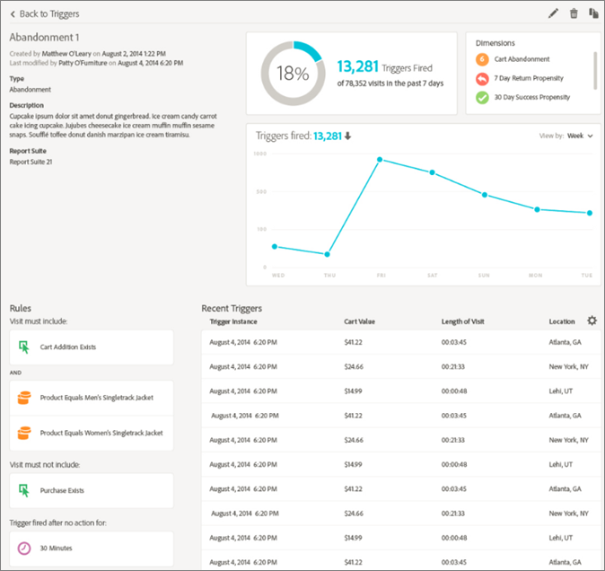

# Triggers

## Triggers の概要 {#topic_4F21FCE9A64E46E8B6D51F494FA652A7}

Triggersを使用すると、主な消費者行動を識別、定義、監視し、ソリューション間のコミュニケーションを生み出して訪問者を再び関与させることができます。 リアルタイムでの意思決定とパーソナライゼーションにTriggersを使用できます。

* 買い物かごの放棄または製品を削除して買い物かごの放棄に対する迅速なリマーケティングの設定
* 不完全なフォームと申し込み
* オンサイトでの任意のアクションまたは一連のアクション

### Triggers のタイプ

一般に、トリガーがマーケティングキャンペーンを起動するには 15～90 分かかることがあります。これは、データ収集の実装、パイプラインへの読み込み、定義済みトリガーのカスタム設定、Adobe Campaign のワークフローによって異なります。

* **放棄：**&#x200B;訪問者が製品を表示したが買い物かごに何も追加しない場合に実行するトリガーを作成できます。
* **アクション：** 例えば、ニュースレターのサインアップ、電子メール購読、またはクレジットカードの申し込み（確認）の後に実行するトリガーを作成できます。 小売業者の場合、忠誠度プログラムにサインアップする訪問者のトリガーを作成できます。 メディアやエンターテイメントでは、特定の番組を視聴し、おそらく調査に反応したい訪問者のトリガーを作成します。
* **セッション開始とセッション終了：** セッション開始およびセッションエンドイベントのトリガーを作成します。

## Experience Cloud のトリガーの作成 {#task_821F37183AC045E5AC8EED20317598FE}

トリガーを作成し、トリガーの条件を設定します。 例えば、買い物かごの放棄などの指標や製品名のようなディメンションなど、訪問中のトリガーのルールの条件を指定できます。 ルールが満たされると、トリガーが実行されます。

>[!NOTE]
>
>現在、100 トリガーまでという技術的な制限があります。

1. In the Experience Cloud, click , then click **[!UICONTROL Launch]**.
2. Locate the [!UICONTROL Triggers] card, then click **[!UICONTROL Manage Triggers]**.
3. 「**[!UICONTROL 新しいトリガー]**」をクリックして、トリガーのタイプを指定します。

   

4. 次のフィールドに入力し、指標およびディメンション項目をルールのコンテナにドラッグすることで、トリガーを設定します。

   | 要素 | 説明 |
   |--- |--- |
   | 名前 | このトリガーのわかりやすい名前。 |
   | 説明 | このトリガーの説明、使用方法など。 |
   | レポートスイート | このトリガーに [使用されるAnalyticsレポートスイート](https://docs.adobe.com/content/help/ja-JP/analytics/admin/manage-report-suites/report-suites-admin.html) 。 この設定は、使用するレポートデータを識別します。 |
   | 訪問には次を含める必要があります 訪問に次を含めることはできません 次のアクションがなかった後のトリガー 含めるメタデータ | 条件または発生してほしい訪問者の行動、および発生してほしくない行動を定義できます。例えば、シンプルな買い物かご放棄トリガーのルールは、次のようになります。<ul><li>訪問には次を含める必要があります：買い物かごへの追加（指標）と存在（特定の製品の表示またはブラウザータイプなどのディメンションでルールをさらに洗練させることができます）。</li><li>訪問に次を含めることはできません：チェックアウト。</li><li>次のアクションがなかった後のトリガー：10 分。</li><li>含めるメタデータ：訪問者の行動に関連する特定のキャンペーンディメンションまたは変数を追加できます。このフィールドは、Adobe Campaign で適切なリマーケティング電子メールを構築するのに便利です。</li></ul> ルールにとって重要な条件に応じて、コンテナ内またはコンテナ間で「ANY」、「AND」または「OR」論理を指定できます。 |
   | コンテナ | コンテナは、トリガーを定義するルール、条件またはフィルターを設定および保存する場所です。 イベントを同時に発生させたい場合は、同じコンテナに配置します。 つまり、各コンテナは、ヒットレベルで別々に処理されます。例えば、2 つのコンテナが AND 演算子で結合されている場合、2 つのヒットが要件を満たすタイミングを満たすルールを期待できます。 |
   | 次のセッション後に開始が新たに開始 | セッション開始およびセッションエンドイベントのトリガーを作成します。 |

5. 「**[!UICONTROL 保存]**」をクリックします。
6. Use triggers for [real-time remarketing](https://docs.campaign.adobe.com/doc/standard/en/EMA_Transactional_messaging_Marketing_Cloud_Triggers.html) in [!DNL Adobe Campaign].

### トリガーの例

Experience Cloud Triggersの例を次に示します。

#### 買い物かごの放棄トリガー

例えば、次のページは、訪問中に表示された製品に基づいて、買い物かごの放棄トリガーに使用できるルールを示しています。

#### 転送者トリガー

次のトリガーは、ヒットがメンズブーツの製品とFacebookの転送者で発生した場合に起動します。 For the two criteria (*products* and *referrer*) to be evaluated in the same hit, they should be added to the same container.

