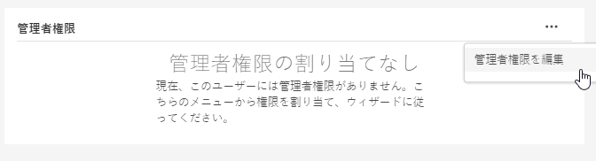

# Experience Cloud ユーザーと製品の管理

Admin Console へのログイン、Experience Cloud ユーザーの権限および製品プロファイルの管理、ブラウザーのサポートについて説明します。

>[!IMPORTANT]
>
>次の情報は、Experience Cloud アプリケーションを対象としています。この情報は、すべての Adobe Cloud 製品を対象とする[エンタープライズ管理ユーザーガイド](https://helpx.adobe.com/jp/enterprise/admin-guide.html)の幅広い管理情報を補完するものです。

管理ツールでは、すべての Experience Cloud ユーザーとその詳細に関する、並べ替え可能でフィルタリング可能なリストを確認できます。詳しくは、[管理ツールでの Experience Cloud ユーザーの表示](admin-tool-experience-cloud.md)を参照してください。

## 製品プロファイルとは {#section_AB50558124D541CF80A0D3D76D35A4BF}

[!UICONTROL 製品プロファイル]は、ユーザーに割り当てることができる製品およびサービスのグループです。Experience Cloud では、権限はユーザーではなく、製品のプロファイルに基づきます。（ただし、管理権限は特定のユーザーに委任できます。）

例えば、Analytics では、Analysis Workspace や Report Builder などのレポートツールをレポートスイート、指標、ディメンションなどとともに 1 つのコレクションにまとめることができます。ユーザーをプロファイルに追加することにより、付与権限を割り当てることができます。

* 詳しくは、このページの「[製品プロファイルへの Analytics アクセス権限の割り当て](admin-getting-started.md#task_040673FE3E3E429B9531FBCB8B6A4391)」を参照してください。
* このページの[ユーザーへの管理者の役割の委任](#delegate-rights)を参照してください。

## Experience Cloud 製品プロファイルの管理 {#task_16335111C52D40E9BAC73D0699584DBF}

製品プロファイルを作成し、権限グループに割り当てます。

ユーザーを組織に招待する場合は、そのユーザーに製品および製品プロファイルへのアクセス権を付与することができます。ユーザーに制限付き管理権限を委任することもできます。同様に、ユーザーグループを作成し、そのグループを製品プロファイルに追加することによって、アクセス権を有効にすることもできます。

1. [Admin Console](https://adminconsole.adobe.com/enterprise/) で、「**[!UICONTROL 製品]**」を選択します。
1. 組織名を選択します。
1. 「**[!UICONTROL 新規プロファイル]**」を選択します。
1. プロファイルの詳細を設定し、「**[!UICONTROL 保存]**」を選択します。

詳細（および Creative Cloud と Document Cloud 製品管理のヘルプ）については、『[管理ユーザーガイド](https://helpx.adobe.com/jp/enterprise/admin-guide.html/jp/enterprise/using/users.ug.html)』の [ID](https://helpx.adobe.com/jp/enterprise/admin-guide.html/jp/enterprise/using/identity.ug.html) を参照してください。

**関連するヘルプ**

* 管理ユーザーガイドの[製品およびプロファイルの管理](https://helpx.adobe.com/jp/enterprise/admin-guide.html/jp/enterprise/using/manage-products.ug.html)。
* Adobe Target ヘルプの [Enterprise ユーザーの権限](https://experienceleague.adobe.com/docs/target/using/administer/manage-users/enterprise/property-channel.html?lang=ja)。
* ビデオ：[Adobe Admin Console で Adobe Target ワークスペースを設定する方法](https://helpx.adobe.com/jp/target/kb/how-to-configure-target-workspaces-in-adobe-admin-console0.html)

<!-- ## What's new in Experience Cloud user management {#concept_06A0A13362F644FB90F947238407637A}

Learn about the latest features in Experience Cloud user and product management.

### Business ID type

Adobe is introducing an identity type called Business ID. This identity type improves the control of user and product management. Adobe is migrating all Adobe IDs (owned by individuals) that are used for business to the new enterprise Business IDs owned by your organization.

If you are an existing Experience Cloud customer, Adobe will migrate all your users with Adobe IDs in the Admin Console to Business IDs. If you are a new enterprise or teams customer, you will add users to the Admin Console using one of the available identity types: Business ID, Enterprise ID, or Federated ID.

What to do

* Your users will need to accept Terms of Use (TOU) changes prior to accounts being migrated to Type2e. 
* Users that belong to multiple organizations might see a Profile Selection screen during the login workflow and need to select the correct one. This ensures that they are logging into the correct organization. (There might be multiple profiles to choose from if a user was a member of multiple organizations before the migration.)

Beginning May 2020, enterprise administrators cannot use the Adobe ID for new organizations created in the Admin Console. Latest: https://wiki.corp.adobe.com/pages/viewpage.action?spaceKey=engage&title=Type2e+DX+GTM-->

## ユーザーへの管理者の役割の委任 {#delegate-rights}

Admin Console では、組織内の他のユーザーに管理権限を制限付きで委任できます。委任された管理者の役割では、エンドユーザーに対するソフトウェアアクセスを管理したり、デプロイ機能へのアクセスを提供したりできます。また、サポート代行者としての役割を果たすこともできます。

例えば、次のことができます。

* クリエイティブディレクターが Creative Cloud へのアクセス権を付与できるようにする。
* マーケティングディレクターが Experience Cloud へのアクセス権を付与できるようにする。
* 管理者の役割と副管理者の役割を切り離して、お互いの役割を侵さないようにします。

副管理者の役割を使用すると、必要以上の機能を提供することなく、複数の人に同時に管理を委任できます。

1. Admin Console で「**[!UICONTROL ユーザー]**」を選択してから、ユーザー名を選択します。

   

1. 「**[!UICONTROL 管理権限を編集]**」を選択します。

   

1. ユーザーの管理権限を指定します。
1. 「**[!UICONTROL 保存]**」を選択します。

## Analytics ユーザーと製品の管理 {#section_97DE101F92CD494AB073893680992F1A}

製品プロファイルに Analytics レポートのアクセス権限（レポートスイート、指標、ディメンションなど）を割り当てることができます。

例えば、複数の Analytics ツール（[!UICONTROL Analysis Workspace]、[!UICONTROL Reports &amp; Analytics]、[!UICONTROL Report Builder]）を含む製品プロファイルを作成できます。これらのプロファイルには、特定の指標およびディメンション（eVar を含む）に対する権限と、セグメントや計算指標の作成などの機能が含まれます。

1. [Admin Console](https://adminconsole.adobe.com/enterprise) にログインし、「**[!UICONTROL 製品]**」を選択します。
1. [!UICONTROL 製品]ページで、製品を選択してから「**[!UICONTROL 権限]**」を選択します（管理者のみが使用できます）。
1. プロファイルの権限の設定：

| 要素 | 説明 |
|--- |--- |
| レポートスイート | 特定のレポートスイートに対する権限を有効にします。 |
| 指標 | トラフィック、コンバージョン、カスタムイベント、ソリューションイベントおよびコンテンツ対応などに対する権限を有効にします。 |
| ディメンション | eVar、トラフィックレポート、ソリューションレポートおよびパスレポートを含む、詳細なレベルでユーザーアクセスをカスタマイズします。 |
| レポートスイートツール | Web サービス、レポートスイートの管理、ツールとレポート、およびダッシュボードの項目に対するユーザー権限を有効にします。 |
| Analytics ツール | 一般的な項目（請求、ログなど）、会社の管理、ツール、web サービスへのアクセス、Report Builder および Data Connectors の統合に関するユーザー権限を有効にします。Admin Console のカスタマイズカテゴリのカンパニー設定は、Analytics ツールに移動されました。 |

**ユーザーアカウントの移行**

Analytics 管理者がユーザーアカウントを Analytics User Management から [Adobe Admin Console](https://adminconsole.adobe.com/enterprise/) / へ移行する際に役立つ Analytics ユーザー ID 移行ツールを入手できます。

アカウントの移行は、顧客ごとに段階的に実施しています。既存のユーザーアカウントを「**[!UICONTROL 管理ツール]**／**[!UICONTROL ユーザー管理]**」から Admin Console へ移行する順番が来た顧客には、アドビから通知し、サポートを提供します。

移行後、ユーザーはそれぞれの Adobe ID（または Enterprise ID）を使用してログインし、Experience Cloud ソリューションおよびサービスへ認証を [experiencecloud.adobe.com](https://experience.adobe.com) で行います。従来のログイン（[!DNL my.omniture.com]、[!DNL sc.omniture.com] および [!DNL experiencecloud.adobe.com]）でログインしようとしたユーザーは、[!DNL experience.adobe.com] にリダイレクトされます。

**関連するヘルプ**

詳しくは、[Analytics ユーザー ID の移行](https://experienceleague.adobe.com/docs/analytics/admin/user-product-management/user-management/migrate-users/c-migration-tool.html?lang=ja)を参照してください。

## Adobe Target の管理 - 製品プロファイルと Workspaces {#section_3860AF177C9E4C7E9C390D36A414F353}

Adobe Target では、Workspaces が製品プロファイルになります。組織でワークスペースを使用すると、特定のユーザーセットを特定のプロパティセットに割り当てることができます。多くの点で、Workspaces は Adobe Analytics のレポートスイートに似ています。

以下を参照してください。

* [Enterprise ユーザーの権限](https://experienceleague.adobe.com/docs/target/using/administer/manage-users/enterprise/property-channel.html?lang=ja)
* [製品およびプロファイルの管理](https://helpx.adobe.com/jp/enterprise/admin-guide.html/jp/enterprise/using/manage-products.ug.html)
* ビデオ：[Adobe Admin Console で Adobe Target ワークスペースを設定する方法](https://helpx.adobe.com/jp/target/kb/how-to-configure-target-workspaces-in-adobe-admin-console0.html)

## Campaign 製品プロファイル、テナント、セキュリティグループの管理 {#section_09CDF75366444CF5810CF321B7C712F3}

Campaign の&#x200B;*テナント*&#x200B;は、Admin Console の製品ページでは&#x200B;*製品*&#x200B;として表示されます。

*セキュリティグループ*&#x200B;は製品プロファイルとして表示されます。

セキュリティグループとセキュリティグループへのユーザーの割り当てについては、[グループとユーザーの管理](https://experienceleague.adobe.com/docs/campaign-standard/using/administrating/users-and-security/managing-groups-and-users.html?lang=ja)を参照してください。

## Experience Platform データ収集（Launch）の管理 {#section_F2DA6778DD2D48AA8F794041971EE6B1}

Experience Platform [!UICONTROL データ収集]（[!UICONTROL Launch]）は、[!UICONTROL Admin Console] の[!UICONTROL 製品]ページに表示されます。Launch 製品プロファイルには、他のソリューションやサービスを含めることができます。

[!UICONTROL Platform Launch] にユーザーを招待し、ユーザーの役割と権限を割り当てます。

Admin Console のユーザー権限と Launch 固有のオプションの形式について設定（プロファイルへの権限の割り当てなど）については、[ユーザー権限](https://experienceleague.adobe.com/docs/experience-platform/tags/admin/user-permissions.html?lang=ja)を参照してください。

## Adobe Experience Manager as a Cloud Service

Adobe Enterprise の顧客は、Adobe [!UICONTROL Admin Console] では組織として表されます。Adobe Experience Manager のお客様は、Adobe [!UICONTROL Admin Console] を使用して、Adobe Experience Manager as a [!UICONTROL Cloud Service] に対する製品の使用権限や IMS 認証を管理できます。

[Adobe Experience Manager as a Cloud Service の IMS サポート](https://experienceleague.adobe.com/docs/experience-manager-cloud-service/security/ims-support.html?lang=ja)を参照してください。

## Audience Manager {#section_C31E3FA8A1E14463B1B3E07235F1983C}

Audience Manager ユーザーを作成し、グループに割り当てます。また、制限（特性、セグメント、宛先、[!DNL AlgoModel]）を表示することもできます。

Audience Manager ヘルプの[管理](https://experienceleague.adobe.com/docs/audience-manager/user-guide/features/administration/administration-overview.html?lang=ja)を参照してください。

## Experience Cloud でサポートされているブラウザー

* [!DNL Microsoft® Edge]（Microsoft® による Internet Explorer 8、9、10 の[サポートは既に終了しています](https://www.microsoft.com/ja-jp/WindowsForBusiness/End-of-IE-support)。そのため、今後アドビでは、Internet Explorer のこれらのバージョンに対して報告された問題は修正しません。）
* [!DNL Google Chrome]
* [!DNL Firefox]
* [!DNL Safari]
* [!DNL Opera]

**メモ：** Experience Cloud インターフェイスはこれらのブラウザーをサポートしていますが、個々のアプリケーションがすべてのブラウザーに対応しているわけではありません（例えば、[Analytics](https://experienceleague.adobe.com/docs/analytics/admin/sys-reqs.html?lang=ja) は [!DNL Opera] をサポートしておらず、[Adobe Target](https://experienceleague.adobe.com/docs/target/using/implement-target/before-implement/supported-browsers.html?lang=ja) は [!DNL Safari] をサポートしていません）。

### 各ソリューションおよび製品の要件

* [Analytics](https://experienceleague.adobe.com/docs/analytics/admin/sys-reqs.html?lang=ja)
* [Report Builder](https://experienceleague.adobe.com/docs/analytics/analyze/report-builder/report-builder-setup/system-requirements.html?lang=ja)
* [Adobe Target](https://experienceleague.adobe.com/docs/target/using/implement-target/before-implement/supported-browsers.html?lang=ja)
