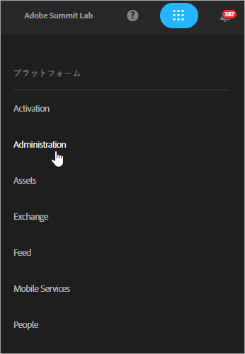
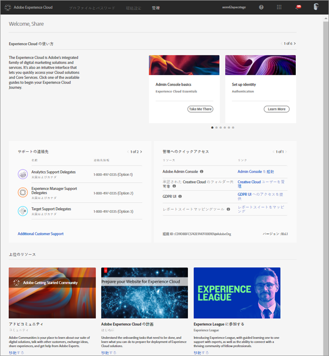
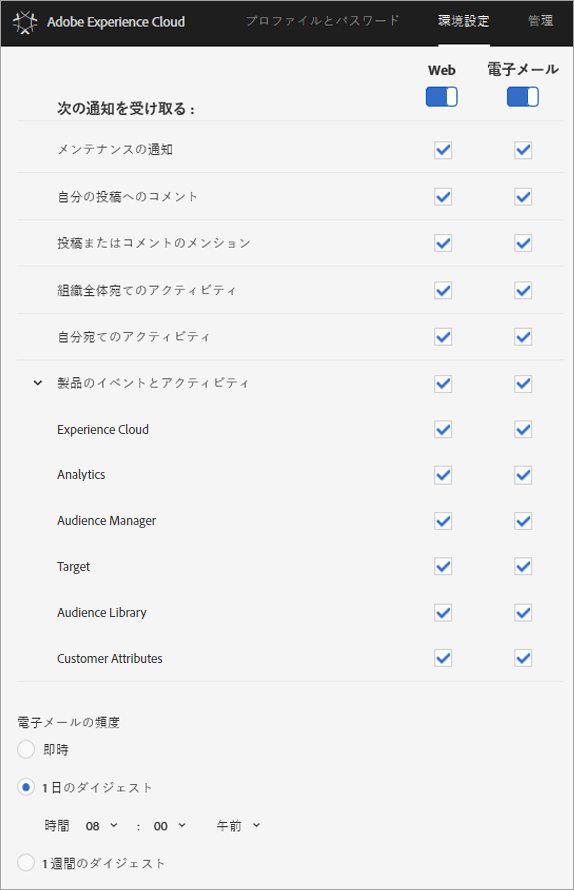

# サインインしてExperience Cloudのプロファイル設定を管理

（単一のソリューションにサインインする代わりに）Experience Cloudにサインインすると、お客様が所有するすべてのソリューションおよびサービスに対するシングルサインオンが可能になります。 このヘルプでは、Experience Cloudへのサインイン、パスワードと通知の管理、デフォルトのパスワードの指定の方法について説明しています。ランディングページ

>[!IMPORTANT]
>
>ユーザーおよび製品管理の更新に関する管理者向けの情報については、[管理](../admin-getting-started/admin-getting-started.md#topic_3FCB4099640647E3B2411ADBFCE81909)を参照してください。

## Experience Cloud へのログイン（管理者）{#task_034FC955031347F3B02B686A09801A08}

ログインし、自分が適切な[組織](../admin-getting-started/organizations.md#topic_C31CB834F109465A82ED57FF0563B3F1)に属していることを確認します。

1. Experience Cloud プルダウンメニュー（）をクリックしてから、「**[!UICONTROL 管理]**」をクリックします。

   

   「**[!UICONTROL 管理]**」リンクが表示されない場合は、表示されている[組織](../admin-getting-started/organizations.md#topic_C31CB834F109465A82ED57FF0563B3F1)（この例では Adobe Corp）の Experience Cloud 管理者ではないということになります。管理者になる方法がわからない場合は、カスタマーケアまたは社内の Experience Cloud 管理者にお問い合わせください。
1. 「**[!UICONTROL 管理]**」をクリックします。

   
1. 次のいずれかのリンクをクリックして続行します。

| 要素 | 説明 |
|--- |--- |
| [管理コンソールの基本](https://helpx.adobe.com/marketing-cloud/how-to/first-time-setup.html) | Experience Cloudソリューションの使用を開始するために必要な最初の手順について説明します。 |
| [IDの設定](https://helpx.adobe.com/enterprise/using/set-up-identity.html) | エンドユーザーの認証に使用するIDシステムを定義し、設定します。 |
| [ユーザー管理](https://helpx.adobe.com/enterprise/using/users.html) | Admin Console へのログインと Experience Cloud ユーザーの権限および製品プロファイルの管理について説明します。 |
| [Admin Console の起動](../admin-getting-started/admin-getting-started.md) | 管理コンソールは、組織全体でアドビのユーザーと製品の権利を管理するための中央の場所です。 [ダイレクトリンク](https://adminconsole.adobe.com)を使用して Admin Console にログインすることもできます。 |
| [Creative Cloud ユーザーの管理](../experience-cloud-assets/t-admin-add-cc-user.md) | Experience Cloud Assetsを使用すると、マーケティング担当者は、デザイナーやCreative Cloudを使用する他のクリエイティブアセットとフォルダーを共有、同期、コラボレーションできます。 組織との共同作業を承認されたCreative Cloudユーザーを管理できます。 |
| [レポートスイートをマッピング](../core-services/core-services.md) | （Analyticsのみ）Experience Cloudコアサービスは、個々のレポートスイートではなく組織に関連付けられます。 これらのサービスを正しく機能させるには、各 Analytics レポートスイートを組織にマッピングする必要があります。(このタスクは、コアサービスに対してAnalyticsを有効にする [ためのより広いワークフローの一部](../core-services/core-services.md#concept_07ED1D5C64234E77976E6D572E78FB9C))。 |
| [Organization ID](../admin-getting-started/organizations.md) | 組織 *IDは* 、管理ページの下部にあります。 このIDは、プロビジョニングされたExperience Cloud会社に関連付けられたIDです。 この ID は 24 文字の英数字から成る文字列で、その後に @AdobeOrg（必須）が続きます。 |

## Experience Cloud へのログイン（ユーザー）{#task_1BFE87E20DCB44078CAC82F3CD44B985}

Experience Cloud での非管理者ユーザーのログインに関するヘルプ情報です。

1. Experience Cloud で自分の[組織](../admin-getting-started/getting-started-experience-cloud.md#concept_384D169B0B724B799D573B8ECB5C39BF)のプロビジョニングが完了していることを管理者に確認します。

1. [Adobe Experience Cloud](https://experiencecloud.adobe.com) ([!DNL experiencecloud.adobe.com])に移動します。
1. 「**[!UICONTROL Adobe ID でログイン]**」をクリックします。

   Experience Cloud 管理者に問い合わせてアカウントのタイプ（Adobe ID または Enterprise ID）を確認してください。

1. ランディングページ上で、セレクターアイコンをクリッ  クして、プルダウンメニューにアクセスします。

   

   このメニューに表示されるソリューションやサービスは、[管理者](../admin-getting-started/admin-getting-started.md#topic_3FCB4099640647E3B2411ADBFCE81909)が定義したアプリケーション権限によって異なります。

## デフォルトの個人用アカウント設定の構成 {#task_73CBCAE6C91749D19C95421E5AC311BA}

個人の詳細情報を編集し、デフォルトの[組織](../admin-getting-started/admin-getting-started.md#concept_705C626560A54CA2A4215F1C870C42B2)や Experience Cloud へのログイン後に表示されるランディングページを指定できます。

1. Experience Cloud にログインし、自分のプロファイルのアイコンをクリックします。

   
1. 「**[!UICONTROL プロファイルを編集]**」をクリックします。

   
1. 続けて個人情報の設定と編集をおこない、「**[!UICONTROL 変更を保存]**」をクリックします。

## 通知の有効化 {#concept_0105453AD71847B8BFCAF4A40915F157}

システムの更新、メンテナンス通知、投稿、メンションおよび共有アセットに関する通知を（電子メールまたは製品内で）受け取ります。 顧客属性のアップロードステータスなど、通知の対象とする製品やソリューションを指定することもできます。

「通知」に移動するには、**[!UICONTROL 通知]**&#x200B;アイコン（）をクリックし、次に&#x200B;**[!UICONTROL 設定]**&#x200B;アイコン（）をクリックします。

自分にとって重要なメッセージタイプに基づいて通知の表示を並べ替えたり、通知を検索したりできます。 また、次の操作も可能です。

* 自分にとって重要なメッセージの種類で並べ替えます。
* 通知を検索します。

**通知を有効にするには**

<!-- 
 <b>Analytics</b> 
 
<ul id="ul_91BF597858124FA5BF338C36F6C5533F"> 
 <li id="li_FAD3E93CDE6242F58F14D55C8A6E23D7">Contribution analysis completed </li> 
 <li id="li_03D33D3228884CECA371B58656B2F3E7">Guided analysis shared </li> 
 <li id="li_DCF710F89317487B8DAA86CC05C694CA">Scheduled report failure </li> 
</ul> 

 <b>Adobe Target</b> 
 

Test started or stopped 
 

 <b>Media Optimizer</b> 
 

Performance alerts 
 

 <b>Dynamic Tag Manager</b> 
 
<ul id="ul_9ACDA418933E40918744D9C32A57DD4B"> 
 <li id="li_4DD0FFD3D9F84A428703611EF767D4D0">New web property created </li> 
 <li id="li_C6B923012E9D40BA91F4CBF7D2D72986">New user added </li> 
 <li id="li_EB0B9D1CFDE24E6987935CCCBFC7892A">Approvals - publishing and approval status for new rules, data elements, and tools </li> 
 <li id="li_17B0B176FF85435FB7EDD4317BC18201">Property has been published </li> 
</ul> -->

## プロファイルとパスワードの管理 {#task_7B89F4F38E5A4C4EB0FF842953856382}

Experience Cloud プロファイルを編集し、デフォルトの組織やランディングページなどを指定することができます。

1. [Experience Cloud にログインします](../admin-getting-started/getting-started-experience-cloud.md#task_1BFE87E20DCB44078CAC82F3CD44B985)。

1. Experience Cloud メニューから、自分のプロファイルの画像をクリックします。

   
1. 「**[!UICONTROL プロファイルを編集]**」をクリックします。

   [プロファイルとパスワード]ページで、[個人の詳細]の下のフィールドとオプションに入力します。

## パスワードの復元 {#task_46541A2806164CB1A4AE8239604E4EB1}

1. ソリューションのログインページに移動します。
1. 「**[!UICONTROL パスワードを忘れた場合]**」をクリックします。

   ソリューションのパスワードをリセットすれば、Experience Cloud でのパスワードのリンクに関する問題は解決します。

   For Adobe Analytics users, navigate to [https://sc2.omniture.com/password_recovery.html](https://sc2.omniture.com/password_recovery.html).

## ダイレクトリンクを使用したソリューションログインの設定 {#concept_8BE493A08786469B88B210E13F78FF2F}

オプションで、Experience Cloudインターフェイスで提供される認証を使用して、ソリューションの特定のページにログインできます。

### URLテンプレート

`https://<tenantId>.experiencecloud.adobe.com/<solutionname>?destURL=<fullURL>`

サンプル URL：

`https://aem62tenant.experiencecloud.adobe.com/analytics?destURL=https%3A%2F%2Fsc.omniture.com%2Freports%2F11562.html`

>[!NOTE]
>
>`destURL` パラメーターで渡す URL は事前にエンコードする必要があります(Encoder sites like [URL Decoder / Encoder](https://meyerweb.com/eric/tools/dencoder/) are available.)

| パラメーター | 説明 | 例 | 必須/オプション |
|--- |--- |--- |--- |
| tenantId | ユーザーがログインするテナントの名前。 | aem62tenant | オプション |
| destURL | ユーザーを呼び出す場所の完全なURL。 | https://sc.omniture.com/x/1_7xxzf | オプション |
| solutionname | destURLパラメーターの所有者であるMACソリューションの名前。 このパラメーターは、URL の所有主であるソリューションにユーザーがアクセスできることを確認するために使用されます。solutionname と destURL パラメーターが同期しているかどうかの確認はソリューション側でおこなわれます。例：URLにSocialとしてのソリューション名が含まれ、指定されたdestURLが分析URLの場合、ユーザーは分析にアクセスできなくてもURLにリダイレクトされます。 MACでは、destURLの所有者がソリューション名と同期している天気を確認しません。 | analytics | destURLパラメーターを使用する場合は必須です。 |
