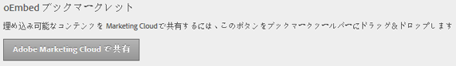

# コンテンツの埋め込み

Web ページから Experience Cloud にコンテンツを埋め込むことができます。

「[!UICONTROL 管理]」で、「**[!UICONTROL Adobe Experience Cloud で共有]**」ボタンをブラウザーのブックマークツールバーにドラッグします。

コンテンツ（ヘルプトピックなど）の埋め込みをサポートしている Web ページ上で、ツールバーの「**[!UICONTROL Adobe Experience Cloud で共有]**」をクリックします。
