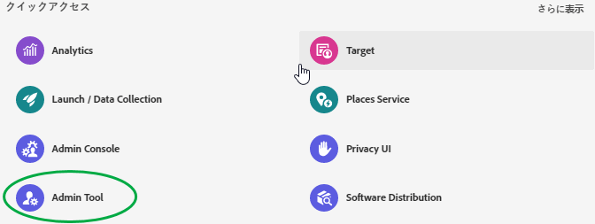
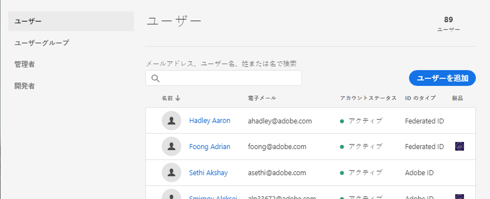
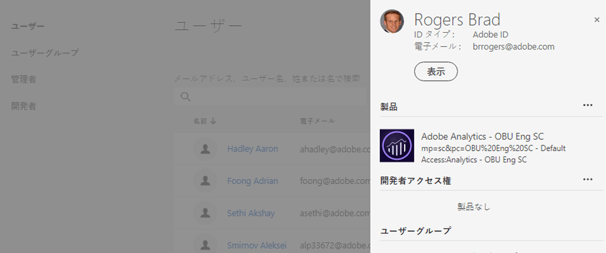
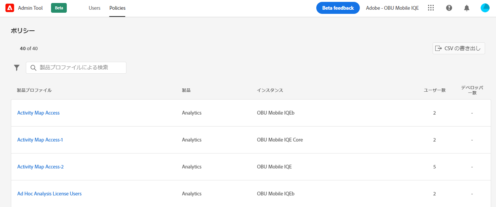
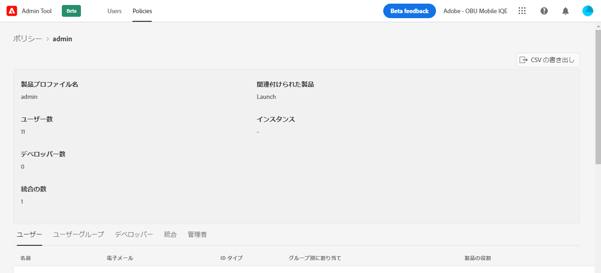

# [!UICONTROL &#x200B; 管理ツール &#x200B;] でExperience Cloudユーザーおよびポリシーを表示する

管理者は、[!UICONTROL &#x200B; 管理ツール &#x200B;] で、すべてのExperience Cloudユーザーとポリシーの並べ替え可能でフィルタリング可能なリストと詳細を表示できます。 ユーザーの詳細には、ユーザーの製品アクセス、役割、前回アクセスした情報が含まれます。ポリシーの詳細には、ポリシーの（製品プロファイル）ユーザー、グループ、開発者、統合および管理者リストや、ポリシーの詳細な権限およびリソース情報が含まれます。

1. にログインします `https://experience.adobe.com/.`。

   

1. [!UICONTROL &#x200B; クイックアクセス &#x200B;] の下で **[!UICONTROL 管理ツール]** をクリックします。

   （または、ホームページ URL の _home_ を _admin_ に置き換えます）。

   [!UICONTROL ユーザー]ページが表示されます。

## ユーザーページ

このページには、組織の Experience Cloud にアクセスできるユーザーの完全なリストが表示されます。アプリケーションの使用権限と最終ログインに関する情報が提供されます。検索、並べ替え、フィルタリングによるユーザーリストのカスタム表示が可能です。

| 要素 | 説明 |
|---|---|
| [!UICONTROL 名前] | ユーザーの姓名です。この列は A から Z、Z から A の順に並べ替えることができます。ユーザー名をクリックすると、そのユーザーの詳細が表示されます。 |
| [!UICONTROL メール] | ユーザーに関連付けられている電子メールアドレスです。この列は A から Z、Z から A の順に並べ替えることができます。 |
| [!UICONTROL ID タイプ] | ユーザーのアカウントの ID タイプです。フィルターを適用して、特定の ID タイプのみを表示できます。詳しくは、[ID タイプの管理](https://helpx.adobe.com/jp/enterprise/using/identity.html)を参照してください。 |
| [!UICONTROL ソリューション] | ユーザーがアクセスできる Experience Cloud アプリケーションの概要です。フィルターを適用して、特定のアプリケーションにアクセスできるユーザーのリストのみに絞り込むことができます。 |
| [!UICONTROL 最終ログイン] | Experience Cloudへの最新のユーザーログインの日時。 この列は、昇順または降順に並べ替えることができます。  **重要：** 2020 年 1 月 13 日（PT）現在、ユーザーの最後のログインデータは 365 日間保持されます。 この情報は、現在のログインアクティビティをExperience Cloudに表示するためのものであり、2020 年 1 月 13 日より前に非アクティブになったアカウントに対して何らかのアクションを実行することを推奨するものではありません。 |

## ユーザーリスト表示のカスタマイズ

列の検索、並べ替え、フィルタリングをおこなって、ユーザーリストをカスタマイズできます。

* 名前または電子メールアドレスでユーザーを検索する。入力したテキスト文字列に一致する検索結果が得られます。
* 値の昇順または降順に列を並べ替える。これは、「[!UICONTROL 名前]」、「[!UICONTROL Eメール]」、「[!UICONTROL 最終ログイン]」の各列に適用されます。
* 複数のフィルターを適用して特定の条件を持つユーザーをリストするには、[**[!UICONTROL フィルター]**] をクリックします。 複数のフィルターカテゴリを適用する場合、「メールドメイン」 `AND` 「ID タイプ」 `AND` 「ソリューション」の条件に一致する結果が検索されます。

| 要素 | 説明 |
|---------|----------|
| [!UICONTROL メールドメイン]フィルター | 「メール」列で文字列を検索し、結果を 1 つまたは複数のドメインに絞り込みます。複数のフィルターを追加するには、各検索語句の後で Enter キーを押します。 |
| [!UICONTROL ID タイプ]フィルター | 使用可能な ID タイプから選択します。複数の ID タイプをフィルターとして使用できます。 |
| [!UICONTROL ソリューション]フィルター | 使用可能なアプリケーションから選択します。複数のアプリケーションフィルターが、ソリューション 1 `OR` ソリューション 2 を含む結果を検索します。 |

## ユーザーの詳細の表示

[!UICONTROL ユーザー]ページでユーザーの詳細を表示するには、ユーザーのメールをクリックします。

各ユーザーの詳細ビューには、ユーザーのアプリケーションアクセス、管理者と製品の役割、前回アクセスした情報に関する重要な詳細が表示されます。

## 情報セクション

このセクションには、次のようなユーザーアカウントの概要が表示されます。

* ユーザーアバターとシステム管理者バッジ（該当する場合）
* 名前
* 電子メール
* ユーザー名（Federated ID アカウントには、メールアドレスとは異なるユーザー名を使用できます）
* [ID タイプ](https://helpx.adobe.com/jp/enterprise/using/identity.html)
* 国
* 前回のログイン

## ソリューション概要

このセクションには、ユーザーがアクセスできる Experience Cloud アプリケーションの概要が表示されます。該当する場合、製品管理の役割が含まれます。

## 詳細な製品アクセスリスト

このセクションには、ユーザーのすべての製品プロファイルメンバーシップの完全なリストが表示されます。

| 要素 | 説明 |
|---------|----------|
| [!UICONTROL 製品] | 製品プロファイルに関連付けられている製品の名前です。 |
| [!UICONTROL インスタンス] | 製品と製品プロファイルに関連付けられているインスタンス（ログイン会社やテナントなど）の名前です。 |
| [!UICONTROL &#x200B; 製品プロファイル &#x200B;] | 製品プロファイルの一意の名前です。 |
| [!UICONTROL 割り当て元グループ] | ユーザーを製品プロファイルに関連付けるユーザーグループの名前です。結果が空白の場合は、ユーザーがグループを介さずに直接製品プロファイルに割り当てられたことを示します。 |
| [!UICONTROL 製品ロール] | 製品プロファイル内のユーザーのロールアサインです。現在、この情報は Adobe Target 製品プロファイルにのみ適用されます。 |

## ポリシーページ

このページには、組織内の Experience Cloud ポリシーの完全なリストが表示されます。製品、インスタンス、ユーザー、デベロッパーに関する情報を提供します。検索、並べ替え、フィルタリングによるポリシーリストのカスタム表示が可能です。

| 要素 | 説明 |
|---|---|
| [!UICONTROL &#x200B; 製品プロファイル &#x200B;] | 製品プロファイルの名前です。列は、A->Z、Z->Aの順に並べ替えることができます。ポリシーの詳細を確認するには、製品プロファイルの名前を選択します。 |
| [!UICONTROL 製品] | 製品プロファイルに関連付けられている製品です。この列は A から Z、Z から A の順に並べ替えることができます。 |
| [!UICONTROL インスタンス] | 製品プロファイルに関連付けられたインスタンス（テナント、ログイン会社など）です。一意のインスタンスまたはテナントを持たない製品では、その値に「 - 」が表示されます。この列は A から Z、Z から A の順に並べ替えることができます。 |
| [!UICONTROL ユーザー数] | 直接割り当てやグループ割り当てなど、製品プロファイルに関連付けられたユーザーのユニーク数です。列の並べ替え順は、最小から最大、または最大から最小に設定できます。 |
| [!UICONTROL デベロッパー数] | 製品のプロファイルに関連付けられているデベロッパー役割の数です。列の並べ替え順は、最小から最大、または最大から最小に設定できます。 |

## ポリシーリスト表示のカスタマイズ

列の検索、並べ替え、フィルタリングをおこなって、ポリシーリストをカスタマイズできます。

* 製品プロファイルを名前で検索します。入力したテキスト文字列に一致する検索結果が得られます。
* 値の昇順または降順に列を並べ替える。これは、[!UICONTROL &#x200B; 製品プロファイル &#x200B;]、[!UICONTROL &#x200B; 製品、][!UICONTROL &#x200B; インスタンス &#x200B;]、[!UICONTROL &#x200B; ユーザー数 &#x200B;]、[!UICONTROL &#x200B; デベロッパー数 &#x200B;] の各列に当てはまります。
* 複数のフィルターを適用して、特定の条件に一致する製品プロファイルをリストするには、「**[!UICONTROL フィルター条件]**」アイコンをクリックします。複数のフィルターカテゴリが適用されている場合、検索にはグループ関連の `AND` インスタンス `AND` ソリューションが含まれます。

| 要素 | 説明 |
|---------|----------|
| [!UICONTROL インスタンス]フィルター | インスタンス列で文字列を検索し、結果を 1 つまたは複数のインスタンスに絞り込みます。複数のフィルターを追加するには、各検索語句の後で Enter キーを押します。 |
| [!UICONTROL ソリューション]フィルター | 使用可能なアプリケーションから選択します。複数のアプリケーションフィルターが、ソリューション 1 `OR` ソリューション 2 を含む結果を検索します。 |

## ポリシーの詳細を表示

[!UICONTROL ポリシー]ページで、ポリシーの詳細を表示するには、製品プロファイル名を選択します。

各製品プロファイルの詳細ビューには、製品プロファイルのサブジェクト（ユーザー、グループなど）に関する重要な詳細が表示されます。 また、製品プロファイルが有効にした権限やリソースも表示されます。

製品プロファイルの詳細を CSV ファイルにエクスポートできます。  「[!UICONTROL CSV を書き出し]」オプションを選択すると、2 つの CSV ファイルが生成されます。

* 件名の詳細（ユーザー、ユーザーグループ、開発者、統合、管理者）
* 権限とリソースの項目

## 概要セクション

このセクションには、次のような製品プロファイルの概要が表示されます。

* 製品プロファイル名
* ユーザー数
* デベロッパー数
* 統合数
* 関連製品
* インスタンス

## 詳細な件名リスト

このセクションには、製品プロファイルに割り当てられているすべてのユーザー、ユーザーグループ、デベロッパー、統合および管理者の完全なリストが表示されます。

| タブ | 説明 |
|---------|----------|
| [!UICONTROL ユーザー] | 製品プロファイルに含まれるユーザーのリスト。ユーザーグループの関連付けは、「[!UICONTROL グループによる割り当て]」列に表示されます。 |
| [!UICONTROL ユーザーグループ] | 製品プロファイルに関連付けられているユーザーグループのリスト。 |
| [!UICONTROL 開発者] | 製品プロファイルに関連付けられているデベロッパーのリスト。 |
| [!UICONTROL 統合] | 製品プロファイルに関連付けられている統合のリスト。 |
| [!UICONTROL 管理者] | 製品プロファイルに関連付けられている管理者のリスト。 |

## 詳細な権限とリソースのリスト

このセクションには、製品プロファイルで使用できる権限とリソースの完全なリストが表示されます。製品プロファイルに含まれている権限とリソースには、「✔」が付いています。  権限とリソースのリストは、見やすいようにタブと列に分類されています。タブと列には、現在の製品に適用されるセクションのリストが表示されます。

## 関連情報

* [!DNL Admin Console] での [ ユーザーの管理 ](https://helpx.adobe.com/jp/enterprise/using/users.html)