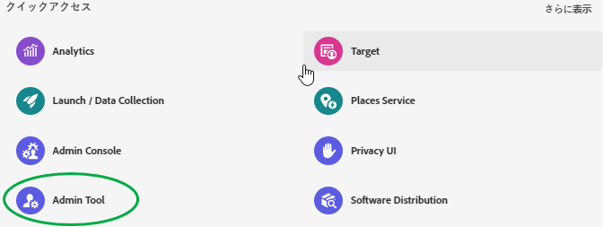
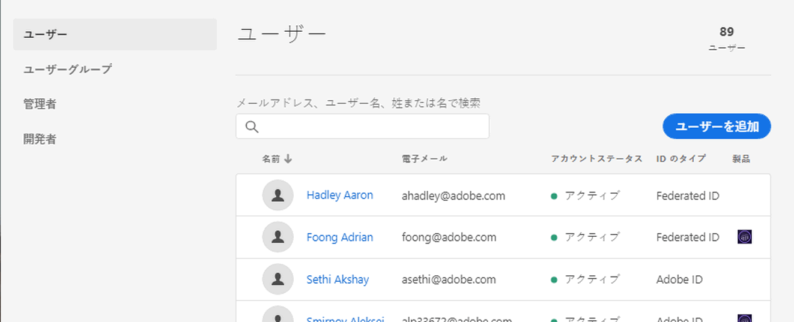
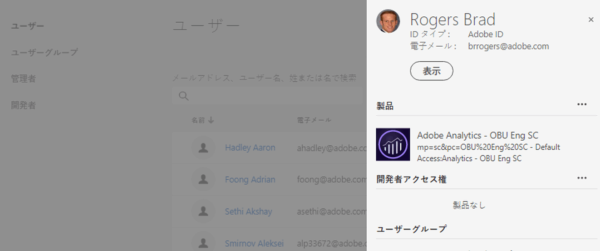
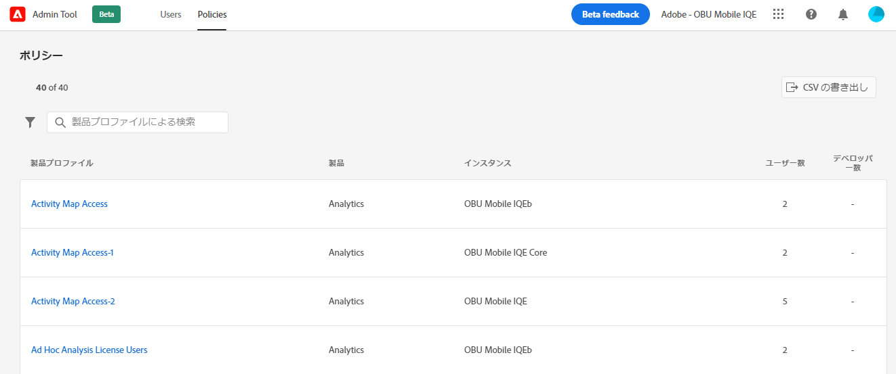
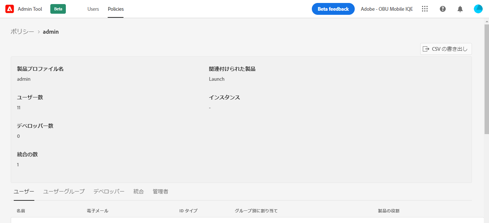

# CX Enterprise [!UICONTROL Admin Tool]

管理者は、すべてのCX Enterprise ユーザーとポリシーの並べ替え可能でフィルター可能なリストを表示し、[!UICONTROL Admin Tool]に詳細を含めることができます。 ユーザーの詳細には、ユーザーの製品アクセス、役割、前回アクセスした情報が含まれます。 ポリシーの詳細には、ポリシーの（製品プロファイル）ユーザー、グループ、開発者、統合、管理者リスト、およびポリシーの詳細な権限とリソース情報が含まれます。

1. にログインします `https://experience.adobe.com/.`。

   

1. [!UICONTROL Quick Access]で、**[!UICONTROL Admin Tool]**&#x200B;をクリックします。

   （または、ホームページ URL の _home_ を _admin_ に置き換えます）。

   [!UICONTROL Users] ページが表示されます。

## ユーザーページ

このページには、組織内のCX Enterpriseへのアクセス権を持つユーザーの完全なリストが表示されます。 アプリケーションの使用権限と最後のサインインに関する情報が提供されます。 検索、並べ替え、フィルタリングによるユーザーリストのカスタム表示が可能です。

| 要素 | 説明 |
| --- | ---|
| [!UICONTROL Name] | ユーザーの姓名です。 この列は、AからZ、ZからAに並べ替えることができます。ユーザー名をクリックすると、ユーザーの詳細が表示されます。 |
| [!UICONTROL Email] | ユーザーに関連付けられている電子メールアドレスです。 この列は A から Z、Z から A の順に並べ替えることができます。 |
| [!UICONTROL ID Type] | ユーザーのアカウントの ID タイプです。 フィルターを適用して、特定の ID タイプのみを表示できます。 詳しくは、[ID タイプの管理](https://helpx.adobe.com/jp/enterprise/using/identity.html)を参照してください。 |
| [!UICONTROL Solutions] | ユーザーがアクセスできるCX Enterprise アプリケーションの概要。 フィルターを適用して、特定のアプリケーションにアクセスできるユーザーのリストのみに絞り込むことができます。 |
| [!UICONTROL Last Login] | CX Enterpriseへの最新のユーザーのログイン日時。 この列は、昇順または降順に並べ替えることができます。  **重要：** 2020年1月13日現在、ユーザーの最後のサインインデータは365日間保持されます。 この情報は、CX Enterpriseでの現在のサインインアクティビティを表示することを目的としており、2020年1月13日より前に非アクティブなアカウントに対してアクションを実行することをお勧めしません。 |

## ユーザーリスト表示のカスタマイズ

列の検索、並べ替え、フィルタリングをおこなって、ユーザーリストをカスタマイズできます。

* 名前または電子メールアドレスでユーザーを検索する。 入力したテキスト文字列に一致する検索結果が得られます。
* 値の昇順または降順に列を並べ替える。 この並べ替えは、[!UICONTROL Name,] [!UICONTROL Email,]および[!UICONTROL Last Login]列に適用されます。
* 複数のフィルターを適用して、特定の条件を持つユーザーを一覧表示するには、**[!UICONTROL Filter By]**&#x200B;をクリックします。 複数のフィルターカテゴリを適用する場合、「メールドメイン」 `AND` 「ID タイプ」 `AND` 「ソリューション」の条件に一致する結果が検索されます。

| 要素 | 説明 |
| ---------| ----------|
| [!UICONTROL Email Domain] フィルター | 「メール」列で文字列を検索し、結果を 1 つまたは複数のドメインに絞り込みます。 複数のフィルターを追加するには、各検索語句の後で Enter キーを押します。 |
| [!UICONTROL ID Type] フィルター | 使用可能な ID タイプから選択します。 複数の ID タイプをフィルターとして使用できます。 |
| [!UICONTROL Solution] フィルター | 使用可能なアプリケーションから選択します。 複数のアプリケーションフィルターが、ソリューション 1 `OR` ソリューション 2 を含む結果を検索します。 |

## ユーザーの詳細の表示

[!UICONTROL Users] ページで、ユーザーの詳細を表示するには、ユーザーの電子メールをクリックします。

各ユーザーの詳細ビューには、ユーザーのアプリケーションアクセス、管理者と製品の役割、最後にアクセスした情報に関する重要な詳細が表示されます。

## 情報セクション

このセクションには、次のようなユーザーアカウントの概要が表示されます。

* ユーザーアバターとシステム管理者バッジ（該当する場合）
* 名前
* メール
* ユーザー名（Federated ID アカウントには、メールアドレスとは異なるユーザー名を使用できます）
* [ID タイプ](https://helpx.adobe.com/jp/enterprise/using/identity.html)
* 国
* 前回のログイン

## ソリューション概要

このセクションには、ユーザーがアクセスできるCX Enterprise アプリケーションの概要が表示されます。 該当する場合、製品管理の役割が含まれます。

## 詳細な製品アクセスリスト

このセクションには、ユーザーのすべての製品プロファイルメンバーシップの完全なリストが表示されます。

| 要素 | 説明 |
| ---------| ----------|
| [!UICONTROL Product] | 製品プロファイルに関連付けられている製品の名前です。 |
| [!UICONTROL Instance] | 製品と製品プロファイルに関連付けられているインスタンス（ログイン会社やテナントなど）の名前です。 |
| [!UICONTROL Product profile] | 製品プロファイルの一意の名前です。 |
| [!UICONTROL Assigned by Group] | ユーザーを製品プロファイルに関連付けるユーザーグループの名前です。 結果が空白の場合は、ユーザーがグループを介さずに直接製品プロファイルに割り当てられたことを示します。 |
| [!UICONTROL Product Roles] | 製品プロファイル内のユーザーのロールアサインです。 現在、この情報は Adobe Target 製品プロファイルにのみ適用されます。 |

## ポリシーページ

このページには、組織内のCX Enterprise ポリシーの一覧が表示されます。 製品、インスタンス、ユーザー、デベロッパーに関する情報を提供します。 検索、並べ替え、フィルタリングによるポリシーリストのカスタム表示が可能です。

| 要素 | 説明 |
| ---| ---|
| [!UICONTROL Product rofile] | 製品プロファイルの名前です。 列は、A->Z、Z->Aの順に並べ替えることができます。ポリシーの詳細を確認するには、製品プロファイルの名前を選択します。 |
| [!UICONTROL Product] | 製品プロファイルに関連付けられている製品です。 この列は A から Z、Z から A の順に並べ替えることができます。 |
| [!UICONTROL Instance] | 製品プロファイルに関連付けられたインスタンス（テナント、ログイン会社など）です。 一意のインスタンスまたはテナントを持たない製品では、その値に「 - 」が表示されます。 この列は A から Z、Z から A の順に並べ替えることができます。 |
| [!UICONTROL Number of Users] | 直接割り当てやグループ割り当てなど、製品プロファイルに関連付けられたユーザーのユニーク数です。 列の並べ替え順は、最小から最大、または最大から最小に設定できます。 |
| [!UICONTROL Number of Developers] | 製品のプロファイルに関連付けられているデベロッパー役割の数です。 列の並べ替え順は、最小から最大、または最大から最小に設定できます。 |

## ポリシーリスト表示のカスタマイズ

列の検索、並べ替え、フィルタリングをおこなって、ポリシーリストをカスタマイズできます。

* 製品プロファイルを名前で検索します。 入力したテキスト文字列に一致する検索結果が得られます。
* 値の昇順または降順に列を並べ替える。 この並べ替えは、[!UICONTROL product profile,] [!UICONTROL Product,] [!UICONTROL Instance,] [!UICONTROL Number of users,]および[!UICONTROL Number of Developers,]列に適用されます。
* **[!UICONTROL Filter By]** アイコンをクリックして、複数のフィルターを適用し、特定の条件を持つ製品プロファイルを一覧表示します。 複数のフィルターカテゴリが適用されている場合、検索にはグループ関連の `AND` インスタンス `AND` ソリューションが含まれます。

| 要素 | 説明 |
| ---------| ----------|
| [!UICONTROL Instance] フィルター | インスタンス列で文字列を検索し、結果を 1 つまたは複数のインスタンスに絞り込みます。 複数のフィルターを追加するには、各検索語句の後で Enter キーを押します。 |
| [!UICONTROL Solution] フィルター | 使用可能なアプリケーションから選択します。 複数のアプリケーションフィルターが、ソリューション 1 `OR` ソリューション 2 を含む結果を検索します。 |

## ポリシーの詳細を表示

[!UICONTROL Policies] ページで、ポリシーの詳細を表示するには、製品プロファイル名を選択します。

各製品プロファイルの詳細ビューには、製品プロファイルの被写体（ユーザー、グループなど）に関する重要な詳細が表示されます。 また、製品プロファイルが有効にした権限やリソースも表示されます。

製品プロファイルの詳細を CSV ファイルにエクスポートできます。 [!UICONTROL Export CSV] オプションでは、次の2つのCSV ファイルが生成されます。

* 件名の詳細（ユーザー、ユーザーグループ、開発者、統合、管理者）
* 権限とリソースの項目

## 概要セクション

このセクションには、次のような製品プロファイルの概要が表示されます。

* 製品プロファイル名
* ユーザー数
* デベロッパー数
* 統合数
* 関連製品
* インスタンス

## 詳細な件名リスト

このセクションには、製品プロファイルに割り当てられているすべてのユーザー、ユーザーグループ、デベロッパー、統合および管理者の完全なリストが表示されます。

| タブ | 説明 |
| ---------| ----------|
| [!UICONTROL Users] | 製品プロファイルに含まれるユーザーのリスト。 ユーザーグループの関連付けが[!UICONTROL Assigned by group]列に表示されます。 |
| [!UICONTROL User Groups] | 製品プロファイルに関連付けられているユーザーグループのリスト。 |
| [!UICONTROL Developers] | 製品プロファイルに関連付けられているデベロッパーのリスト。 |
| [!UICONTROL Integrations] | 製品プロファイルに関連付けられている統合のリスト。 |
| [!UICONTROL Administrators] | 製品プロファイルに関連付けられている管理者のリスト。 |

## 詳細な権限とリソースのリスト

このセクションには、製品プロファイルで使用できる権限とリソースの完全なリストが表示されます。 製品プロファイルに含まれている権限とリソースには、「✔」がマークされています。 権限とリソースのリストは、見やすいようにタブと列に分類されています。 タブと列には、現在の製品に適用されるセクションのリストが表示されます。

## 関連情報

* [!DNL Admin Console]の[&#x200B; ユーザーの管理](https://helpx.adobe.com/jp/enterprise/using/users.html)
