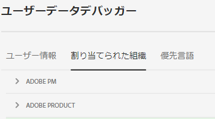
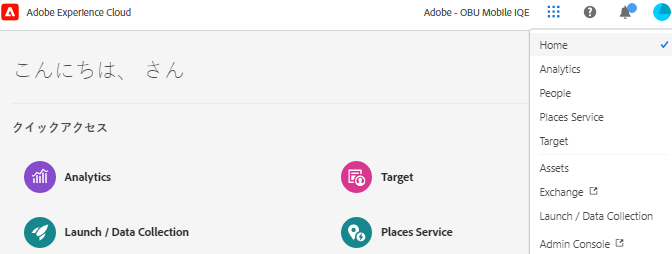
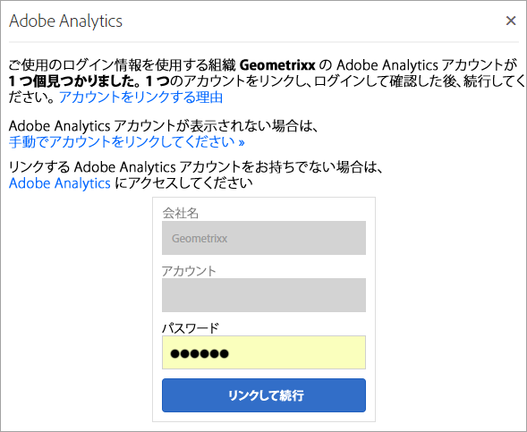

# Experience Cloud の組織

*組織* （組織 ID）とは、管理者がグループおよびユーザーを設定し、Experience Cloudでのシングルサインオンを制御するために使用するエンティティです。

この組織は、Experience Cloud のすべての製品とアプリケーションにまたがるログイン会社のように機能します。ほとんどの場合、組織は勤務先の会社名です。ただし、1 つの会社が多くの組織を持つことができます。

正しい組織にログインしていることを確認するには、「**[!UICONTROL プロファイル]**」をクリックしてデフォルトの組織名を表示します。 複数の組織にアクセスできる場合は、ヘッダーバーで別の組織を表示して切り替えることもできます。

>[!NOTE]
>
>組織間を切り替えると、その特定の組織のAdmin Consoleにアクセスできます。 目的の組織がリストに表示されない場合は、その組織の管理者にアクセス権をリクエストする必要がある場合があります。 （複数の Admin Console を統合する必要がある場合は、Adobe カスタマーサポートにお問い合わせください。）

## 連合 ID

組織が Federated ID を使用している場合、Experience Cloud を使用すると、自身のメールアドレスとパスワードを入力しなくても、組織のシングルサインオンでログインできます。`#/sso:@domain` を Experience Cloud URL（`https://experience.adobe.com`）に追加して、このタスクを完成します。

例えば、Federated ID を持ち、ドメインが `adobecustomer.com` の組織の場合、URL リンクを `https://experience.adobe.com/#/sso:@adobecustomer.com` に設定します。 また、この URL にアプリケーションパスを付けてブックマークに追加することで、特定のアプリケーションに直接移動することもできます。 （例えば、Adobe Analytics の場合は `https://experience.adobe.com/#/sso:@adobecustomer.com/analytics`。）

## 組織 ID を表示 {#concept_EA8AEE5B02CF46ACBDAD6A8508646255}

サポートを受けるために、割り当てられた組織 ID を見つけることができます。 ヘッダーの **[!UICONTROL 組織]** セレクターを使用して、自分が正しい組織に属していることを確認したり、組織を切り替えたりできます。

組織 ID は、プロビジョニングされている Experience Cloud の会社に関連付けられた ID です。この ID は 24 文字の英数字から成る文字列の後に `@AdobeOrg`（必須）を付けたものです。

`https://experience.adobe.com` の任意のページからキーボードショートカット **Ctrl+i** を使用して、組織 ID を他のアカウント情報と共に表示できます。

**組織 ID を表示するには**

1. [Experience Cloud](https://experience.adobe.com) で、キーボードの **Ctrl+i** キーを押します。

   

1. **[!UICONTROL ユーザー情報]** の下で **[!UICONTROL 現在の組織 ID]** を探すと、組織 ID を見つけることができます。

   または、管理者がAdmin Console（[https://adminconsole.adobe.com](https://adminconsole.adobe.com) に移動）にログインし、URL で組織 ID を表示することができます。

   例として、次の URL を見てみましょう。

   `https://adminconsole.adobe.com/C538193582390300A495CC9@AdobeOrg/overview`

   ID は次のとおりです。

   `C538193582390300A495CC9@AdobeOrg`

## アプリケーションアカウントを Adobe ID にリンクする {#task_FD389E78640848919E247AC5E95B8369}

通常は、Experience Cloud 管理者がアプリケーションやサービスへのアクセス権を付与します。まれに、アプリケーションの資格情報をAdobe IDにリンクできることがあります。

1. Experience Cloudへの招待メールの手順に従います。

1. Adobe ID または Enterprise ID を使用してログインします。

1. **[!UICONTROL アプリケーションセレクター]** をクリックします。 （）。

   

   アクセスできるアプリケーションはカラー表示されます。

1. 目的のアプリケーションをクリックします。

   。

   このタイプのメッセージは、ユーザーが適切なグループに属している（かつアプリケーションに対する権限を持っている）が、そのアカウントの資格情報をまだ Adobe ID にリンクしていない場合に表示されます。

1. 「**[!UICONTROL アカウントにリンク]**」をクリックし、資格情報を設定します。

## デフォルトの組織を指定 {#concept_6A191B42A9874A9780882903BA18F071}

ログイン時に使用するデフォルトの組織を指定できます。

1. ヘッダーで「**[!UICONTROL プロファイル]**」をクリックし、「環境設定」をクリックします。

1. 「[!UICONTROL &#x200B; 一般 &#x200B;]」で、デフォルトの組織を選択します。

## アカウントのリンクに関する問題のトラブルシューティング {#concept_DFCB29A3B4834FC59AA29E0BBA301584}

アカウントのリンクに起因する問題に関するヘルプです。

一般的に、アカウントのリンクは、Adobe ID が以前のユーザーにリンクされていることが原因で失敗します。アカウントのリンクに失敗した場合は、

* [アドビサポートにお問い合わせ](https://experienceleague.adobe.com/?support-solution=General&amp;lang=ja#support)ください。
* 問題が解決するまでの間、標準のログインを使用してアプリケーションにアクセスします。
