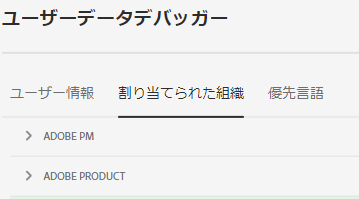
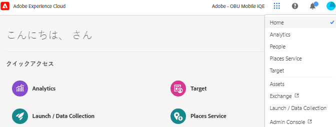
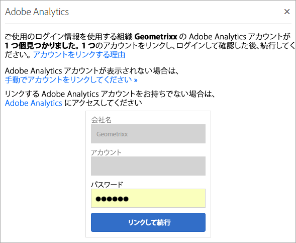
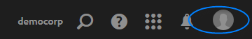

# 組織とアカウントのリンク

*組織* （組織ID）は、管理者がグループとユーザーを設定し、CX Enterpriseでのシングルサインオンを制御できるようにするエンティティです。

CXMは、あらゆるCX エンタープライズ製品とアプリケーションに対応するログイン企業のような役割を果たします。 ほとんどの場合、組織は勤務先の会社名です。 ただし、1 つの会社が多くの組織を持つことができます。

正しい組織にログインしていることを確認するには、**[!UICONTROL Profile]**&#x200B;をクリックしてデフォルトの組織名を表示します。 複数の組織にアクセスできる場合は、ヘッダーバーで別の組織を表示して切り替えることもできます。

>[!NOTE]
>
>組織を切り替えると、その組織のAdmin Consoleにアクセスできます。 目的の組織が表示されない場合は、その組織の管理者にアクセス権をリクエストする必要がある場合があります。 （複数のAdmin Consoleを統合する必要がある場合は、Adobe カスタマーサポートにお問い合わせください）。

## Federated ID

組織でFederated IDを使用している場合は、電子メールアドレスとパスワードを入力しなくても、組織のシングルサインオンでログインできます。 CX エンタープライズ URL （`https://experience.adobe.com`）に`#/sso:@domain`を追加して、このタスクを実行します。

例えば、Federated ID を持ち、ドメインが `example.com` の組織の場合、URL リンクを `https://experience.adobe.com/#/sso:@example.com` に設定します。 また、この URL にアプリケーションパスを付けてブックマークに追加することで、特定のアプリケーションに直接移動することもできます。 （例えば、Adobe Analytics の場合は `https://experience.adobe.com/#/sso:@example.com/analytics`。）

## 組織IDの表示

割り当てられた組織IDは、サポート目的で見つけることができます。 ヘッダーの&#x200B;**[!UICONTROL Organization]** セレクターを使用して、正しい組織に属していることを確認するか、組織間で切り替えることができます。

組織IDは、プロビジョニングされたCX Enterprise会社に関連付けられたIDです。 この ID は 24 文字の英数字から成る文字列の後に `@AdobeOrg`（必須）を付けたものです。

`https://experience.adobe.com`の任意のページのキーボードショートカット **Ctrl+i**&#x200B;を使用して、組織IDやその他のアカウント情報を表示できます。

**組織IDを表示するには**

1. [CX Enterprise](https://experience.adobe.com)で、キーボードの&#x200B;**Ctrl+i**&#x200B;を押します。

   

1. **[!UICONTROL User Information]**&#x200B;の下で&#x200B;**[!UICONTROL Current Org ID]**&#x200B;を探し、組織IDを見つけることができます。

   または、管理者はAdmin Consoleにログインし（[https://adminconsole.adobe.com](https://adminconsole.adobe.com)に移動）、URLで組織IDを確認できます。

   例として、次の URL を見てみましょう。

   `https://adminconsole.adobe.com/C538193582390300A495CC9@AdobeOrg/overview`

   ID は次のとおりです。

   `C538193582390300A495CC9@AdobeOrg`

## アプリケーションアカウントを Adobe ID にリンクする

通常、CX エンタープライズ管理者は、アプリケーションとサービスへのアクセス権を付与します。 まれに、アプリケーションの資格情報をAdobe IDにリンクできます。

1. CX Enterpriseへのメール招待状の手順に従います。

1. Adobe ID または Enterprise ID を使用してログインします。

1. **[!UICONTROL Application selector]**&#x200B;をクリックします。 （）。

   

   アクセスできるアプリケーションはカラー表示されます。

1. 目的のアプリケーションをクリックします。

   

   このタイプのメッセージは、ユーザーが適切なグループに属している（かつアプリケーションに対する権限を持っている）が、そのアカウントの資格情報をまだ Adobe ID にリンクしていない場合に表示されます。

1. 「**[!UICONTROL Link Account]**」をクリックし、資格情報を入力します。

## 既定の組織を指定

ログイン時に使用するデフォルトの組織を指定できます。

1. ヘッダーで「**[!UICONTROL Profile]**」をクリックし、「環境設定」をクリックします。

1. [!UICONTROL General]で、既定の組織を選択します。

## アカウントのリンクに関する問題のトラブルシューティング

アカウントのリンクに起因する問題に関するヘルプです。

一般的に、アカウントのリンクは、Adobe ID が以前のユーザーにリンクされていることが原因で失敗します。 アカウントのリンクに失敗した場合は、

* [アドビサポートにお問い合わせ](https://experienceleague.adobe.com/ja?support-solution=General&lang=ja#support)ください。
* 問題の解決中に、標準ログインを使用してアプリケーションにアクセスします。

