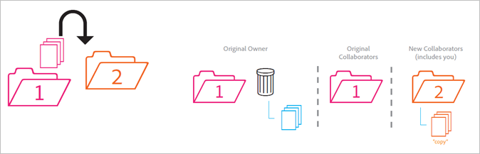

# 共有フォルダーの動作

共有フォルダーを移動、削除および復元するときの動作のルールについて説明します。

>[!NOTE]
>
>共有されている Experience Cloud フォルダーとアセットは、Creative Cloud デスクトップに 1 対 1 関係で複製されます。Experience Cloud ユーザーがフォルダーを変更（削除、追加、または共有の削除）すると、そのアクションは Creative Cloud デスクトップと web に反映されます。 したがって、フォルダーが非共有の場合、フォルダーとアセットはローカルマシンから削除されます。 共有が削除されると、フォルダーとその内容はローカルコンピューター上のごみ箱に移動します。ごみ箱に移動したフォルダーとその内容は、手動でお使いのコンピューターに復元できます。

## 非共有フォルダーを共有フォルダーに移動 {#section_A9BAC1A244A246A984AC62660E61E0C0}

非共有フォルダーを共有フォルダーに移動します。

**結果**：両方のフォルダーが共有されます。

## 共有フォルダーを非共有フォルダーに移動 {#section_8BA83001DCEC4CF084B980C4A660F59A}

共有フォルダーを非共有フォルダーに移動します。

**結果**：非共有フォルダーは非共有のままです。 共有フォルダーは共有のままです。

## 非共有フォルダーのコンテンツを共有フォルダーに移動 {#section_2941ED0DC52E4573AC1AB4C22313DD8E}

コンテンツを非共有フォルダーから共有フォルダーに移動します。

**結果：**&#x200B;内容が共有され、すべての共同作業者が内容を表示できるようになります。 ストレージは内容のサイズ分だけ増加します。

## 共有コンテンツをアーカイブまたは削除 {#section_5210D5F4943A44D0BA675D8EB4EAE20F}

共有フォルダーにあるコンテンツをアーカイブまたは削除します。

**結果：**&#x200B;内容はフォルダーの所有者用にアーカイブされます。 内容を所有していない共同作業者は、内容にアクセスできなくなります。

## 所有している共有コンテンツを非共有フォルダーに移動 {#section_3810A364B67E4B8C9CA244BC52BF91BB}

所有している共有フォルダーのコンテンツを非共有フォルダーに移動します。

**結果：**&#x200B;内容が非共有になります。 共有フォルダーの共同作業者は内容にアクセスできなくなります。

## 所有していないコンテンツを非共有フォルダーに移動 {#section_310766EBF0DC4C0BB4AB3E8A4DAEBE07}

コンテンツを他のユーザーが所有する共有フォルダーから非共有フォルダーに移動します。

**結果：**&#x200B;内容は非共有フォルダーに表示され、共有フォルダーから削除されます。 共有フォルダーの共同作業者は内容にアクセスできなくなります。 内容は共有フォルダーの所有者用にアーカイブされます。

所有者と編集者は所有していない内容を移動できますが、閲覧者は移動できません。 所有者と編集者が内容を移動した場合、どのユーザーの共有フォルダーでも内容は使用できません。

## 所有しているフォルダーをアーカイブまたは削除 {#section_B314B13512A5409C87C49DFDB7602E14}

所有している共有フォルダーを（web 経由で）アーカイブまたは（デスクトップ経由で）削除します。

**結果：**&#x200B;フォルダーは非共有になり、アーカイブされます。 共同作業者はフォルダーにアクセスできなくなります。

## 共有フォルダーを別の共有フォルダーに移動 {#section_0A3F203D048D4D1586E9850DC92C51E9}

所有している共有フォルダーを、所有している（または所有していない）別の共有フォルダーに移動します。

**結果：**&#x200B;フォルダーがフォルダー 2 に移動すると、新しい共同作業者と共有されます。

## 共有コンテンツを別の共有フォルダーに移動 {#section_69F6C312792A4CD2831BD14A340F850E}

コンテンツを共有フォルダーから別の共有フォルダーに移動します。

**結果：**&#x200B;内容はフォルダー 2 に表示され、新しい共同作業者と共有されます。 内容はフォルダー 1 から削除され、所有者にはアーカイブとして表示されますが、他の共同作業者は内容にアクセスできなくなります。

## コンテンツをアーカイブから復元 {#section_DEA990B3581741F89FBB81D18C2AB449}

共有フォルダーに属していた内容をアーカイブから復元します。 内容はアーカイブしたときに所有していたものです。

**結果：**&#x200B;内容は共有フォルダーに復元され、すべての共同作業者が再びアクセスできるようになります。 共有フォルダーが存在しなくなった場合、内容は元の親フォルダーの非共有コピーに配置されます。
