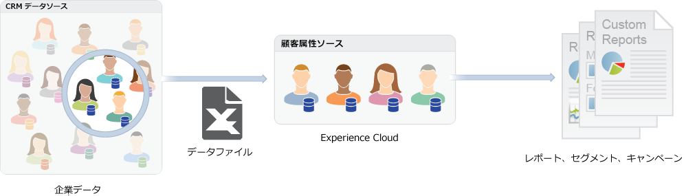

# [!DNL Customer Attributes] Experience Cloud中

[!DNL Customer Attributes] Experience Cloudでは、顧客関係管理（CRM）データベースから取り込んだ大規模法人データをアップロードできます。 データをExperience Cloudの顧客属性データソースにアップロードすると、そのデータをで使用できます [!DNL Adobe Analytics] および [!DNL Adobe Target].

## を見つけます。 [!DNL Customer Attributes] 機能

1. Experience Cloud にログインします。

1. に移動します。 **[!DNL Experience Platform]** > **[!UICONTROL 人物]** > **[!UICONTROL 顧客属性]**.

## アップロードの前提条件 [!DNL Customer Attributes] {#section_BD38693AFBF34926BA28E964963B4EA0}

* **ソリューションのイネーブルメント：** [ソリューションを Experience Platform サービスに対応させます](core-services.md#concept_07ED1D5C64234E77976E6D572E78FB9C)。

* **グループのメンバーシップ：**&#x200B;顧客属性データをアップロードするには、ユーザーは、[顧客属性グループ](admin-getting-started.md#task_3295A85536BF48899A1AB40D207E77E9)のメンバーである必要があります。また、Adobe Analytics グループまたは Adobe Target グループのいずれかに属している必要もあります。

  自社が顧客属性にアクセスできるかどうかを知るには、[!DNL Experience Cloud] 管理者が、[Experience Cloud](https://experience.adobe.com) にログインする必要があります。**[!UICONTROL 管理]**／**[!UICONTROL Admin Console]**／**[!UICONTROL グループ]**&#x200B;に移動します。次の場合 *[!DNL Customer Attributes]* 次のいずれかとして表示： [!UICONTROL 製品プロファイル]、開始する準備が整いました。

  に追加されたユーザー [!DNL Customer Attributes] を表示します [!UICONTROL 顧客属性] Experience Cloudインターフェイスの左側のメニュー項目。

* 顧客属性には、**Adobe Target** `at.js`（任意のバージョン）または `mbox.js` バージョン 58 以降が必要です。

  参照： [at.js のデプロイ方法](https://experienceleague.adobe.com/docs/target-dev/developer/client-side/overview.html?lang=en).

## 企業顧客データとは  {#section_6F34C29F11414842AA57D2B1248FA3C6}

企業データは様々なシステムに分散されています。企業データは複雑で、そのデータが持つ意味は人によって異なることがあります。このデータには、メンバーシップ、忠誠度、年齢、性別、所有する製品、興味、ライフタイム値などの情報が含まれます。

次に示すのは、製品の購読者データを示すデータファイルの例です。このデータには、メンバー ID、権利が付与されている製品、市場で最も多く発売されている製品などの情報が含まれています。

データファイルを作成したら、**[!UICONTROL Experience Cloud]**／**[!UICONTROL 顧客属性]**&#x200B;で作成する顧客属性ソースにアップロードできます。

このワークフローについては、[顧客属性データのアップロード](t-crs-usecase.md#task_BCC327B2A0EF4A1BBB2934013AB92B78)を参照してください。

## Analytics と Target における顧客属性の例 {#section_4E77650F6CEE4C4ABCD0B3221A5AE5D9}

データがExperience Cloudに格納されたら、それをカスタマイズして、レポート、セグメント化、アクティビティおよびキャンペーン用のソリューションに共有できます。

以下に例を示します。

| ソリューション | メリットと使用例 |
|--- |--- |
| Adobe Analytics | マーケターとアナリストは、次のことを把握できます。<ul><li>ゴールドレベルの顧客に最も効果的なオンラインキャンペーン。</li><li>ゴールドレベルの顧客が検索している製品と、プラチナレベルの顧客が検索している製品の違い。</li><li>サイトを再設計すると、古い顧客のコンバージョン率が向上するか。</li><li>ライフタイム値が低い顧客がサイトで調べる傾向にある製品です。</li></ul> |
| Adobe Target | Adobe Target ユーザーは、属性データを利用して次のことができます。<ul><li>ロイヤルティクラブメンバー専用の特別割引とオファーを表示する。</li><li>高級志向の顧客により高価な製品を勧める。</li><li>既にメールを受け取っている顧客に対し、通常はメールのサインアップ用に確保されているスペースにアップセルのオファーを表示する。</li></ul> |

{style="table-layout:auto"}
