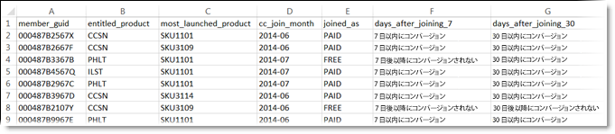

# 顧客属性

## 概要

[!UICONTROL 顧客属性] を検索するには **[!DNL Experience Platform]****[!UICONTROL 、ユーザー]** / **[!UICONTROL 顧客属性に移動します]**

エンタープライズ顧客データを顧客関係管理（CRM）データベースに取り込んでいる場合は、そのデータを Experience Cloud の顧客属性データソースにアップロードできます。アップロード後は、データを [!DNL Adobe Analytics] と [!DNL Adobe Target] で利用できます。

## 顧客属性をアップロードするための前提条件 {#section_BD38693AFBF34926BA28E964963B4EA0}

* **ソリューションの有効化：** [コアサービス向けにソリューションを有効化](../core-services/core-services.md#concept_07ED1D5C64234E77976E6D572E78FB9C)します。

* **グループのメンバーシップ：**&#x200B;顧客属性データをアップロードするには、ユーザーは、[顧客属性グループ](../admin-getting-started/admin-getting-started.md#task_3295A85536BF48899A1AB40D207E77E9)のメンバーである必要があります。また、Adobe Analytics グループまたは Adobe Target グループのいずれかに属している必要もあります。

   自社が顧客属性にアクセスできるかどうかを知るには、 [!DNL Experience Cloud] 管理者が、[!DNL Experience Cloud] にログインする必要があります。**[!UICONTROL 管理]**／**[!UICONTROL Admin Console を起動]**／**[!UICONTROL グループ]**&#x200B;に移動します。グループの 1 つとして&#x200B;*顧客属性*&#x200B;がある場合は、すぐに始めることができます。

   顧客属性グループに追加されたユーザーには、Experience Cloud インターフェイスの左側に[!UICONTROL 顧客属性]メニュー項目が表示されます。

* **ターゲット mbox：**&#x200B;顧客属性には、mbox.js バージョン 58 以降が必要です。

   [mbox.js の実装](https://marketing.adobe.com/resources/help/en_US/target/ov/t_mbox_download.html)を参照してください。

* **at.js：**&#x200B;すべてのバージョン。

## 企業顧客データとは{#section_6F34C29F11414842AA57D2B1248FA3C6}

企業データは様々なシステムに分散されています。企業データは複雑で、そのデータが持つ意味は人によって異なることがあります。このデータには、メンバーシップ、忠誠度、年齢、性別、所有する製品、興味、ライフタイム値などの情報が含まれます。

次に示すのは、製品の購読者データを示すデータファイルの例です。このデータには、メンバー ID、購入製品、最も頻繁に利用されている製品などの情報が含まれています。

作成したデータファイルは、**[!UICONTROL Experience Cloud]**／**[!UICONTROL 顧客属性]**&#x200B;を選択して作成する顧客属性ソースにアップロードできます。

このワークフローについては、[顧客属性データのアップロード](../attributes/t-crs-usecase.md#task_BCC327B2A0EF4A1BBB2934013AB92B78)を参照してください。

## ソリューションの使用例 {#section_4E77650F6CEE4C4ABCD0B3221A5AE5D9}

データを Experience Cloud にアップロードした後は、そのデータをカスタマイズし、レポート、セグメント化、アクティビティおよびキャンペーンで利用するためにソリューションで共有できます。

以下に例を示します。

| ソリューション | メリットと使用例 |
|--- |--- |
| Adobe Analytics | マーケターとアナリストは、次のことを把握できます。<ul><li>ゴールドレベルの顧客に最も効果的なオンラインキャンペーン。</li><li>ゴールドレベルの顧客が検索している製品と、プラチナレベルの顧客が検索している製品の違い。</li><li>サイトを再設計すると、古い顧客のコンバージョン率が向上するか。</li><li>ライフタイム値が低い顧客がサイトで調べる傾向にある製品は何か。</li></ul> |
| Adobe Target | Target ユーザーは、属性データを利用して次のことができます。<ul><li>ロイヤルティクラブメンバー専用の特別割引とオファーを表示する。</li><li>高級志向の顧客により高価な製品を勧める。</li><li>既に電子メールを受け取っている顧客に対し、通常は電子メールのサインアップ用に確保されているスペースにアップセルのオファーを表示する。</li></ul> |
