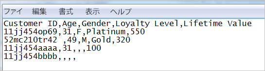

# 顧客属性のデータファイルおよびデータソースについて

顧客属性を Experience Cloud にアップロードするためのデータファイル要件および複数のデータソースに関する情報です。

CRMまたは企業の類似データにアクセスする必要があります。 Experience Cloud にアップロードするデータは `.csv` ファイルでなければなりません。FTP や sFTP を利用してアップロードする場合は、`.fin` ファイルもアップロードします。

顧客属性は、1 日に数ファイルを処理するように設計されています。小さなファイルを多数処理することで発生する問題を軽減するために、同じ組織から 30 分以内に送信されたファイルは、優先順位の低いキューにルーティングされます。

<!-- <p>Articulate difference between this and SAINT. </p> -->

## 許可されるファイルタイプと命名規則 {#section_6F64FA02ACCC4215B0862CB6A1821FBF}


<table id="table_C27955F6B52A45B28BEEAAF14FFC86D8"> 
 <thead> 
  <tr> 
   <th colname="col1" class="entry"> ファイルタイプ </th> 
   <th colname="col2" class="entry"> 説明 </th> 
  </tr> 
 </thead>
 <tbody> 
  <tr> 
   <td colname="col1"> <p> <span class="filepath"> .csv </span> </p> </td> 
   <td colname="col2"> <p>コンマ区切り値ファイル（Excelで作成したファイルなど）。 これは、顧客属性データを含むファイルです。 </p> <p> <b>命名規則：</b> ファイル名の拡張子に空白が含まれていないことを確認します。 </p> </td> 
  </tr> 
  <tr> 
   <td colname="col1"> <p> <span class="filepath"> .fin </span> </p> </td> 
   <td colname="col2"> <p>（必須）<span class="filepath">.fin</span> ファイルは、データのアップロードの終了をシステムに知らせます。<span class="filepath">.fin</span> ファイルの名前は <span class="filepath">.csv</span> ファイルの名前と一致する必要があります。 </p> <p>アドビは、<span class="filepath">.fin</span> 拡張子を持つ空のテキストファイルを作成することを推奨します。空のファイルを使用して容量やアップロード時間を節約できます。 </p> <p> <p>注意：<span class="filepath">.fin</span> ファイルのアップロード後にファイル名を変更することはできません。<span class="filepath">.fin</span> ファイルは別個にアップロードする必要があり、既にアップロード済みのファイルの名前を変更しても、.fin ファイルとしては認識されません。 </p> </p> <p><span class="filepath">.fin</span> ファイルを顧客属性 FTP でアップロードすると、データはすばやく取得されます（1 分以内）。これは、あまり頻繁にデータを取得しない（1 時間に 1 回程度）他のアドビ FTP ベースのシステムとは異なる点です。 </p> <p>Web の UI でドラッグ＆ドロップしてアップロードする場合、<span class="filepath">.fin</span> ファイルは不要です。 </p> </td> 
  </tr> 
  <tr> 
   <td colname="col1"> <p> <span class="filepath"> .gz</span> または <span class="filepath">.zip </span> </p> </td> 
   <td colname="col2"> <p> <span class="filepath">.gz</span>（gzip）または <span class="filepath">.zip</span> - 圧縮ファイル用。<span class="filepath">.zip</span> ファイルは、アーカイブに複数のファイルを含めることはできません。 </p> <p> <b>命名規則：</b><span class="filepath">.zip</span> または <span class="filepath">.gz</span> の名前は <span class="filepath">.csv</span> の名前と一致する必要があります。例えば、<span class="filepath">.csv</span> ファイルが <span class="filepath">crm_small.csv</span> の場合、<span class="filepath">.zip</span> ファイルは <span class="filepath">crm_small.csv.zip</span> である必要があります。 </p> <p>.fin ファイルは .csv のファイル名と拡張子以外が一致する必要があります。 </p> </td> 
  </tr> 
 </tbody> 
</table>


## 属性データファイルの要件 {#section_169FBF5B7BBA47CE825B7A330CF3FE98}


**CSVの例**

CSVファイルは、次の形式に従う必要があります。

サンプルCSV:


テキストエディターで表示したのと同じファイル：



**ガイドライン**

<table id="table_A9849CC9AA784763921DE057F0F61515"> 
 <thead> 
  <tr> 
   <th colname="col1" class="entry"> 項目 </th> 
   <th colname="col2" class="entry"> 説明 </th> 
  </tr> 
 </thead>
 <tbody> 
  <tr> 
   <td colname="col1"> <p>ドラッグ&amp;ドロップ </p> </td> 
   <td colname="col2"> <p>ドラッグ&amp;ドロップファイルは100 MB未満にする必要があります。 </p> <p>Web の UI でドラッグ＆ドロップしてアップロードする場合、<span class="filepath">.fin</span> ファイルは不要です。 </p> </td> 
  </tr> 
  <tr> 
   <td colname="col1"> <p>顧客ID列 </p> </td> 
   <td colname="col2"> <p> 最初の列は一意の顧客IDである必要があります。 使用するIDは、Experience Cloud IDサービスに渡されるIDに対応している必要があります。 </p> <p>Analyticsの場合、propまたはeVarに保存されるID。 </p> <p>Targetの場合、setCustomerID値。 (See <a href="../core-services/core-services.md#section_AD473A6A21C1446498E700363F9A8437" format="dita" scope="local"> Analytics &amp; Adobe Target - synching the customer ID </a>) </p> <p> この顧客IDは、CRMがデータベース内の各ユーザーに対して使用する一意の識別子です。 残りの列は、CRMから取得された属性です。 アップロードする属性の数を選択します。 </p> <p>列見出しにはわかりやすく読みやすい名前を付けることをお勧めしますが、必須ではありません。 アップロード後におこなうスキーマの検証の際に、アップロードされた行と列にわかりやすい名前をマッピングできます。 </p> <p> <b>顧客IDについて</b> </p> <p>通常、企業はCRMシステムの顧客IDを使用します。 この ID は、ユーザーのログイン時に <span class="codeph">setCustomerIDs</span> 呼び出しを使用して設定されます。このIDは、Experience CloudにアップロードされるCRMファイルのキーとしても使用されます。 An <a href="../attributes/t-crs-usecase.md#task_09DAC0F2B76141E491721C1E679AABC8" format="dita" scope="local"> Alias ID </a> is a friendly name for a data store in Audience Manager, where the alias data is stored. システムは、エイリアスを（setCustomerIDsを介して）このデータストアに送信します。 CRMファイルは、そのデータストア内のデータに適用されます。 </p> <p><span class="codeph">setCustomerIDs</span> 情報については、<a href="https://docs.adobe.com/content/help/en/id-service/using/reference/authenticated-state.html" format="https" scope="external">顧客 ID と認証の状態</a>を参照してください。 </p> </td> 
  </tr> 
  <tr> 
   <td colname="col1"> <p>後続のヘッダーと列 </p> </td> 
   <td colname="col2"> <p>後続のヘッダーは、各属性の名前を表す必要があります。 </p> <p> これらの列には、CRMの顧客属性が含まれている必要があります。 </p> </td> 
  </tr> 
  <tr> 
   <td colname="col1"> <p>属性の制限 </p> </td> 
   <td colname="col2"> <p>数百の <span class="filepath">.csv</span> 列を Experience Cloud の顧客属性サービスにアップロードできます。ただし、購読を設定して属性を選択する場合、所有するソリューションに応じて、次の制限が適用されます。 </p> <p> 
     <ul id="ul_2BB85067918D4BB3B59394F3E3E37A6D"> 
      <li id="li_93703988B9934384B4B94A839D028380"> <b>Analytics Standard：</b>合計 3 件 </li> 
      <li id="li_D1E5E7BD24C54591B14D15DE97447835"> <b>Analytics Premium：</b>レポートスイートあたり 200 件 </li> 
      <li id="li_8C891FE3D1EF49FA9F81E2E32CD0B9CA"> <b>Adobe Target Standard:</b> 5 </li> 
      <li id="li_2B66D43023F34EA685CE2C38A9250CEA"> <b>Adobe Target Premium:</b> 200 </li> 
     </ul> </p> </td> 
  </tr> 
  <tr> 
   <td colname="col1"> <p>行の制限 </p> </td> 
   <td colname="col2"> <p>行数に対する既知の制限はありません。 </p> </td> 
  </tr> 
  <tr> 
   <td colname="col1"> <p>列の制限 </p> </td> 
   <td colname="col2"> <p>実際的には、列数を200前後に制限します。 </p> </td> 
  </tr> 
  <tr> 
   <td colname="col1"> <p>文字制限 </p> </td> 
   <td colname="col2"> <p>Analyticsサブスクリプションを作成すると、アップロードされたファイルのフィールドの長さが255文字に切り捨てられます。 </p> </td> 
  </tr> 
  <tr> 
   <td colname="col1"> <p>FTPのガイドラインとサイズの制限 </p> </td> 
   <td colname="col2"> <p> 
     <ul id="ul_E157EE6F98914EADA0C103D1D1E705D3"> 
      <li id="li_84FBD455DD164A28AC16F4A5AB19E4B3">FTP のファイルサイズの上限は、各アップロードで 4 GB です。 </li> 
      <li>ファイルサイズの下限は、各アップロードで 10 MB です。 </li>
      <li>30 分ごとに 1 つのファイルをアップロードできます。 </li>
      <li id="li_B69A20C51D824727AA99C1F6F78537A4"> <span class="filepath">.csv</span>（および <span class="filepath">.fin</span>）ファイルを FTP サイトのルートフォルダーにアップロードする必要があります。 </li> 
     </ul> </p> <p> <p>重要：FTP アカウントの合計許容量は 40 GB です。処理済みのファイルを削除するのは、お客様の責任です。 </p> </p> </td> 
  </tr> 
  <tr> 
   <td colname="col1"> <p>ファイル要件 </p> </td> 
   <td colname="col2"> <p> 各属性ソースには、コンマで区切られた同じ数のフィールドを含める必要があります。 </p> <p> 改行、二重引用符、またはコンマを含むフィールドは引用符で囲む必要があります。 </p> <p> フィールド内の二重引用符文字は、バックスラッシュ(\)を使用してエスケープする必要があります。 </p> <p> 空白の列は<span class="term">Null</span> として保存されます。 </p> </td> 
  </tr> 
  <tr> 
   <td colname="col1"> <p>複数のファイル </p> </td> 
   <td colname="col2"> <p>顧客属性データをアップロードする際、連続してアップロードする複数のファイルがある場合（特にファイルが大きい場合）は、前のファイルが処理されていることを確認してから次のファイルをアップロードするようにしてください。これを監視するには、前のファイルが顧客属性 FTP アカウント内の処理済みフォルダーまたは失敗フォルダーに移動したタイミングを確認します。 </p> <p> 大きなファイルを小さなファイルに分割し、それらを短時間で連続して送信すると、次のファイルを送信する前に各ファイルが完全に処理されない限り、処理速度が低下する可能性があります。 </p> </td> 
  </tr> 
  <tr> 
   <td colname="col1"> <p>文字エンコーディング </p> </td> 
   <td colname="col2"> <p>日本の場合、UTF-8は必須です。 </p> </td> 
  </tr> 
   <tr> 
   <td colname="col1"> <p>履歴データ </p> </td> 
   <td colname="col2"> <p> 顧客属性は、Analyticsの基になる訪問者プロファイルに結び付けられます。 したがって、顧客属性は、Analyticsでのその訪問者プロファイルの全期間にわたって、訪問者に関連付けられます。 これには、顧客が初めてログインする前に発生した動作も含まれます。 </p> <p> Data Warehouseのバックフィル方式を使用する場合、データはAnalytics ID(AID)に基づくpost_visid_high/lowに結び付けられます。 Experience Cloud IDサービスを使用している場合、データはExperience Cloud ID(MID)に基づくpost_visid_high/lowに結び付けられます。 </p> </td> 
  </tr> 
  <tr> 
   <td colname="col1"> <p>データフィード </p> </td> 
   <td colname="col2"> <p>顧客属性は、データフィードでは使用できません。 </p> </td> 
  </tr> 
 </tbody> 
</table>


## 複数のデータソースの活用 {#section_76DEB6001C614F4DB8BCC3E5D05088CB}

顧客属性ソースを作成、変更または削除すると、IDが新しいデータソースと同期され始める前に約1時間遅延が発生します。

各顧客属性ソースのエイリアスIDは一意である必要があります。 同じIDを利用する複数のデータソースがある場合は、次のように設定する必要があります。

**Dynamic Tag ManagementのVisitorAPI.jsまたはExperience Cloud IDツール：**

適切なデータソースに対応する 2 つの顧客 ID を設定します。

```
Visitor.setCustomerIDs({ 
     "ds_id1”:"123456", 
     "ds_id2":"123456" 
});
```

(See [Customer IDs and Authentication States](https://docs.adobe.com/content/help/en/id-service/using/reference/authenticated-state.html) for more information.)

In the **[!UICONTROL Experience Cloud]** > **[!UICONTROL People]** > **[!UICONTROL Customer Attributes]**:

上記の顧客IDに対応する一意のエイリアスIDを使用して、2つの顧客属性ソースを作成します。 この方法を使用すると、同じ参照IDを複数の顧客属性ソースに送信できます
