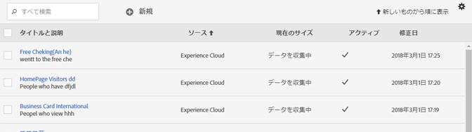
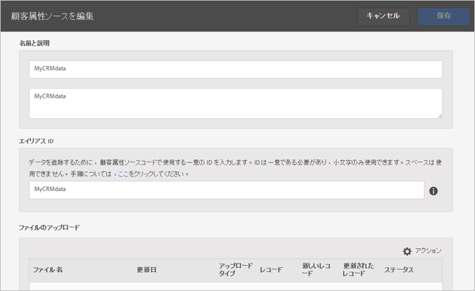
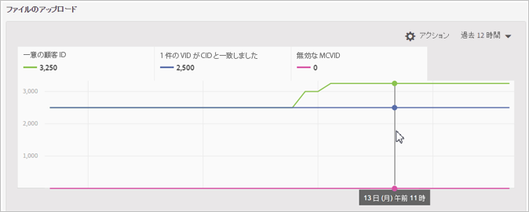
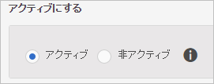
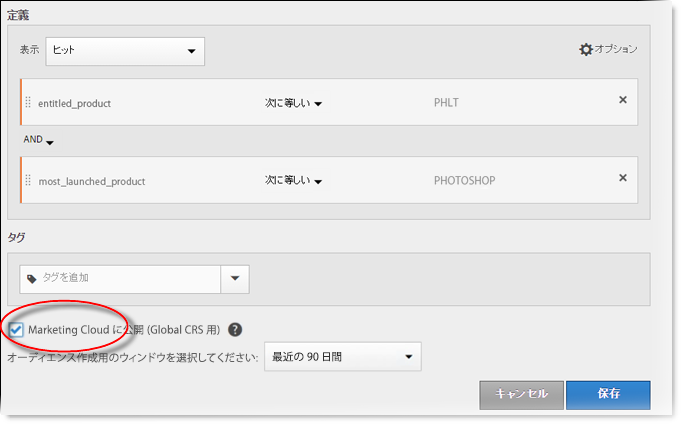
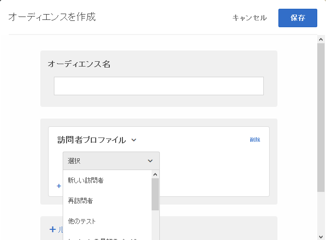

# 顧客属性ソースの作成とデータファイルのアップロード

顧客属性ソース（CSV および FIN ファイル）を作成してデータをアップロードします。準備できたら、データソースをアクティブ化できます。データソースがアクティブになったら、属性データを Analytics と Target で共有します。

## 顧客属性のワークフロー {#concept_BF0AF88E9EF841219ED4D10754CD7154}


1. [データファイルの作成](../attributes/t-crs-usecase.md#task_B5FB8C0649374C7A94C45DCF2878EA1A)
1. [属性ソースの作成とデータファイルのアップロード](../attributes/t-crs-usecase.md#task_09DAC0F2B76141E491721C1E679AABC8)
1. [スキーマの検証](../attributes/t-crs-usecase.md#task_09DAC0F2B76141E491721C1E679AABC8)
1. [購読の設定と属性ソースの有効化](../attributes/t-crs-usecase.md#task_1ACA21198F0E46A897A320C244DFF6EA)

データソースがアクティブになると、以下のことが可能になります。

* [Adobe Analytics での顧客属性の使用](../attributes/t-crs-usecase.md#task_7EB0680540CE4B65911B2C779210915D)
* [Adobe Target での顧客属性の使用](../attributes/t-crs-usecase.md#task_FC5F9D9059114027B62DB9B1C7D9E257)

>[!IMPORTANT]
>
>この機能にアクセスするには、ユーザーが「顧客属性」製品プロファイル（顧客属性 - デフォルトのアクセス）に割り当てられている必要があります&#x200B;**[!UICONTROL 管理]**／**[!UICONTROL Admin Console]**／**[!UICONTROL グループ]**&#x200B;に移動します。[!UICONTROL 製品プロファイル]の 1 つとして&#x200B;*顧客属性*&#x200B;がある場合は、すぐに始めることができます。顧客属性グループに追加されたユーザーには、Experience Cloud インターフェイスの左側に「[!UICONTROL 顧客属性]」メニューが表示されます。
>
>また、顧客属性機能を使用するには、ユーザーがソリューションレベルのグループ（Analytics または [!DNL Target]）に属している必要があります。

[Experience Cloud ユーザーと製品の管理](../admin-getting-started/admin-getting-started.md#task_3295A85536BF48899A1AB40D207E77E9)を参照してください。

## データファイルの作成 {#task_B5FB8C0649374C7A94C45DCF2878EA1A}

このデータは、CRM の企業顧客データです。データには、メンバー ID、権限付与されている製品、最も頻繁に起動する製品など、製品に関する購読者データが含まれます。

1. `.csv` を作成します。

   >[!NOTE]
   >
   >このプロセスの後半で、`.csv` をドラッグ＆ドロップしてファイルをアップロードします。[FTP を使用してアップロード](../attributes/t-upload-attributes-ftp.md#task_591C3B6733424718A62453D2F8ADF73B)する場合は、`.csv` と同じ名前の `.fin` ファイルも必要です。

   企業顧客データファイルの例：

   

1. 続行する場合は、ファイルをアップロードする前に[データファイル要件](../attributes/crs-data-file.md#concept_DE908F362DF24172BFEF48E1797DAF19)の重要な情報を確認してください。
1. 以下に説明するように、[顧客属性ソースを作成してデータファイルをアップロードします](../attributes/t-crs-usecase.md#task_BCC327B2A0EF4A1BBB2934013AB92B78)。

## 属性ソースの作成とデータファイルのアップロード {#task_09DAC0F2B76141E491721C1E679AABC8}

Experience Cloud の新しい顧客属性ソースを作成ページでこれらの手順を実行します。

>[!IMPORTANT]
>
>顧客属性ソースを作成、変更または削除する場合、ID が新しいデータソースと同期され始めるまで、最大 1 時間の遅延があります。顧客属性ソースを作成または変更するには、Audience Manager の管理者権限が必要です。Audience Manager カスタマーケアまたはコンサルティングに問い合わせて、管理者権限を取得してください。

1. [!DNL Experience Cloud] で、メニュー  アイコンをクリックします。
1. **[!DNL Experience Platform]** で、**[!UICONTROL People]**／**[!UICONTROL 顧客属性]**&#x200B;をクリックします。

   [!UICONTROL 顧客属性]ページでは、既存の属性データソースを管理したり、編集したりできます。

   
1. 「**[!UICONTROL 新規]**」をクリックします。

   
1. [!UICONTROL 顧客属性ソースを編集]ページで、以下のフィールドを設定します。

   * **[!UICONTROL 名前：]**&#x200B;データ属性ソースのわかりやすい名前。[!DNL Adobe Target] の場合、属性名にスペースを含めることはできません。スペースを含む属性が渡された場合、[!DNL Target] はその属性を無視します。次の文字もサポートされていません。`< , >, ', "`

   * **[!UICONTROL 説明：]**（オプション）データ属性ソースの説明。

   * **[!UICONTROL エイリアス ID：]**&#x200B;特定の CRM システムなど、顧客属性データのソースを表します。顧客属性ソースのコードで使用される一意の ID です。ID は一意で、スペースを含まないアルファベットおよびアンダースコアの組み合わせにしてください。Experience Cloud UI で顧客属性ソースのエイリアス ID フィールドに入力する値は、実装から（Dynamic Tag Management または Mobile SDK の JavaScript を使用して）渡されている値と一致させる必要があります。

      エイリアス ID は、追加の顧客 ID 値を設定する方法に対応しています。以下に例を示します。

      * **Dynamic Tag Management：**&#x200B;エイリアス ID は、[Experience Cloud ID サービス](https://docs.adobe.com/content/help/ja-JP/dtm/using/tools/macid.html)ツールの「[!UICONTROL 顧客設定]」の「*統合コード*」の値に対応しています。

      * **訪問者 API：**&#x200B;エイリアス ID は、各訪問者と関連付けることができる追加の[顧客 ID](https://docs.adobe.com/content/help/ja-JP/id-service/using/reference/authenticated-state.html) に対応しています。

         例：*crm_id* の場合：

         ```
         "crm_id":"67312378756723456"
         ```

      * **iOS：** エイリアス ID は [visitorSyncIdentifiers:identifiers](https://docs.adobe.com/content/help/ja-JP/mobile-services/ios/overview.html) の *&quot;idType&quot;* に対応しています。

         以下に例を示します。

         `[ADBMobile visitorSyncIdentifiers:@{@<`**`"idType"`**`:@"idValue"}];`

      * **Android：** エイリアス ID は [syncIdentifiers](https://docs.adobe.com/content/help/ja-JP/mobile-services/android/overview.html) の *&quot;idType&quot;* に対応しています。

         以下に例を示します。

         `identifiers.put(`**`"idType"`**`, "idValue");`

         エイリアス ID フィールドおよび顧客 ID に関するデータ処理の詳しい情報については、[複数のデータソースの活用](../attributes/crs-data-file.md#section_76DEB6001C614F4DB8BCC3E5D05088CB)を参照してください。
   * **[!UICONTROL ファイルのアップロード：]** `.csv` データファイルをドラッグ＆ドロップしたり、FTP を使用してデータをアップロードできます（FTP を使用するには、`.fin` ファイルも必要です）。[FTP を使用したデータのアップロード](../attributes/t-upload-attributes-ftp.md#task_591C3B6733424718A62453D2F8ADF73B)を参照してください。

      >[!IMPORTANT]
      >
      >特定のデータファイル要件が存在します。詳しくは、[データファイル要件](../attributes/crs-data-file.md#concept_DE908F362DF24172BFEF48E1797DAF19)を参照してください。


      ファイルをアップロードすると、このページの「[!UICONTROL ファイルのアップロード]」見出しの下に、表データが表示されます。スキーマを検証したり、購読を設定したり、FTP を設定したりできます。

      **ファイルのアップロードのグラフ**

      

   * **[!UICONTROL 一意の顧客 ID：]**&#x200B;この属性ソースにアップロードした重複を除く一意の ID の数を表示します。

   * **[!UICONTROL Experience Cloud 訪問者 ID にエイリアスされた顧客提供 ID：]** Experience Cloud 訪問者 ID にエイリアスされた ID の数を表示します。

   * **[!UICONTROL エイリアス数の多い顧客提供 ID：]**&#x200B;エイリアスされた Experience Cloud 訪問者 ID が 500 以上ある、顧客提供 ID の数を表示します。このような顧客提供 ID は、個人ではなくある種の共有ログインを表している可能性が最も高くなります。これらの ID に関連付けられた属性は、エイリアス数が 10,000 に達するまで、直近にエイリアスされた 500 個の Experience Cloud 訪問者 ID に振り分けられます。エイリアス数が 10,000 に達すると、顧客提供 ID は無効になり、関連付けられた属性の振り分けはおこなわれなくなります。


## スキーマの検証 {#task_404AAC411B0D4E129AB3AC8B7BE85859}

検証プロセスでは、アップロードした属性（文字列、整数、数値など）に表示名と説明をマッピングできます。また、スキーマを更新して属性を削除することもできます。

[スキーマの検証](../attributes/validate-schema.md#concept_B3A01A15D04E4F998118E09B3A9B5043)を参照してください。

属性を削除するには、[（オプション）スキーマの更新（属性の削除）](../attributes/t-crs-usecase.md#task_6568898BB7C44A42ABFB86532B89063C)を参照してください。

## （オプション）スキーマの更新（属性の削除） {#task_6568898BB7C44A42ABFB86532B89063C}

スキーマの属性を削除したり属性を置換したりする方法。

1. [!UICONTROL 顧客属性ソースを編集]ページで、**[!UICONTROL Target]** または **[!UICONTROL Analytics]** サブスクリプション（「[!UICONTROL サブスクリプションの設定]」の下）を削除します。
1. [更新されたフィールドを含む新しいデータファイルをアップロードします](../attributes/t-crs-usecase.md#task_09DAC0F2B76141E491721C1E679AABC8)。

## 購読の設定と属性ソースの有効化 {#task_1ACA21198F0E46A897A320C244DFF6EA}

購読を設定すると、Experience Cloud とソリューション間のデータフローが設定されます。属性ソースを有効化すると、購読しているソリューションでデータが利用できるようになります。アップロードした顧客レコードは、Web サイトまたはアプリケーションから入ってくる ID 信号と照合されます。

詳しくは、[サブスクリプションの設定](../attributes/subscription.md#concept_ECA3C44FA6D540C89CC04BA3C49E63BF)を参照してください。

**属性ソースを有効化するには**

[!UICONTROL 新しい顧客属性ソースを作成 [または] 顧客属性ソースを編集]ページで、[!UICONTROL アクティブにする]見出しを探し、「**[!UICONTROL アクティブ]**」をクリックします。



## Adobe Analytics での顧客属性の使用 {#task_7EB0680540CE4B65911B2C779210915D}

Adobe Analytics などのソリューションで利用できるデータを使用して、データをレポートし、分析し、マーケティングキャンペーンで適切な対応をとることができます。

以下の例は、アップロードした属性に基づいた [!DNL Analytics] セグメントを示しています。このセグメントは、最も頻繁に起動する製品が Photoshop である [!DNL Photoshop Lightroom] の購読者を示しています。



セグメントを Experience Cloud に公開すると、Experience Cloud Audiences と Audience Manager で利用できるようになります。

詳しくは、Analytics ヘルプの[顧客属性レポート](https://docs.adobe.com/content/help/ja-JP/core-services/interface/customer-attributes/attributes.html)を参照してください。

## Adobe Target での顧客属性の使用 {#task_FC5F9D9059114027B62DB9B1C7D9E257}

[!DNL Target] では、オーディエンスの作成時に「[!UICONTROL 訪問者プロファイル]」セクションから顧客属性を選択できます。すべての顧客属性には、リストにプレフィックス [!DNL crs.] が付きます。これらの属性を、必要に応じて他のデータ属性と組み合わせることで、オーディエンスを構築します。



[!DNL Target] ヘルプの[新しいオーディエンスの作成](https://docs.adobe.com/content/help/ja-JP/target/using/audiences/create-audiences/audiences.html)を参照してください。
