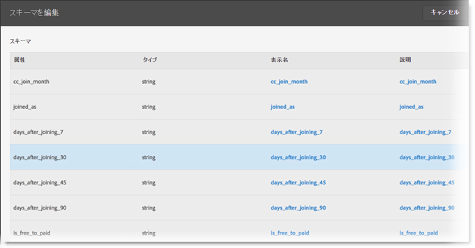

# スキーマの検証

検証プロセスでは、アップロードした属性（文字列、整数、数値など）に表示名と説明をマッピングできます。これらの設定に基づいてスキーマが作成されます。このスキーマは、このデータソースに今後アップロードされるすべてのデータの検証に使用されます。このマッピングプロセスによって元のデータが変更されることはありません。

>[!NOTE]
>
>検証後にスキーマを更新すると、顧客属性が削除されます。 [スキーマの更新（属性の削除）](../attributes/t-crs-usecase.md#task_6568898BB7C44A42ABFB86532B89063C)を参照してください。

**[!UICONTROL 顧客属性ソース]**／**[!UICONTROL 新しい顧客属性ソースを作成]**／**[!UICONTROL スキーマを表示 / 編集]**

[!UICONTROL スキーマの検証]ページでは、スキーマの各行は、アップロードされた CSV ファイルの列を表しています。

* **[!UICONTROL データの追加：]**&#x200B;新しい属性データをこのデータソースにアップロードできます。

* **[!UICONTROL スキーマを表示 / 編集：]**&#x200B;次の手順で説明するように、表示名を属性データにマッピングします。

* **[!UICONTROL FTP のセットアップ：]**[ FTP を使用してデータをアップロードします](../attributes/t-upload-attributes-ftp.md#task_591C3B6733424718A62453D2F8ADF73B)。

* **[!UICONTROL ID 検索：]**`.csv` から顧客 ID（CID）を入力して、その ID の Experience Cloud 情報を検索します。この機能は、訪問者に対して属性データが表示されない理由をトラブルシューティングするのに役立ちます。

   * **[!UICONTROL ECID（Experience Cloud ID）：]**&#x200B;最新の Experience Cloud ID サービスを使用している場合に表示されます。MCID サービスを使用していても、ここに ID がリストされない場合、Experience Cloud はその CID のエイリアスを受け取っていません。つまり、その訪問者がログインしていないか、実装がその ID を渡していません。

   * **[!UICONTROL CID（顧客 ID）：]**&#x200B;この CID と関連付けられている属性。prop または eVar を使用して CID（AVID）をアップロードし、属性は表示されるが AVID は表示されない場合は、訪問者がサイトにログインしていないことを意味します。

   * **[!UICONTROL AVID（Analytics 訪問者 ID）：]** prop または eVar を使用して CID をアップロードする場合に表示されます。これらの ID が Experience Cloud に渡されている場合、入力した CID に関連付けられている訪問者 ID がここに表示されます。

Experience Cloud に顧客属性ソースと FTP アカウントを作成したら、FTP を使用してデータをアップロードすることもできます。属性ソースごとに 1 つの FTP アカウントを作成できます。アップロードしたファイルは、そのアカウントのルートフォルダーに保存されます。データは .csv 形式にする必要があります。2 つ目の .fin ファイルは、アップロードが完了したことを示します。

文字列、整数および数値に適用する名前は、[!DNL Analytics] 指標の作成に使用されます。詳しくは、[!DNL Analytics] ヘルプの[顧客属性レポート](https://docs.adobe.com/help/ja-JP/analytics/components/variables/dimensions-reports/reports-customer-attributes.html)を参照してください。

* **[!UICONTROL 属性：]**&#x200B;アップロードされた `.csv` ファイルから読み出された属性データ。

* **[!UICONTROL タイプ：]**&#x200B;データタイプ。次のようなものがあります。

   * **文字列：**&#x200B;一連の文字。

   * **整数：** ゼロ、正の自然数および負の自然数。

   * **数値：**&#x200B;小数第 2 位まで取ることができます。

* **[!UICONTROL 表示名：]**&#x200B;属性のわかりやすい名前。例えば、*顧客の年齢*&#x200B;を、*顧客となった年数*&#x200B;に変更できます。

* **[!UICONTROL 説明：]**&#x200B;属性のわかりやすい説明。
