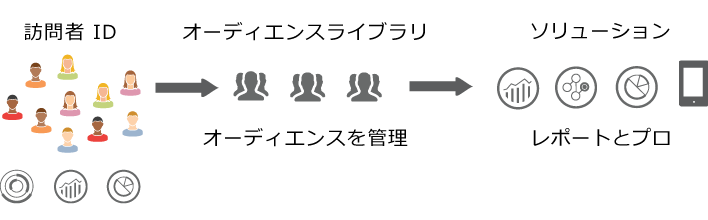

# Experience Cloud Audiences {#topic_679810123CAA4E0CA4FA3417FB0100C7}

オーディエンスは、訪問者の集合（訪問者 ID のリスト）です。アドビのオーディエンスライブラリで、訪問者データからオーディエンスのセグメント化への変換を管理します。したがって、オーディエンスの作成と管理は、セグメントの作成と使用に似ています。オーディエンスセグメントは、[!DNL Experience Cloud] の製品やサービスと共有することもできます。

オーディエンスは、次のような各種ソースから作成または取得できます。

* [!DNL Experience Cloud] で作成される新しいソース
* [!DNL Experience Cloud] に公開された [!DNL Analytics] セグメント
* [!DNL Audience Manager]

**リアルタイムオーディエンスと履歴オーディエンスの比較**

どのオーディエンスも、そのソースを問わず、リアルタイムターゲティングの用途で使用できます。ただし、Analytics から Audience Manager に共有されたオーディエンスは、リアルタイムターゲティング用にはアクセスできません。システムは、オーディエンスを 2 つの方法で評価します。

* Analytics の履歴オーディエンスは 4 時間ごとに評価されます。処理して共有するのに、合計で最大 8 時間かかる場合があります。履歴オーディエンスには常にリターン訪問者が含まれます。
* リアルタイムオーディエンスは Experience Cloud Audiences をソースとし、リアルタイムで評価されます。

## アプリケーションでのオーディエンスの使用方法 {#concept_01EB9345C5344597BC94A864EDD38EE1}

次の表に、オーディエンスがアプリケーションアプリケーションでどのように使用されるかをExperience Cloudします。

| ソリューション | 説明 |
|--- |--- |
| Experience Cloud Audiences | [オーディエンスライブラリ](audience-library.md)インターフェイスで直接、オーディエンスを作成、管理、共有します。次のことができます。<ul><li>Analytics の生データを使用して、リアルタイムオーディエンスを使用する。</li><li>オーディエンスを結合して、リアルタイムデータと履歴データを合成したオーディエンスを作成する。</li><li>推定オーディエンスサイズをグラフィック表示する。</li></ul>  作成するオーディエンスタイプについての推奨事項については、[Experience Cloud Audiences ](https://experienceleague.adobe.com/docs/experience-cloud-kcs/kbarticles/KA-16471.html?lang=ja)を参照してください。 |
| Analytics | セグメンテーションでは、セグメントを構築してレポートスイートと組み合わせ、Experience Cloud にセグメントを公開できます。セグメントを公開すると、Experience Cloud の[!UICONTROL オーディエンスライブラリ]ページに表示されます（詳しくは、Analytics ヘルプの [Experience Cloud にセグメントを公開](https://experienceleague.adobe.com/docs/analytics/components/segmentation/segmentation-workflow/seg-publish.html?lang=ja)を参照）。また、オーディエンスは、Adobe Target によって提供されるキャンペーンエクスペリエンスの対象オーディエンスとして使用したり、Audience Manager で使用したりできます。Adobe Analytics からオーディエンスを共有し、アクティブなキャンペーンで使用するために選択すると、過去 90 日間にセグメント定義条件を満たした訪問者プロファイルが [!UICONTROL Audience Services] に送信されます。共有オーディエンス数の上限は 75 に増えました。Analytics から Experience Cloud に共有するオーディエンスのユニークメンバー数が 2,000 万を超えてはなりません。キャッシュの影響で、Analytics で削除したレポートスイートが Experience Cloud に反映されるまで 12 時間かかります。 |
| Mobile Services | [!UICONTROL デバイスタイプ]レポートのサンバーストによるビジュアライゼーションを使用してモバイルトラフィックを分析します。 |
| [!DNL Target] | この [ID サービス](https://experienceleague.adobe.com/docs/id-service/using/home.html?lang=ja) は、訪問者 ID とデータを、アプリケーション全体で使用できる単一の実行可能なプロファイルに統合します。 「[Experience Cloud に公開](audience-library.md)」チェックボックスを Adobe Analytics でセグメント作成処理中にオンにすると、Adobe Target のカスタムオーディエンスライブラリ内でセグメントを使用できるようになります。Analytics または Audience Manager で作成されたセグメントは、[!DNL Target] のアクティビティで使用できます。例えば、[!DNL Analytics] コンバージョン指標および [!DNL Analytics] で作成されたオーディエンスセグメントに基づいてキャンペーンアクティビティを作成できます。 |
| Audience Manager | 共有オーディエンスは、Audience Manager でのセグメント化に使用できます。Experience Cloud のオーディエンスはすべて、Audience Manager でネイティブに使用できます。Audience Manager は以下に対応しています。<ul><li>アプリケーションワークフローでの共有および使用方法に関する組み込みの自動化</li><li>他ツールとのデータ連携</li><li>類似モデリング</li></ul> |
| Campaign | <ul><li>別のAdobe Experience CloudアプリケーションからAdobe Campaignに共有オーディエンスをインポートします。</li><li>共有オーディエンスの形式で受信者リストを書き出す。これらの共有オーディエンスは、使用する別のAdobe Experience Cloudアプリケーションで使用できます。</li></ul> |
| Advertising Cloud | オーディエンスをターゲットとして使用します。 |

{style=&quot;table-layout:auto&quot;}

>[!IMPORTANT]
>
>訪問者が Analytics から共有されるオーディエンスの資格を得てから、その情報が [!DNL Target]、Ad Cloud および Campaign Standard で対応可能になるまでに、4～8 時間の遅延があります。

## その他のヘルプ情報 - 質問、ガイダンス、使用例 {#section_C7F151644D8A45F7B6FC54F58845635D}

| ヘルプの内容 | リソース |
|--- |--- |
| オーディエンスが見つからない場合 | プロビジョニングが完了していることを確認します。詳しくは、 [はじめに — コアサービス向けにアプリケーションを有効化](core-services.md). [ここ](https://adobe.allegiancetech.com/cgi-bin/qwebcorporate.dll?idx=X8SVES)から Profiles &amp; Audiences へのアクセス権をリクエストします（統合プロビジョニングフォーム）。 |
| ユースケース | 使用するアプリケーションの詳細については、 [オーディエンス作成オプション](https://experienceleague.adobe.com/docs/experience-cloud-kcs/kbarticles/KA-16471.html?lang=en) を参照してください。 |
| フォーラム | [Audiences フォーラム](https://experienceleaguecommunities.adobe.com/t5/Adobe-Experience-Cloud-Audiences/ct-p/experience-cloud-audiences-community)でも、オーディエンスを活用するうえで役立つリソースを入手できます。 |

{style=&quot;table-layout:auto&quot;}

## オーディエンスライブラリのインターフェイス要素 {#section_D04ACEF61CEF4B189AE6BA9F40D0DBF4}

[!DNL Experience Cloud] は、ネイティブのリアルタイムオーディエンス識別機能と共に、オーディエンスを作成および管理するためのライブラリを提供します。

**[!UICONTROL Experience Cloud]**／**[!UICONTROL Experience Platform]**／**[!UICONTROL People]**／**[!UICONTROL オーディエンスライブラリ]**

| 要素 | 説明 |
|--- |--- |
| 新規 | [オーディエンスを作成](audience-library.md)します。 |
| タイトルと説明 | オーディエンスを識別および説明する列見出し。 |
| 作成者 | オーディエンスセグメントを作成したユーザー。 |
| ソース | オーディエンスが作成された場所を示します。<ul><li>**Analytics：** Adobe Analytics で作成され、[Experience Cloud に公開された](audience-library.md)セグメント。</li><li>**Experience Cloud：**[Experience Cloud Audiences で作成された](audience-library.md)新しいオーディエンス。</li><li>**Audience Manager：** Audience Manager で作成されたオーディエンスは Experience Cloud Audiences に自動的に表示されます。</li></ul> |
| 現在のサイズ | 現在のオーディエンスのサイズ。 |
| アクティブ | セグメントのアクティブステータス。 |

{style=&quot;table-layout:auto&quot;}
