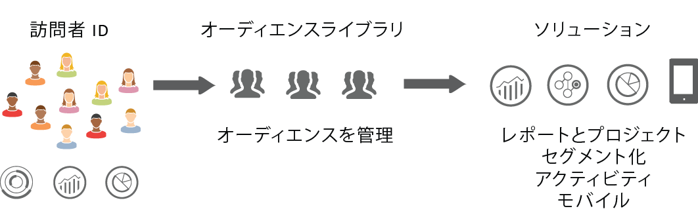
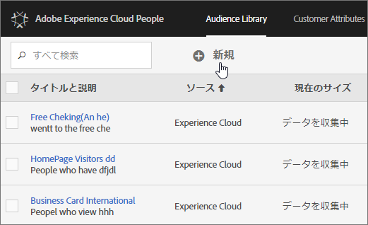

# Experience Cloud Audiences {#topic_679810123CAA4E0CA4FA3417FB0100C7}

オーディエンスは、訪問者の集合（訪問者 ID のリスト）です。アドビのオーディエンスライブラリで、訪問者データからオーディエンスのセグメント化への変換を管理します。したがって、オーディエンスを作成および管理することは、セグメントを作成および使用することに似ています。また、オーディエンスセグメントを [!DNL Experience Cloud] で製品やサービスと共有することもできます。

オーディエンスは、次のような各種ソースから作成または取得できます。

* [!DNL Experience Cloud] で作成される新しいソース
* [!DNL Analytics] に公開された [!DNL Experience Cloud] セグメントから
* 送信元 [!DNL Audience Manager]

**リアルタイムオーディエンスと履歴オーディエンスの比較**

どのオーディエンスも、そのソースを問わず、リアルタイムターゲティングの用途で使用できます。ただし、Analytics から Audience Manager に共有されたオーディエンスは、リアルタイムターゲティング用にはアクセスできません。システムは、オーディエンスを 2 つの方法で評価します。

* Analytics の履歴オーディエンスは 4 時間ごとに評価されます。処理および共有には、合計で最大 8 時間かかる場合があります。履歴オーディエンスには常にリターン訪問者が含まれます。
* リアルタイムオーディエンスは Experience Cloud オーディエンスをソースとし、リアルタイムで評価されます。

## ソリューションでのオーディエンスの使用方法 {#concept_01EB9345C5344597BC94A864EDD38EE1}

Experience Cloud ソリューションでのオーディエンスの使用方法を次の表に示します。

| ソリューション | 説明 |
|--- |--- |
| Experience Cloud Audiences | [オーディエンスライブラリ](../audience-library/audience-library.md)インターフェイスで直接、オーディエンスを作成、管理、共有します。次のことができます。<ul><li>Analytics の生データを使用して、リアルタイムオーディエンスを使用する。</li><li>オーディエンスを結合して、リアルタイムデータと履歴データを合成したオーディエンスを作成する。</li><li>推定オーディエンスサイズをグラフィック表示する。</li></ul>  作成するオーディエンスタイプについての推奨事項については、[Experience Cloud オーディエンス](https://helpx.adobe.com/jp/marketing-cloud-core/kb/People/Audience-Creation-Options.html)を参照してください。 |
| Analytics | セグメンテーションでは、セグメントを構築してレポートスイートと組み合わせ、Experience Cloud にセグメントを公開できます。セグメントを公開すると、Experience Cloud の[!UICONTROL オーディエンスライブラリ]ページに表示されます（詳しくは、Analytics ヘルプの [Experience Cloud にセグメントを公開](https://docs.adobe.com/content/help/ja-JP/analytics/components/segmentation/segmentation-workflow/seg-publish.html)を参照）。また、オーディエンスは、Adobe Target によって提供されるキャンペーンエクスペリエンスの対象オーディエンスとして使用したり、Audience Manager で使用したりできます。オーディエンスが Adobe Analytics から共有され、アクティブなキャンペーンで使用するために選択されると、過去 90 日間でセグメント定義条件に適合したすべての訪問者プロファイルが、Experience Cloud [!UICONTROL オーディエンスサービス]プラットフォームに送信されます。共有オーディエンス数の上限は 75 に増えました。Analytics から Experience Cloud に共有するオーディエンスの個別メンバーの数が 2,000 万を超えてはなりません。キャッシュの影響で、Analytics で削除したレポートスイートが Experience Cloud に反映されるまで 12 時間かかります。 |
| Mobile Services | [!UICONTROL デバイスタイプ]レポートのサンバーストによるビジュアライゼーションを使用してモバイルトラフィックを分析します。 |
| [!DNL Target] | [ID サービス](https://docs.adobe.com/content/help/ja-JP/id-service/using/home.html)により、訪問者 ID とデータが、ソリューション全体ですぐに使用できる単一のプロファイルに統合されます。「[Experience Cloud に公開](../audience-library/audience-library.md)」チェックボックスを Adobe Analytics でセグメント作成処理中にオンにすると、Adobe Target のカスタムオーディエンスライブラリ内でセグメントを使用できるようになります。Analytics または Audience Manager で作成されたセグメントは、[!DNL Target] のアクティビティで使用できます。例えば、[!DNL Analytics] コンバージョン指標および [!DNL Analytics] で作成されたオーディエンスセグメントに基づいてキャンペーンアクティビティを作成できます。 |
| Audience Manager | 共有オーディエンスは、Audience Manager でのセグメント化に使用できます。Experience Cloud オーディエンスはすべて、Audience Manager でネイティブに使用できます。Audience Manager は以下に対応しています。<ul><li>ソリューションワークフローでのオーディエンスの共有および利用の自動化</li><li>他ツールとのデータ連携</li><li>類似モデリング</li></ul> |
| Campaign | <ul><li>別の Adobe Experience Cloud ソリューションから Adobe Campaign に共有オーディエンスを読み込む。</li><li>共有オーディエンスの形式で受信者リストを書き出す。これらの共有オーディエンスは、お使いの別の Adobe Experience Cloud ソリューションで使用できます。</li></ul> |
| Media Manager | オーディエンスをターゲットとして使用します。 |

>[!IMPORTANT]
>
>訪問者が Analytics から共有されるオーディエンスの資格を得てから、その情報が [!DNL Target]、Ad Cloud および Campaign Standard で対応可能になるまでに、4～8 時間の遅延があります。

## その他のヘルプ情報 - 質問、ガイダンス、使用例 {#section_C7F151644D8A45F7B6FC54F58845635D}

| ヘルプの内容 | リソース |
|--- |--- |
| オーディエンスが見つからない場合 | プロビジョニングが完了していることを確認します。[はじめに - ソリューションのコアサービスへの対応](../core-services/core-services.md)を参照してください。 [ここ](https://www.adobe.com/go/audiences)をクリックして Profiles &amp; Audiences へのアクセス権をリクエストします（統合プロビジョニングフォーム）。 |
| 使用例 | 使用するソリューションの選択については、ナレッジベースで[オーディエンス作成オプション](https://helpx.adobe.com/jp/marketing-cloud-core/kb/People/Audience-Creation-Options.html)を参照してください。 |
| フォーラム | [オーディエンスフォーラム](https://forums.adobe.com/community/experience-cloud/platform/core-services/people-service/audiences)でも、オーディエンスを利用するうえで役立つ情報を入手できます。 |

## オーディエンスライブラリのインターフェイス要素 {#section_D04ACEF61CEF4B189AE6BA9F40D0DBF4}

[!DNL Experience Cloud] は、ネイティブのリアルタイムオーディエンス識別機能と共に、オーディエンスを作成および管理するためのライブラリを提供します。

**[!UICONTROL Experience Cloud]**／**[!UICONTROL Experience Platform]**／**[!UICONTROL People]**／**[!UICONTROL オーディエンスライブラリ]**

| 要素 | 説明 |
|--- |--- |
| 新規 | [オーディエンスを作成](../audience-library/audience-library.md)します。 |
| タイトルと説明 | オーディエンスを識別および説明する列見出し。 |
| 作成者 | オーディエンスセグメントを作成したユーザー。 |
| ソース | オーディエンスが作成された場所を示します。<ul><li>**Analytics：** Adobe Analytics で作成され、[Experience Cloud に公開された](../audience-library/audience-library.md)セグメント。</li><li>**Experience Cloud：**[Experience Cloud オーディエンスで作成された](../audience-library/audience-library.md)新しいオーディエンス。</li><li>**Audience Manager：** Audience Manager で作成されたオーディエンスは Experience Cloud オーディエンスに自動的に表示されます。</li></ul> |
| 現在のサイズ | 現在のオーディエンスのサイズ。 |
| アクティブ | セグメントのアクティブステータス。 |
