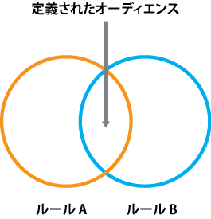
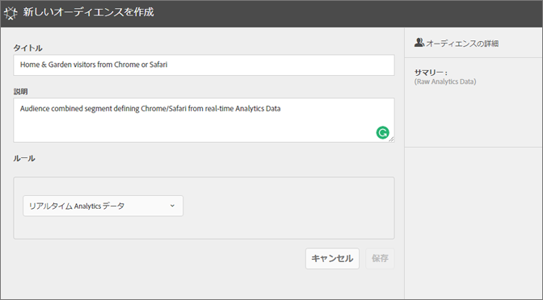
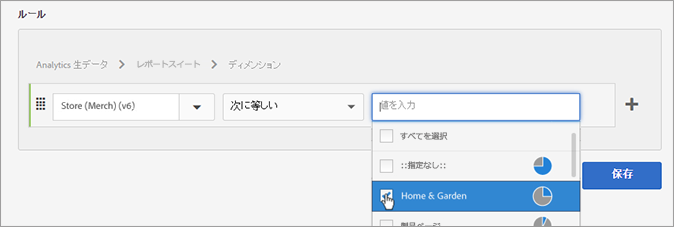
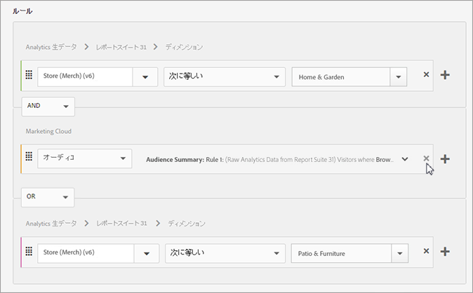
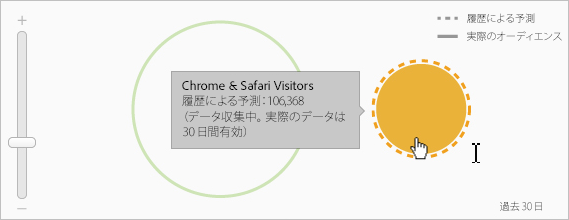

# オーディエンスの作成

Experience Cloud で属性ルールを使用して、オーディエンスを作成し、複合オーディエンスを定義する方法について説明します。

この記事では、次の方法を説明します。

* オーディエンスの作成
* ルールの作成
* ルールを使用した複合オーディエンスの定義

次の図は、複合オーディエンス内の2つのルールを表しています。

各円は、オーディエンスのメンバーシップを定義するルールを表します。 両方のオーディエンスルールのメンバーとしての資格を持つ訪問者が重なり合って、複合の定義されたオーディエンスになります。

>[!NOTE]
>
>オーディエンスが完全に定義されるのは、指定されたデータ収集期間の終了後です。次の例は、複合オーディエンスのルールを作成する方法を示しています。 このオーディエンスは、次の要素で構成されます。

* ページデータまたは生の解析データから派生する「家庭とガーデニング」セクション。
* [!DNL Experience Cloud] に[公開](../audience-library/audience-library.md#task_32FEEFE0B32E4E388CD4D892D727282A)された [!DNL Adobe Analytics] セグメントから得られる Chrome ユーザーと Safari ユーザー。

   

1. In the [!DNL Experience Cloud], under [!DNL Experience Platform], click **[!UICONTROL People]** > **[!UICONTROL Audience Library].**
1. On the [!UICONTROL Audiences] page, click **[!UICONTROL New]**. 

   

1. [!UICONTROL 新しいオーディエンスを作成]ページで、タイトルと説明を指定します。
1. 「[!UICONTROL ルール]」で、属性のソースを選択します。

   * **[!UICONTROL Real-Time Analytics データ：]**（生データ）Real-Time Analytics イメージリクエストから得られる属性データであり、eVar やイベントなどのデータが含まれます。この属性ソースを使用する場合は、レポートスイートを選択し、含めるディメンションまたはイベントを定義する必要があります。 このレポートスイートの選択は、レポートスイートで使用される変数構造を提供します。
   >[!NOTE]
   >
   >キャッシュの影響により、Analytics で削除したレポートスイートが Experience Cloud に反映されるまで 12 時間かかります。

   * **[!UICONTROL Experience Cloud：]**[!DNL Experience Cloud] Experience Cloud ソースから抽出された属性データ。例えば、[!DNL Analytics] で作成したオーディエンスセグメントからのデータや、[!DNL Audience Manager] からのデータです。

1. オーディエンスルールを定義し、「保存」をクリ **[!UICONTROL ックしま]す。**

>[!NOTE]
>
>オーディエンスルールを定義する場合は、実装変数について理解している必要があります。

「[!UICONTROL ルール]」で、*`Home & Garden`* 属性の選択肢を定義します。

* **[!UICONTROL 属性のソース：]** Analytics 生データ
* **[!UICONTROL レポートスイート：]**&#x200B;レポートスイート 31
* Dimension = **[!UICONTROL Store (Merch) (v6)]** > **[!UICONTROL Equals]** > **[!UICONTROL Home &amp; Garden]**

*Chrome および Safari の訪問者*&#x200B;は、Analytics から共有されたオーディエンスセグメントです。

* **[!UICONTROL 属性のソース：]** Experience Cloud
* **[!UICONTROL ディメンション：]** Chrome および Safari の訪問者

比較のために、*OR* ルールを追加して、「Patio &amp; Furniture」などのサイトセクションへのすべての訪問者を確認することもできます。

結果のルールは、ChromeおよびSafariのユーザーがHome &amp; Gardenを訪問した、定義済みのオーディエンスです。 「テラスと家具」セグメントは、そのサイトセクションを訪問するすべての訪問者に対する追加のインサイトを提供します。

* **履歴による予測：**（点線の円）[!DNL Analytics] データに基づいて作成されたルールを表しています。
* **実際のオーディエンス：** （実線の円）Audience Managerから30日間のデータを含む、作成されたルール。 Audience Managerのデータが30日に達すると、線は実線になり、実際の数値を表します。

指定した期間のデータ収集が完了すると、円が結合され、定義されたオーディエンスが表示されます。

オーディエンスを保存すると、他のソリューションで使用できるようになります。 例えば、Adobe Targetアクティビティに共有オーディエンスを含めることができます。
