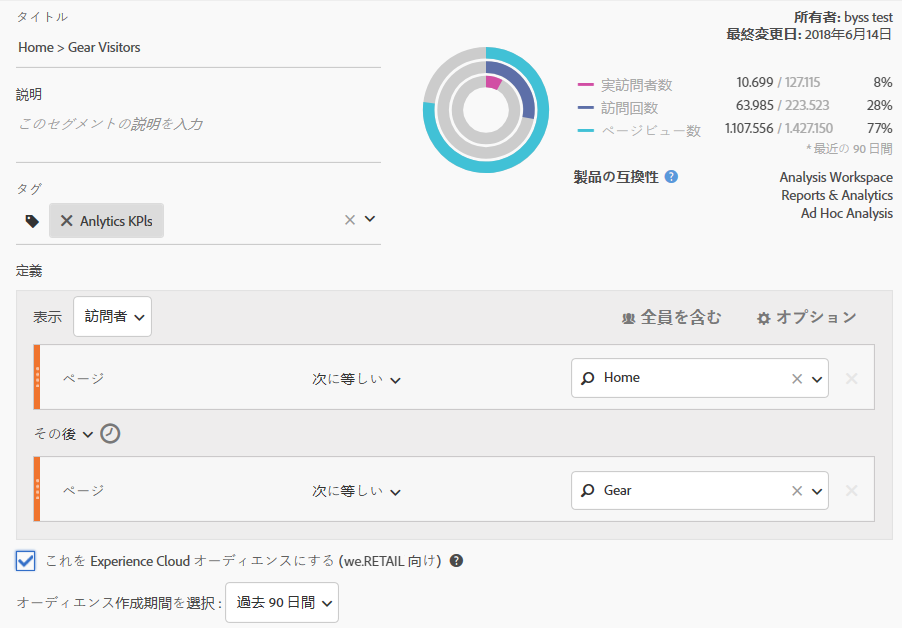

# Analytics オーディエンスセグメントの公開

オーディエンスマーケティングアクティビティ用に、Analytics オーディエンスセグメントを Experience Cloud と Adobe Target に公開します。

1. Analytics で[セグメントを構築](https://marketing.adobe.com/resources/help/en_US/analytics/segment/seg_build.html)します。
1. セグメントビルダーで、「このエクスペリエンスをエクスペリエンスクラウドオーディエンスに **[!UICONTROL する]** 」オプションを有効にします。

   

   | 要素 | 説明 |
   |--- |---|
   | この Experience Cloud オーディエンスを作成 (&lt;レポートスイート名&gt; 向け) | このセグメントを Experience Cloud に公開します。公開されたオーディエンスは、Adobe Target でのマーケティングアクティビティと、Audience Manager でのセグメント化に使用できます。 公開するためには、「タイトル」および「説明」フィールドが必須です。 このオプションを有効にすると、タイトルとオーディエンスセグメントの定義は共有されますが、実際のデータは共有されません。そのオーディエンスが Target のアクティビティに関連付けられている場合、Analytics は、その Experience Cloud および Target オーディエンスに振り分けられた訪問者の ID を送信し始めます。その時点で、オーディエンス名と対応するデータが Experience Cloud オーディエンスページに表示され始めます。 AnalyticsからExperience Cloudに共有されるオーディエンスが、2,000万人のオーディエンスメンバーを超えることはできません。 キャッシュにより、Analyticsで削除されたレポートスイートは、削除がExperience Cloudに表示されるまで12時間かかります。 Analytics では、公開されたセグメントを編集または削除できます。セグメントが使用中の場合は、セグメントを編集すると、警告メッセージが表示されます。公開したセグメントが Adobe Target によって使用されている場合は削除できません。 訪問者がAnalyticsから共有されたオーディエンスの資格を得たら、Target、Advertising CloudおよびCampaignでその情報がアクション可能になるまでに24~48時間の遅延があります。 **Data PrivacyAudiences** は、訪問者の認証状態に基づいてフィルタリングされません。訪問者が未認証状態および認証状態でサイトを閲覧できる場合、訪問者が未認証のときに生じるアクションによって、訪問者がオーディエンスに含められる可能性があります。[Analytics のプライバシーの概要](https://marketing.adobe.com/resources/help/en_US/reference/?f=c_Privacy_Overview)を確認して、オーディエンス共有にプライバシーが与える大きな影響を理解してください。 |
   | オーディエンス作成用のウィンドウを選択してください | これは、固定ではなく、**周期的** な期間です。 |

1. 「 **[!UICONTROL 保存]**」をクリックします。
1. アクセス [!DNL Adobe Target]して [!UICONTROL 、「オーディエンス]」をクリックします。
1. [!UICONTROL オーディエンス] ページで、Experience Cloudからオーディエンスを探します。

   これらのオーディエンスは、アクティビティで使用できます。
