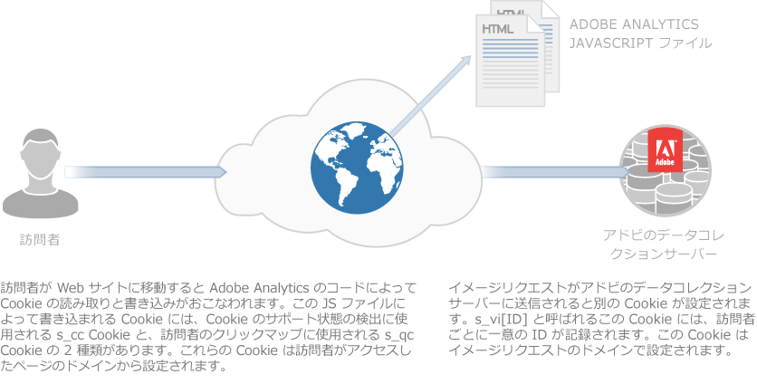
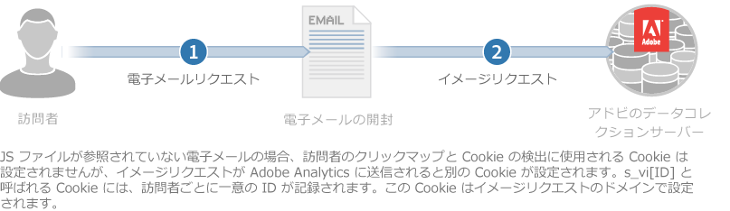

# cookie とプライバシーについて {#about-cookies-and-privacy}

アドビでは、お客様のプライバシーおよびデータセキュリティを最優先の重要事項と認識して、アドビは複数のプライバシー組織に参加し、プライバシー規制当局および自主規制の原則に協力しています。 この協力には、Digital Advertising Alliance AdChoices プログラムが含まれ、お客様に、自身の情報がどのように使用されているか、およびその使用に関する選択肢を提供します。

Experience Cloud 製品で設定される cookie には、個人の特定を可能にする情報を含むものはほとんどありません。これらの cookie および関連付けられたデータはセキュリティによって保護され、レポート処理と、適切なコンテンツおよび広告を提供することのみを目的として使用されます。データが第三者や他のアドビ顧客に開示されることはありません。ただし、業界の集計レポートでこれらのデータが使用される場合はあります。例えば、[!DNL Digital Marketing Insight Report] には、様々な小売業者における集約的な匿名データについての横断的な分析結果が掲載されます。

ブラウザーレベルの情報を、アドビが他の企業の情報と混合することはありません。顧客データのプライバシーとセキュリティを保護するために、Experience Cloud の一部のサービスには、追跡対象サイトごとに異なる cookie セットを使用できる機能があります。また、Suite の一部機能では、顧客企業自体のドメイン名を cookie の所有者として使用することもできます。この設定を使用すると、Experience Cloud の cookie が「*ファーストパーティ cookie*」（恒常的にその企業自体に属する cookie）となり、プライバシーとセキュリティの保護レイヤーがさらに 1 層増強されることになります。

cookie への保存と cookie からの提供が可能なのは、以前にその cookie に保存された情報のみです。cookie からコードを実行することや、保存先のコンピューター上にある他の情報にアクセスすることはできません。さらに、Cookieデータに対するアクセスには Web ブラウザーによる制限も適用されます。ブラウザーの cookie セキュリティポリシーにより、あらゆる cookie データに対するアクセスは、もともとその情報を設定した Web サイトによるものしか認められません。

例えば、Adobe.com の Web サイトによって設定された cookie を Adobe.com 以外の Web サイトが参照することはできません。

次の図は、標準的なイメージリクエストにおける cookie の用途を示しています。

次の図は、ダイレクトイメージリクエスト（JS ファイルの読み込みがおこなわれない場合）における cookie の用途を示しています。

