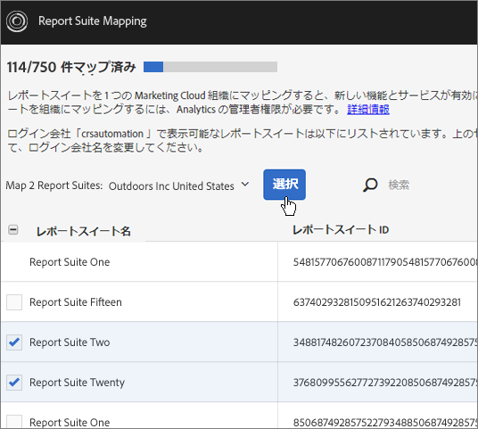
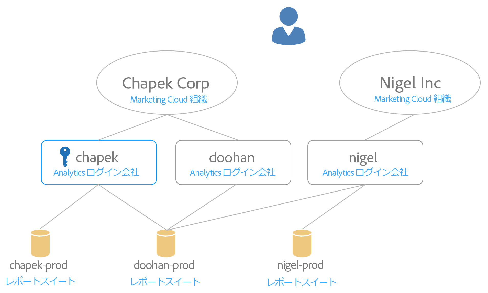

# 組織へのレポートスイートのマッピング {#topic_7C4740559EAC4E0FA5F8DEF886B580DA}

>[!NOTE]
>
>レポートスイートのマッピング機能は、2020 年 11 月に廃止されます。未処理のレポートスイートは、準備中にマッピングしてください。ご質問があれば、ClientCare にお問い合わせください。

1 つまたは複数のレポートスイートを組織にマッピングする方法について説明します。

Experience Cloud サービス（Experience Cloud ID サービスや [!UICONTROL People] など）は、個々のレポートスイートではなく組織に関連付けられています。これらのサービスを正しく機能させるには、各 Analytics レポートスイートを組織にマッピングする必要があります。マッピングプロセスは以下のように実行されます。

* Experience Cloud 組織をレポートスイート用の主要組織として設定します。
* レポートスイートにアクセスできるユーザーは変更されません（アクセスが可能かどうかは引き続き各ユーザーの Adobe Analytics ログインアカウントによって決定されます）。

## 要件

マッピングをおこなうには、マッピングしたいレポートスイートへのアクセス権を持つログイン会社の Analytics 管理者であることが必要です。また、このアカウントが [Experience Cloud 組織にリンクされている](../admin-getting-started/organizations.md#topic_C31CB834F109465A82ED57FF0563B3F1)ことが、その組織にレポートスイートをマッピングするうえで必須となります。

指定したレポートスイートへのアクセス権を持つ組織のログイン会社の Analytics 管理者権限を持っていない場合、その組織はグレー表示されます。

## 組織へのレポートスイートのマッピング {#task_23993FE78DF6455FA8D7BE60686EA16C}

1. [!DNL Analytics]／**[!UICONTROL 管理]**／**[!UICONTROL データガバナンス]**&#x200B;で、データガバナンス用レポートスイートに移動します（[レポートスイートのデータガバナンス設定の表示／管理](https://docs.adobe.com/help/ja-JP/analytics/admin/data-governance/gdpr-view-settings.html)を参照）。

1. 各レポートスイートにアクセスできるログイン会社を確認するには、「**[!UICONTROL 表示可能なログイン会社名]**」をクリックします。

   この画面は、十分な情報に基づいてマッピングをおこなえるようにすることを目的としています。

1. レポートスイートの横にある「**[!UICONTROL マッピングされた組織]**」列のドロップダウンリストをクリックし、マッピングする組織を選択します。

   Experience Cloud 組織の選択に関するヒントについては、次の節を参照してください。

## 組織に複数のレポートスイートをマッピングする {#task_94955B0D8ABA4CB1A38746ECF8E32711}

1. **[!UICONTROL Experience Cloud]**／**[!UICONTROL 管理]**／**[!UICONTROL レポートスイートマッピング]**&#x200B;をクリックします。

1. マッピングするレポートスイートを選択します。

   

1. 組織（この例では Outdoors Inc）を選択し、「**[!UICONTROL 選択]**」をクリックします。

   Experience Cloud 組織の選択に関するヒントについては、次の節を参照してください。

1. 「**[!UICONTROL マッピングを保存]**」をクリックします。

## Experience Cloud 組織の選択に関するヒント {#mapping-tips}

この節では、レポートスイートのマッピング先となる Experience Cloud 組織を選択する際に役立つヒントを紹介します。

### どの組織を選択すべきか

既に Experience Cloud ID サービスがレポートスイートにデプロイされている場合は、レポートスイートマッピングツールで選択する組織と、サイト上の [!DNL visitorAPI.js] ファイルで指定されている組織が同じであることを確認します。[Experience Cloud ID サービスのテストと検証](https://docs.adobe.com/content/help/en/id-service/using/implementation-guides/test-verify.html)の指示に従えば、訪問者 ID サービスで使用されている組織 ID を確認できます。

レポートスイート用のデータを収集するサイト上にまだ訪問者 ID サービスがデプロイされておらず、今後 Experience Cloud 訪問者 ID サービスをデプロイする予定がある場合は、レポートスイートマッピングツールで選択した組織と一致するようにデプロイをおこなう必要があります。

### 一部の組織がグレー表示されている理由

これは、グレー表示されているレポートスイートにマッピングするために必要な権限が不足していることを示しています。次の例をご覧ください。

この図では、青色の鍵が管理権限を示しています。グレーの線は可視性を示しています。

このユーザーは、2 つの Experience Cloud 組織にアクセスできます。このユーザーは以下の操作を実行しました。

* Analytics ログイン会社 [!UICONTROL chapek] 内の自分の管理者アカウントを Experience Cloud 組織 [!UICONTROL Chapek Corp] の自分のアカウントにリンクした。
* Analytics ログイン会社 [!UICONTROL doohan] 内の自分の非管理者アカウントを Experience Cloud 組織 [!UICONTROL Chapek Corp] の自分のアカウントにリンクした。
* Analytics ログイン会社「nigel」内の自分の非管理者アカウントを Experience Cloud 組織「Nigel Inc」の自分のアカウントにリンクした。

以下は、これらのレポートスイートに関して実行できるマッピングアクションと実行できないマッピングアクションを一覧にまとめたものです。

* このユーザーはリンクされている Analytics ログイン会社（[!UICONTROL chapek]）の管理者であり、このユーザーのアカウントはこの組織にリンクされているので、[!UICONTROL chapek-prod] レポートスイートを [!UICONTROL Chapek Corp] 組織にマッピングできます。
* このユーザーは [!UICONTROL nigel-prod] レポートスイートを表示できるログイン会社の管理者ではないので、このレポートスイートをリンクすることはできません。
* このユーザーは Experience Cloud 組織にリンクされているログイン会社（[!UICONTROL chapek]）の管理者なので（Analytics ログイン会社「doohan」の管理者ではないという点に注意）、[!UICONTROL doohan-prod] レポートスイートを [!UICONTROL Chapek Corp] にマッピングできます。このユーザーは実行できませんが、[!UICONTROL doohan-prod] レポートスイートは Experience Cloud 組織「Nigel Inc」にもマッピングできるという点を認識しておくことが重要です。その場合、両方の Experience Cloud 組織がリストに表示されますが、[!UICONTROL Nigel Inc] はグレー表示されます。マッピングをおこなう前に、このユーザーはログイン会社「nigel」の管理者に問い合わせて、マッピングに最適な候補はどちらの組織なのかを判断する必要があります。最初にレポートスイートを作成するときに使用した組織とは異なる組織を選択した場合、UI には「競合の可能性」警告が表示されます。

## よくある質問 {#section_099E485805994C929FF9C9F75219BEE1}

### すべてのレポートスイートが表示されないのはなぜですか。

一部のレポートスイートは別のログイン会社で表示できる場合があります。画面上部にあるドロップダウンリストを使用すると現在のログイン会社を変更できます。

### レポートスイートのドロップダウンリストに見覚えのない組織が表示されている場合はどうすればよいですか。

マッピング権限を持っていないレポートスイートがあったとしても、リストには、レポートスイートをマッピングできる&#x200B;*可能性*&#x200B;のあるすべての組織が表示されます。リスト内でグレー表示されている組織にレポートスイートをマッピングする必要があるかどうかがわからない場合は、組織の Experience Cloud 管理者に問い合わせてください。

### レポートスイートの「表示可能なログイン会社名」列に見覚えのないログイン会社が表示されている場合はどうすればよいですか。

そのレポートスイートは別のログイン会社と共有されていて、そのログイン会社は別の Experience Cloud 組織に属していた可能性があります。

### 「競合の可能性」エラーが表示され、このレポートスイートが別の組織から生成されたものであるというメッセージが表示されたのですが、これは何を意味しますか。どのような点が問題なのでしょうか。

これは、十分な情報に基づいてレポートスイートのマッピングをおこなえるようにするための通知です。そのレポートスイートが本来は別の組織で作成されたものであり、その組織の方がマッピングに適している可能性があるという点を認識してもらうことが目的です。

### レポートスイートがマッピングされているかどうかを確認するには、どうすればよいですか。

マッピング済みレポートスイートは編集不可能な形式で表示されます。マッピングを変更する必要がある場合は、カスタマーケアまでご連絡ください。

### Experience Cloud 組織の組織 ID しかわからない場合、組織 ID に対応する名前を調べるには、どうすればよいですか。

組織名は「[組織とアカウントの設定](https://docs.adobe.com/content/help/ja-JP/core-services/interface/manage-users-and-products/organizations.html)」で確認できます。

### 「マッピング日」列に日付が表示されています。誰がこのマッピングを実行したのでしょうか。

Analytics インターフェイスで「レポートスイートの変更ログ」を参照することで、変更をおこなったユーザーのユーザー ID を確認できます。IMS 組織にスイートが関連付けられたことを示すイベントを探してください。
