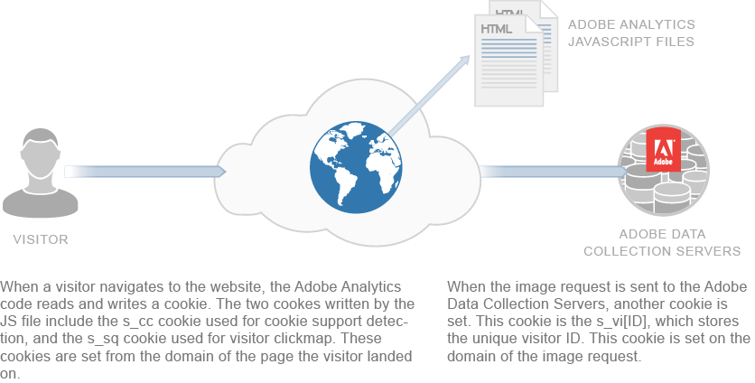
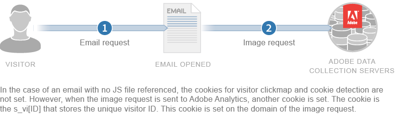

# CX EnterpriseでのCookieの使用方法

Adobe CX EnterpriseはCookieを使用します。 Cookieとは、web サイトがブラウザーに送信するデータの小さな断片のことで、後で使用するために保存されます。 Cookieは、再訪問したり、ページ間を移動したりしたときに、web サイトが何かを覚えるのに役立ちます。 Cookieは訪問を追跡し、あるデバイスを別のデバイスと区別するのに役立ちます。

法律では、多くの場合、Cookieを保存したり使用したりする前に許可を得る必要があります。 Adobeでは、適切なルールを理解するために、法務部門と確認することをお勧めします。

## ファーストパーティ cookie について

Adobe CX Enterpriseでは、ページビューとブラウザーセッションの間で保持されない情報を追跡するためにCookieを使用します。 可能であれば、Adobeはファーストパーティ Cookie （お客様のweb サイトに関連付けられている）を使用します。 複数のサイトやドメインをまたいでアクティビティを追跡するには、サードパーティ Cookieが必要です。

一部のブラウザーやスパイウェア対策ツールは、サードパーティ Cookieをブロックします。 Adobeには、Cookieがブロックされていても、Cookieが引き続き機能することを確認する方法があります。 この動作は、Experience Platform Identity Service （ECID）を使用するか、古いAnalytics Cookie （`s_vi` Cookieなど）を使用するかによって異なります。

* [CX エンタープライズ ID サービス ](https://experienceleague.adobe.com/en/docs/id-service/using/intro/overview): ECID サービスは、コレクション ドメインがサイト ドメインと一致するかどうかにかかわらず、常にファーストパーティ Cookieを設定します。 JavaScriptを使用して、サイトのドメインにCookieを配置します。

* [Analytics レガシー識別子](analytics.md) （`s_vi` Cookieなど）: Cookieがファーストパーティであるかサードパーティであるかは、設定によって異なります。

   * データ収集サーバーがサイトのドメインと一致した場合、Cookieは1st パーティとなります。
   * 一致しない場合、Cookieはサードパーティです。 サードパーティ Cookieがブロックされている場合、Adobeは通常のCookieの代わりにフォールバック Cookie （`s_fid`）を設定します。

コレクションサーバーがサイトのドメインと一致することを確認するには、**CNAME設定**&#x200B;を使用します。 これには、カスタムドメイン（自分が所有する）をAdobe サーバーにポイントするようにDNS設定を更新することが含まれます。 これにより、トラッキング Cookieが1st パーティとして表示されます。 1つのCNAMEは複数のドメインで動作できますが、CNAMEと一致しないドメインは、引き続きサードパーティ Cookieを設定します。

>[!NOTE]
>
>AppleのIntelligent Tracking Prevention （ITP）は、Adobeのファーストパーティ Cookieの有効期間を制限します。これは、コレクションドメインがサイトドメインと一致する場合でも同様です。 ITPは、macOSのSafariと、iOSおよびiPadOSのすべてのブラウザーに影響します。 2020年11月以降、CNAMEを使用して設定されたCookieは、JavaScriptで設定されたCookieと同様に迅速に有効期限が切れます。 この時間制限は将来に変更される可能性があります。

以下は、テキストの簡略化されたバージョンです。

## Cookie とプライバシー

Adobeは、プライバシーとデータセキュリティに真剣に取り組んでいます。 プライバシー機関、規制当局、AdChoicesなどのプログラムと連携し、データの使用方法について関係者が制御できるようにします。

Adobe CX EnterpriseのCookieの多くは、個人情報を保存しません。 セキュリティが確保され、レポート、コンテンツ、広告などに使用できるのは企業だけです。 Adobeは、業界全体の匿名レポート（デジタルマーケティングInsightレポートなど）を除き、このデータを他のお客様やサードパーティと共有することはありません。

Adobeは、複数の企業のブラウザーデータを統合していません。 Adobeの一部のツールでは、プライバシーを保護するために、各web サイトで独自のCookie セットを使用できます。 一部のツールでは、Cookieに独自のドメインを使用することができるため、ファーストパーティでより安全な方法で使用できます。

Cookieは、それ以前に保存された情報のみを保存できます。 デバイスでコードを実行したり、他のデータを読み取ったりすることはできません。 また、web ブラウザーでは、Cookieを設定するweb サイトのみがCookieを読み取ることができます。 例えば、設定したCookieを読み取ることができるのはAdobe.comのみです。

次の図は、標準的なイメージリクエストにおける cookie の用途を示しています。

次の図は、ストレートイメージリクエストの cookie の使用方法を示しています（JS ファイルが読み込まれていないシナリオで使用）。

