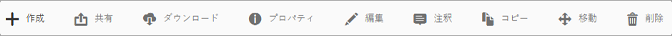
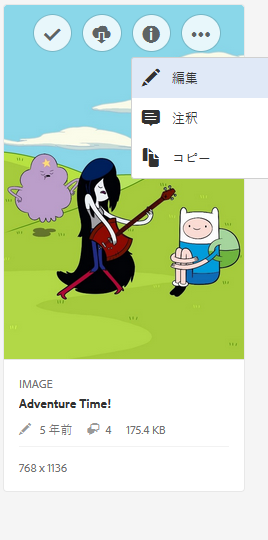
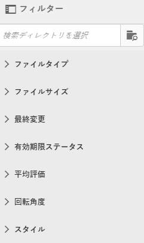
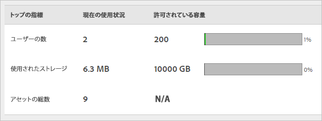

# Experience Cloud Assets の概要

Experience Cloud Assets は、複数のアプリケーション間で共有できるマーケティング用アセットの単一の集中リポジトリを提供します。アセットは、デジタルドキュメント、画像、ビデオ、オーディオのいずれか（またはその一部）で、複数のレンディションを持つことができ、サブアセット（例えば、[!DNL Photoshop] ファイルのレイヤー、[!DNL PowerPoint] ファイルのスライド、PDF のページ、ZIP 内のファイルなど）を持つことができます。

アセットサービスには次のものが含まれます。

* アセットストレージ、管理インターフェイス、（アプリケーション経由でアクセスする）組み込みの選択インターフェイス。
* Creative Cloud、Experience Cloud コラボレーションおよび Experience Cloud アプリケーションとの統合。

アセットを使用すると、一貫性とブランドコンプライアンスが向上し、市場投入までの時間が短縮されます。アプリケーションのワークフローを効率化できます。

* **[!DNL Adobe Target]**：A/B テストと多変量分析テストを設定できます。
* **[!DNL Ad Cloud]**：様々なチャネルとキャンペーン全体で広告ユニットを作成できます。
* **[!DNL Adobe Campaign]**：アセットを電子メールニュースレターとキャンペーンに配置します。

[!UICONTROL Experience Cloud Assets] では、次のことをおこなえます。

* [Experience Cloud Assets への移動](experience-cloud-assets.md#section_3657039DD3524F2AA88753BFF4781125)
* [ツールバーへのアクセス](experience-cloud-assets.md#section_EC2E401D225148818F3753248556BE6B)
* [アセットの編集](experience-cloud-assets.md#section_CD3C55A9D4574455B94D0955391C8FEC)
* [アセットの検索](experience-cloud-assets.md#section_50FE049010B446FC9640AA6A30E5A730)
* [アセットへの注釈の付加](experience-cloud-assets.md#section_67FE1DFAAB744DA5B1CD3AD3CCEABF7A)
* [アセットのフルスクリーン表示とズーム](experience-cloud-assets.md#section_A9F50D7D6BE341A2AB8244A4E42A4EF7)
* [アセットプロパティの表示](experience-cloud-assets.md#section_FED28711DAB14E1BBEEA7CA890EE9573)
* [使用状況レポートの実行](experience-cloud-assets.md#section_15D782FFB8D74CF4A735116CC03AD902)

## Experience Cloud Assets への移動 {#section_3657039DD3524F2AA88753BFF4781125}

## ツールバーへのアクセス {#section_EC2E401D225148818F3753248556BE6B}

アセット（またはアセットディレクトリ）に移動し、「**[!UICONTROL 選択]**」を選択します。

ツールバーから、検索、タイムライン、レンディション、編集、注釈、ダウンロードなどの機能にすばやくアクセスできます。

>[!NOTE]
>
>アセットを [!DNL Target] から正常に削除するには、アセットを Adobe Target アクティビティから削除する必要があります。

## アセットの編集 {#section_CD3C55A9D4574455B94D0955391C8FEC}

アセットの編集機能には次のものが含まれます。

* 切り抜き
* 回転
* 反転

## アセットの検索 {#section_50FE049010B446FC9640AA6A30E5A730}

キーワード、ファイルタイプ、サイズ、最終変更日時、公開ステータス、向きおよびスタイルで検索できます。

## アセットへの注釈の付加 {#section_67FE1DFAAB744DA5B1CD3AD3CCEABF7A}

画像の上に円や矢印を描いて「**[!UICONTROL 注釈]**」を選択し、共同作業者に確認を求める注釈をアセットに付けます。

## アセットのフルスクリーン表示とズーム {#section_A9F50D7D6BE341A2AB8244A4E42A4EF7}

**[!UICONTROL ビュー]**／**[!UICONTROL 画像]**&#x200B;を選択して、アセット画像全体を表示し、ズームを有効にします。

## アセットプロパティの表示 {#section_FED28711DAB14E1BBEEA7CA890EE9573}

プロパティ付きのカードビュー、リスト表示および列ビューのいずれかを選択して、アセットをより容易に見つけることができます。

**[!UICONTROL ビュー]**／**[!UICONTROL プロパティ]**&#x200B;を選択して、アセットのプロパティを表示します。

## 使用状況レポートの実行 {#section_15D782FFB8D74CF4A735116CC03AD902}

ユーザー数、使用されているストレージおよびアセット合計数を表示します。

**[!UICONTROL ツール]**／**[!UICONTROL レポート]**／**[!UICONTROL 使用状況レポート]**&#x200B;を選択します。

