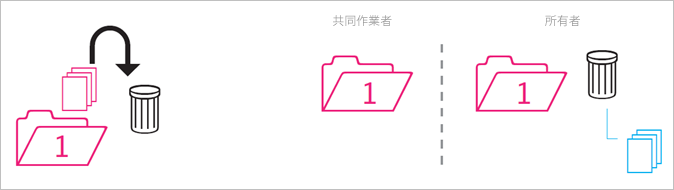
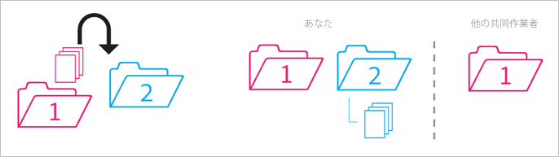
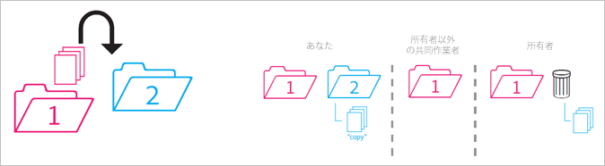
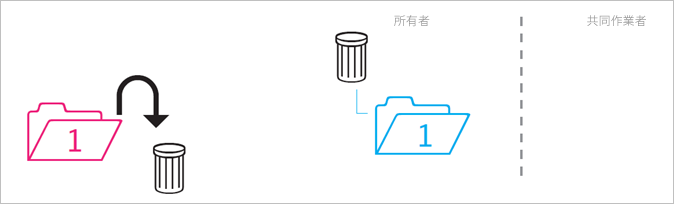
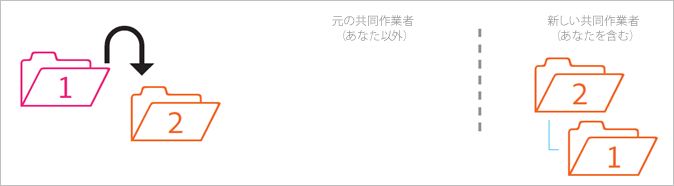
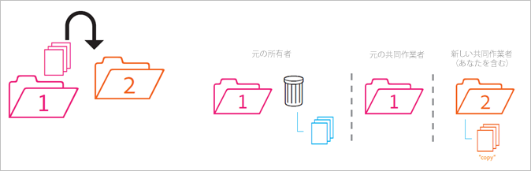
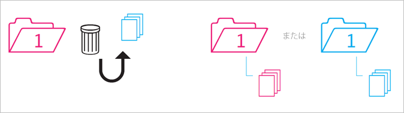

# 共有フォルダーの動作

共有フォルダーを移動、削除および復元するときの動作のルールについて説明します。

>[!NOTE]
>
>共有されている Experience Cloud フォルダーとアセットは、Creative Cloud デスクトップに 1 対 1 関係で複製されます。Experience Cloud ユーザーがフォルダーを変更（削除、追加または共有を削除）すると、その操作は Creative Cloud デスクトップと Web に反映されます。したがって、フォルダーが非共有になると、フォルダーとアセットはローカルマシンから削除されます。共有が削除されると、フォルダーとそのコンテンツは、ローカルコンピューター上のごみ箱に移動されます。ごみ箱に移動されたコンテンツはマシン上に手動で復元できます。

## 非共有フォルダーを共有フォルダーに移動 {#section_A9BAC1A244A246A984AC62660E61E0C0}

非共有フォルダーを共有フォルダーに移動します。

**結果：** 両方のフォルダーが共有になります。

## 共有フォルダーを非共有フォルダーに移動 {#section_8BA83001DCEC4CF084B980C4A660F59A}

共有フォルダーを非共有フォルダーに移動します。

**結果：** 非共有フォルダーは非共有のまま残ります。共有フォルダーは共有のまま残ります。

## 非共有フォルダーのコンテンツを共有フォルダーに移動 {#section_2941ED0DC52E4573AC1AB4C22313DD8E}

非共有フォルダーのコンテンツを共有フォルダーに移動します。

**結果：** コンテンツが共有され、すべての共同作業者がコンテンツを表示できるようになります。ストレージがコンテンツのサイズ分だけ増加します。

## 共有コンテンツをアーカイブまたは削除 {#section_5210D5F4943A44D0BA675D8EB4EAE20F}

共有フォルダー内のコンテンツをアーカイブまたは削除します。

**結果：** コンテンツはフォルダーの所有者用にアーカイブされます。コンテンツを所有していない共同作業者はコンテンツにアクセスできなくなります。

## 所有している共有コンテンツを非共有フォルダーに移動 {#section_3810A364B67E4B8C9CA244BC52BF91BB}

所有している共有フォルダーのコンテンツを非共有フォルダーに移動します。

**結果：** コンテンツは共有されなくなります。共有フォルダーの共同作業者はコンテンツにアクセスできなくなります。

## 所有していないコンテンツを非共有フォルダーに移動 {#section_310766EBF0DC4C0BB4AB3E8A4DAEBE07}

誰かが所有している共有フォルダーのコンテンツを非共有フォルダーに移動します。

**結果：** コンテンツは非共有フォルダーに表示され、共有フォルダーからは削除されます。共有フォルダーの共同作業者はコンテンツにアクセスできなくなります。コンテンツは共有フォルダーの所有者用にアーカイブされます。

所有者と編集者は、自分たちが所有していないコンテンツを移動できますが、閲覧者はできません。所有者や編集者がコンテンツを移動すると、どのユーザーも共有フォルダー内でコンテンツを使用できなくなります。

## 所有しているフォルダーをアーカイブまたは削除 {#section_B314B13512A5409C87C49DFDB7602E14}

所有している共有フォルダーを（Web で）アーカイブまたは（デスクトップで）削除します。

**結果：** フォルダーは非共有になった後、アーカイブされます。共同作業者はフォルダーにアクセスできなくなります。

## 共有フォルダーを別の共有フォルダーに移動 {#section_0A3F203D048D4D1586E9850DC92C51E9}

所有している共有フォルダーを、所有している（または所有していない）別の共有フォルダーに移動します。

**結果：** フォルダーがフォルダー 2 に移動されると、フォルダーは移動先の新しい共同作業者と共有されるようになります。

## 共有コンテンツを別の共有フォルダーに移動 {#section_69F6C312792A4CD2831BD14A340F850E}

共有フォルダーのコンテンツを別の共有フォルダーに移動します。

**結果：** コンテンツはフォルダー 2 に表示され、移動先の新しい共同作業者と共有されるようになります。コンテンツはフォルダー 1 からは削除され、所有者にはアーカイブとして表示されますが、他の共同作業者はコンテンツにアクセスできなくなります。

## コンテンツをアーカイブから復元 {#section_DEA990B3581741F89FBB81D18C2AB449}

共有フォルダーに属していたコンテンツをアーカイブから復元します。なお、これは自分が所有しているときにアーカイブしたコンテンツです。

**結果：** コンテンツは共有フォルダーに復元され、すべての共同作業者が再びアクセスできるようになります。共有フォルダーが既に存在しない場合は、コンテンツは元の親フォルダーの非共有コピーに配置されます。
