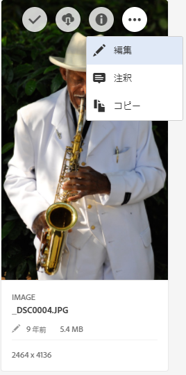
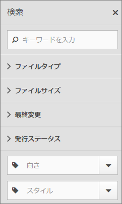
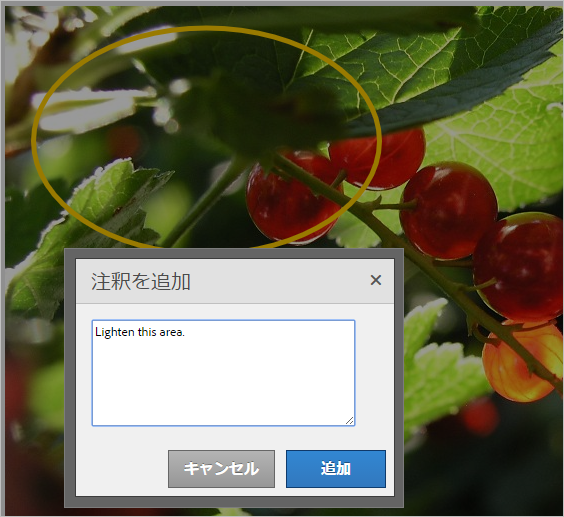
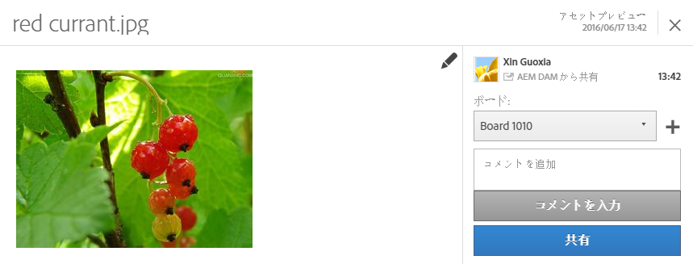
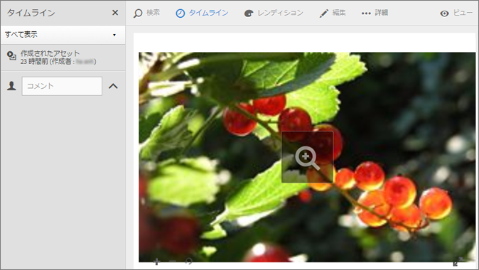
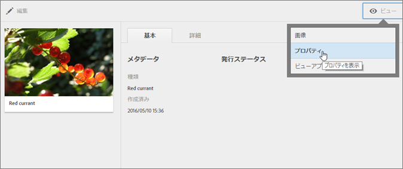

# Assets

Experience Cloud Assets は、ソリューション全体で共有できるマーケティング用アセットの一元管理ツールです。アセットは、デジタルドキュメント、画像、ビデオまたはオーディオ（またはその一部）で、複数のレンディションを持つことができ、サブアセットを持つことができます（例えば、Photoshop ファイルのレイヤー、PowerPoint ファイルのスライド、PDF のページ、ZIP 内のファイルなど）。

<!-- asset.xml -->
アセットサービスの一例を示します。

* アセットストレージ、管理インターフェイス、組み込み選択インターフェイス（ソリューションを利用してアクセス）。
* Creative Cloud、Experience Cloud コラボレーションおよび Experience Cloud ソリューションとの統合

アセットを使用すると、整合性とブランドコンプライアンスが高まり、市場への投入時間が短縮されます。各ソリューションでワークフローを効率化できます。

* **[!DNL Social]**：Facebook、Twitter、LinkedIn、Google+ のソーシャルメディアに投稿します。
* **[!DNL Target]**：A/B テストと多変量分析テストを設定できます。
* **[!DNL Media Optimizer]**:様々なチャネルやキャンペーンにわたる広告ユニットの開発
* **[!DNL Campaign]**：アセットを電子メールニュースレターとキャンペーンに配置します。

[!UICONTROL Experience Cloud Assets] では、次のことをおこなえます。

* [Experience Cloud Assets への移動](../experience-cloud-assets/experience-cloud-assets.md#section_3657039DD3524F2AA88753BFF4781125)
* [ツールバーにアクセスする](../experience-cloud-assets/experience-cloud-assets.md#section_EC2E401D225148818F3753248556BE6B)
* [アセットを編集する](../experience-cloud-assets/experience-cloud-assets.md#section_CD3C55A9D4574455B94D0955391C8FEC)
* [アセットを検索する](../experience-cloud-assets/experience-cloud-assets.md#section_50FE049010B446FC9640AA6A30E5A730)
* [アセットに注釈を付ける](../experience-cloud-assets/experience-cloud-assets.md#section_67FE1DFAAB744DA5B1CD3AD3CCEABF7A)
* [アセットをフィードと共有する](../experience-cloud-assets/experience-cloud-assets.md#section_2CD53A99600D4A3D9AA82C3CDA666E6B)
* [アセットをフルスクリーン表示、ズームする](../experience-cloud-assets/experience-cloud-assets.md#section_A9F50D7D6BE341A2AB8244A4E42A4EF7)
* [アセットプロパティを表示する](../experience-cloud-assets/experience-cloud-assets.md#section_FED28711DAB14E1BBEEA7CA890EE9573)
* [使用状況レポートを実行する](../experience-cloud-assets/experience-cloud-assets.md#section_15D782FFB8D74CF4A735116CC03AD902)
* [Experience Manager とのアセットの共有](../experience-cloud-assets/experience-cloud-assets.md#section_45C1B72F4D274F54BC6CCB64D2580AC5)

## Experience Cloud Assets への移動 {#section_3657039DD3524F2AA88753BFF4781125}

## ツールバーへのアクセス {#section_EC2E401D225148818F3753248556BE6B}

アセット（またはアセットディレクトリ）に移動し、 **[!UICONTROL 「選択]**」をクリックします。

ツールバーから、検索、タイムライン、レンディション、編集、注釈、ダウンロードなどの機能にすばやくアクセスできます。

## アセットを編集する {#section_CD3C55A9D4574455B94D0955391C8FEC}

アセットの編集機能には次のものが含まれます。

* 切り抜き
* 回転
* 反転

## アセットの検索 {#section_50FE049010B446FC9640AA6A30E5A730}

キーワード、ファイルタイプ、サイズ、最終変更日時、発行ステータス、向きおよびスタイルで検索できます。

## アセットに注釈を付ける {#section_67FE1DFAAB744DA5B1CD3AD3CCEABF7A}

画像の上に円や矢印を描いて「**[!UICONTROL 注釈]」をクリックし、共同作業者に確認を求める注釈をアセットに付けます。**

## アセットをフィードに共有する {#section_2CD53A99600D4A3D9AA82C3CDA666E6B}

ツールバーから **[!UICONTROL 「共有」]** をクリックして、アセットを [他のExperience Cloudユーザー](../feed.md#concept_9256B8768A294009A777282DD8719213) にフィードとして共有します。

共有では、フィードページに画像が表示されます。また、カードを共有しているユーザーも表示されます。

## フルスクリーンアセットの表示とズーム {#section_A9F50D7D6BE341A2AB8244A4E42A4EF7}

**[!UICONTROL 表示]** / **[!UICONTROL 画像]** をクリックして、アセット画像全体を表示し、ズームを有効にします。

## アセットプロパティの表示 {#section_FED28711DAB14E1BBEEA7CA890EE9573}

プロパティ付きのカードビュー、リストビューおよび列ビューのいずれかを選択して、アセットをより容易に見つけることができます。

**[!UICONTROL 表示/]****[!UICONTROL プロパティ]** をクリックして、アセットのプロパティを表示します。

## 使用状況レポートの実行 {#section_15D782FFB8D74CF4A735116CC03AD902}

ユーザー数、使用されているストレージおよびアセット合計数を表示します。

**[!UICONTROL ツール]** / **[!UICONTROL レポート]** / **[!UICONTROL 使用状況レポートをクリックします]**

