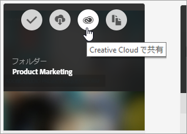
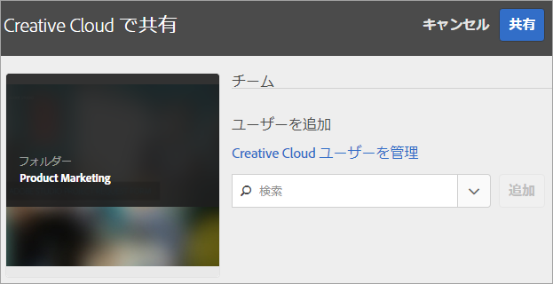
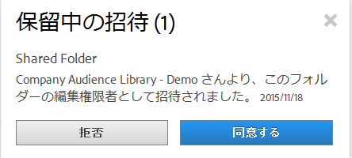
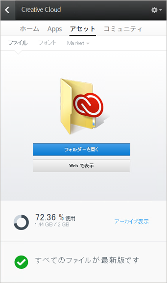
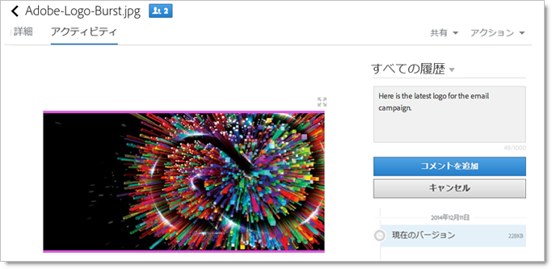
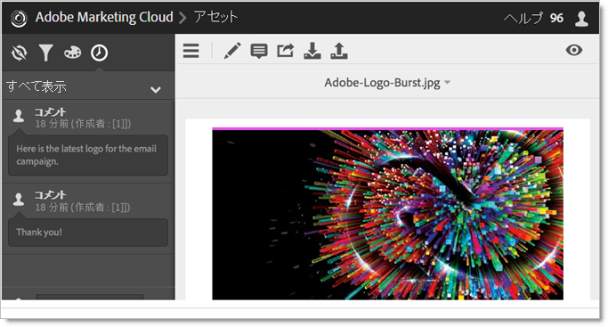
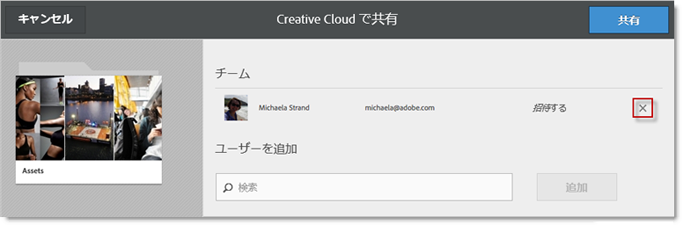
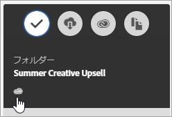

# Experience Cloud アセットフォルダーの共有

Creative Cloud ユーザーと Experience Cloud アセットフォルダーを共有します。

1. Asset フォルダーで、「**[!UICONTROL Creative Cloud で共有]**」をクリックします。

   
1. Creative Cloud で共有ページでユーザーを検索してから、「**[!UICONTROL 追加]**」をクリックします。

   

1. 「**[!UICONTROL 共有]**」をクリックします。
1. [!DNL Creative Cloud] デスクトップを起動（またはブラウザーの [!UICONTROL Creative Cloud Files] ページに移動）して、要求通知を探します。

   
1. 要求を開いてから、「**[!UICONTROL 同意]**」をクリックします。

   
1. フォルダーのコンテンツにアクセスするには、「**[!UICONTROL フォルダーを開く]**」（または「**[!UICONTROL Web で表示]**」）をクリックします。

   
1. 共有アセットにコメントを追加して続行します。

   Creative Cloud では、画像をクリックしてから「**[!UICONTROL アクティビティ]**」をクリックして、画像にコメントを追加することができます。コメントは、[!DNL Creative Cloud] と [!DNL Experience Cloud] のアセットで同期されます。

   

   Experience Cloud では、画像をクリックしてからタイムラインアイコンをクリックして、画像にコメントを追加します。コメントは、Creative Cloud と Experience Cloud のアセットで同期されます。

   

1. フォルダーの共有を解除するには、「Creative Cloudーを使用して共有&#x200B;]**」をクリックし（[手順3](../experience-cloud-assets/t-share-creative-cloud.md#step_BA17CFA185284641A9B878BA29551996)と同様）、「X」をクリックしてユーザーを削除し、「**[!UICONTROL &#x200B;共有&#x200B;]**」をクリックします。**[!UICONTROL 

すべてのCreative Cloudユーザーを削除すると、フォルダーは非共有になり、Creative Cloudユーザーはアクセスできなくなります。

共有アセットを使用する方法の詳細は次のとおりです。

* ソーシャル投稿の場合、[!UICONTROL  の]セットセレクター[!DNL Adobe Social]でアセットを使用する。
* アクティビティの画像の場合、[!DNL Adobe Target] の[オファーライブラリ](https://docs.adobe.com/help/ja-JP/target/using/experiences/offers/manage-content.html)でアセットを読み込むまたはスワップする。

Creative Cloud にフォルダーを共有すると、フォルダー上に Creative Cloud のロゴが表示されます。

関連するヘルプ：

* [Creative Cloud ヘルプ - ファイルの管理と同期](https://helpx.adobe.com/jp/creative-cloud/help/sync-files.html)
* [Creative Cloud ヘルプ - 他のユーザーとの共同作業](https://helpx.adobe.com/jp/creative-cloud/help/collaboration.html)
* [Creative Cloud ヘルプ - 共同作業に関する FAQ](https://helpx.adobe.com/jp/creative-cloud/help/collaboration-faq.html)
