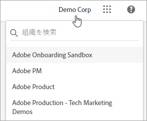
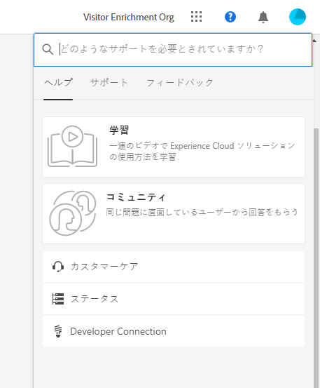
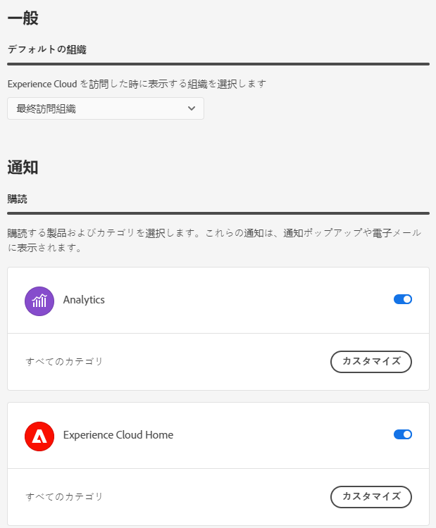
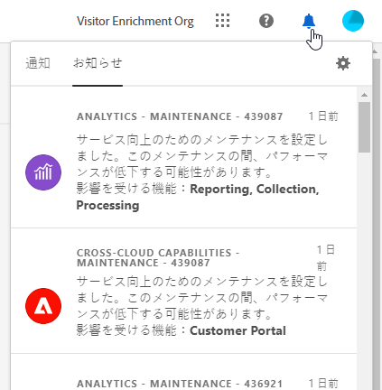

# Experience Cloud インターフェイスヘルプ

Experience Cloud の中央インターフェイスコンポーネントには、次の機能が含まれます。

* ログインしてアプリケーションとサービスにアクセスする
* グローバル検索を使用して製品ヘルプとビジネスオブジェクトを検索する
* アカウント設定（アラート、通知、サブスクリプション）の管理

## Experience Cloud でのブラウザーのサポート {#browser}

最高のパフォーマンスを実現するために、Experience Cloud は、一番人気のブラウザー（最新バージョンに加えて 2 つ前までのバージョンを含む）に合わせて最適化されています。

* Chrome
* Edge
* Firefox
* Opera
* Safari

ブラウザーがリストに表示されない場合でも、サポートされている可能性はありますが、リストに表示されたブラウザーの いずれかを使用することをお勧めします。

>[!NOTE]
>
>Experience Cloud ドメインで実行されているすべてのアプリケーションがすべてのブラウザーをサポートしているわけではありません。不明な場合は、特定のアプリケーションのドキュメントを確認してください。

## Experience Cloud での言語サポート {#languages}

Experience Cloud は、アドビユーザーアカウントの環境設定で設定された各ユーザーの優先言語をサポートしています。現在サポートされている言語は次のとおりです。

* 中国語
* 英語
* フランス語
* ドイツ語
* イタリア語
* 日本語
* 韓国語
* ポルトガル語
* スペイン語
* 台湾語

すべてのアプリケーションチームはグローバルな言語サポートに取り組んでいますが、一部のアプリケーションは、上記のすべての言語では提供されていません。プライマリ言語が Experience Cloud アプリケーションでサポートされていない場合、利用可能であればセカンダリ言語をデフォルトに設定することもできます。 これは、[Experience Cloud のユーザーの環境設定](https://experience.adobe.com/preferences) で実行できます。

## Experience Cloud にサインインする {#signin}

ログインし、自分が適切な[組織](organizations.md)に属していることを確認します。

1. [Adobe Experience Cloud](https://experience.adobe.com) に移動します。
1. 「**[!UICONTROL Adobe ID でログイン]**」を選択します。
1. 自分が適切な組織に属していることを確認します。

   

   正しい [組織](organizations.md) にログインしていることを確認するには、プロファイルのアバターをクリックして組織名を表示します。複数の組織にアクセスできる場合は、ヘッダーバーで別の組織を表示して切り替えることもできます。

   組織が Federated ID を使用している場合、Experience Cloud を使用すると、自身のメールアドレスとパスワードを入力しなくても、組織のシングルサインオンでログインできます。`#/sso:@domain` を Experience Cloud URL（`https://experience.adobe.com`）に追加して、このタスクを完成します。

   例えば、Federated ID を持ち、ドメインが `adobecustomer.com` の組織の場合、URL リンクを `https://experience.adobe.com/#/sso:@adobecustomer.com` に設定します。 また、この URL にアプリケーションパスを付けてブックマークに追加することで、特定のアプリケーションに直接移動することもできます。 （例えば、Adobe Analytics の場合は `https://experience.adobe.com/#/sso:@adobecustomer.com/analytics`。）

## Experience Cloud アプリケーションへのアクセス {#navigation}

Experience Cloud にログインすると、統合ヘッダーからすべてのアプリケーション、サービスおよび組織にすばやくアクセスできます。

アプリケーションセレクターを選択  をクリックして、所有するExperience Cloudサービスにアクセスします。

## Experience Cloud での検索とサポート {#search-support}

Experience Cloud の検索では、[Experience League](https://experienceleague.adobe.com/?lang=ja#home) 上のヘルプ（ドキュメント、チュートリアル、コース）を検索できます。

[!UICONTROL ヘルプ]メニューからも、次の項目にアクセスできます。

* **[!UICONTROL サポート]：** サポートチケットを作成するか、Twitter を使用して[!UICONTROL サポート]にお問い合わせください。
* **[!UICONTROL フィードバック]：**&#x200B;フィードバックを使用してアドビに連絡し、ご意見をお聞かせください。
* **[!UICONTROL ステータス]：** に移動して、製品の `https://status.adobe.com/experience_cloud` 運用状況と[!UICONTROL サブスクリプションの管理]を確認します。
* **[!UICONTROL Developer Connection]：** `adobe.io` に移動して、開発者向けドキュメントを見つけます。

## アカウント設定 {#account-menu}

アカウントの環境設定メニューで、次の操作を実行できます。

* ダークテーマを指定する（このテーマに対応していないアプリケーションもあります）
* [組織](organizations.md)を検索する
* ログアウト
* アカウントの[環境設定、通知、サブスクリプション](#preferences)を設定する

### Experience Cloud の[!UICONTROL 環境設定]を管理する {#preferences}

Experience Cloud の環境設定には、通知、購読、アラートが含まれます。

選択 **[!UICONTROL 環境設定]** アカウントメニューから  をクリックして環境設定を管理します。

[!UICONTROL Experience Cloud の環境設定]では、次の機能を設定できます。

| 機能 | 説明 |
|--- |--- |
| デフォルトの[組織](organizations.md) | Experience Cloud の起動時に表示する組織を選択します。 |
| [!UICONTROL サブスクリプション] | 購入する製品とカテゴリを選択します。[!UICONTROL 通知]ポップオーバーとメール内の通知。 |
| [!UICONTROL 優先度] | 優先度が高いと見なすカテゴリを選択します。これらのカテゴリには「高」タグが付き、アラートんなどの配信用に設定できます。 |
| [!UICONTROL アラート] | ブラウザーにアラートを表示する通知を選択します。アラートは、ウィンドウの右上隅に数秒間表示されます。 |
| メール | 通知メールの受信頻度を指定します。（送信しない、即時、毎日または毎週） |

{style=&quot;table-layout:auto&quot;}

## 通知とお知らせ {#notifications}

「**[!UICONTROL 通知]**」を選択すると、重要な通知や、アドビからのお知らせを表示できます。

通知は、[Experience Cloud の環境設定](#preferences)で設定できます。
