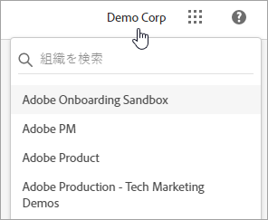
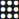
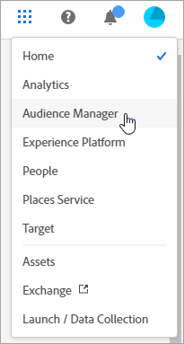
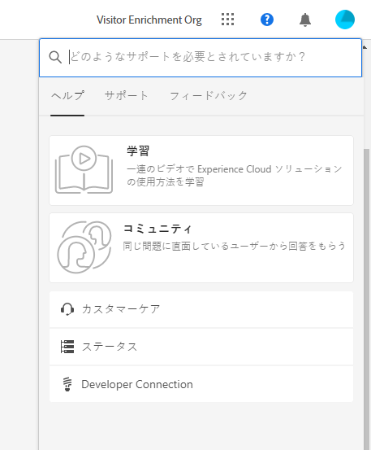
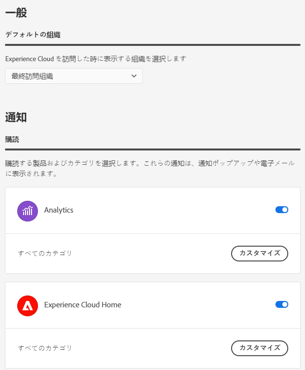
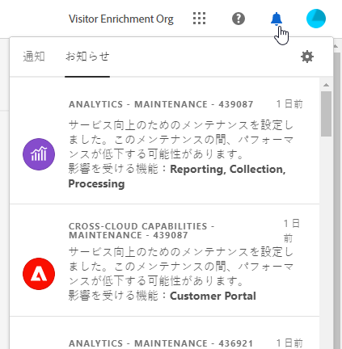

# CX エンタープライズ中央インターフェイスコンポーネント

CX Enterpriseの中央インターフェイスコンポーネントには、次のような機能が搭載されています。

* ログインしてアプリケーションとサービスにアクセスする
* グローバル検索を使用して製品ヘルプとビジネスオブジェクトを検索する
* アカウント設定（アラート、通知、サブスクリプション）の管理

## CX Enterpriseでのブラウザーサポート

最高のパフォーマンスを実現するために、CX Enterpriseは、最新バージョンと以前の2つのバージョンを含む、最も人気のあるブラウザーに最適化されています。

* Chrome
* Edge
* Firefox
* Opera
* Safari

ブラウザーがリストに表示されない場合でも、サポートされている可能性はありますが、リストに表示されたブラウザーの いずれかを使用することをお勧めします。

>[!NOTE]
>
>CX Enterprise ドメインで実行されているすべてのアプリケーションが、すべてのブラウザーをサポートしているわけではありません。 不明な場合は、特定のアプリケーションのドキュメントを確認してください。

## CX Enterpriseの言語サポート

CX Enterpriseでは、Adobe ユーザーアカウントの環境設定で設定されている、各ユーザーの優先言語をサポートしています。 現在サポートされている言語は次のとおりです。

* 中国語
* 英語
* フランス語
* ドイツ語
* イタリア語
* 日本語
* 韓国語
* ポルトガル語
* スペイン語
* 台湾語

すべてのアプリケーションチームはグローバルな言語サポートに取り組んでいますが、一部のアプリケーションは、上記のすべての言語では提供されていません。 お客様のプライマリ言語がCX Enterprise アプリケーションでサポートされていない場合は、セカンダリ言語をデフォルトに設定することもできます。 これは、[CX Enterprise ユーザー環境設定](https://experience.adobe.com/preferences)で実行できます。

## CX Enterpriseにログイン

ログインして、正しい組織に属していることを確認します。

1. [Adobe CX Enterprise](https://experience.adobe.com)に移動します。
1. 「**[!UICONTROL Adobe IDでログイン」をクリックします]**。
1. 自分が適切な組織に属していることを確認します。

   

   正しい組織にログインしていることを確認するには、**[!UICONTROL プロファイル]**&#x200B;をクリックして組織名を表示します。 複数の組織にアクセスできる場合は、**[!UICONTROL 組織]** セレクターを使用して、別の組織を表示して切り替えることもできます。

   組織でFederated IDを使用している場合は、電子メールアドレスとパスワードを入力しなくても、組織のシングルサインオンでログインできます。 CX エンタープライズ URL （`https://experience.adobe.com`）に`#/sso:@domain`を追加して、このタスクを実行します。

   例えば、Federated ID を持ち、ドメインが `example.com` の組織の場合、URL リンクを `https://experience.adobe.com/#/sso:@example.com` に設定します。 また、この URL にアプリケーションパスを付けてブックマークに追加することで、特定のアプリケーションに直接移動することもできます。 （例えば、Adobe Analytics の場合は `https://experience.adobe.com/#/sso:@example.com/analytics`。）

## CX Enterprise アプリケーションへのアクセス

CX Enterpriseにログインすると、統合ヘッダーからすべてのアプリケーション、サービス、組織にすばやくアクセスできます。

所有しているCX Enterprise サービスにアクセスするには、アプリケーション セレクターをクリックします。

## CX Enterpriseの検索とサポート

CX Enterprise検索を使用すると、[Experience League](https://experienceleague.adobe.com/ja#home)でヘルプ（ドキュメント、チュートリアル、コース）を検索できます。

[!UICONTROL &#x200B; ヘルプ &#x200B;] メニューでは、次のアクセス権も使用できます。

* **[!UICONTROL サポート &#x200B;]:** サポートチケットを作成するか、Twitterを使用して[!UICONTROL &#x200B; サポート &#x200B;]にお問い合わせください。
* **[!UICONTROL フィードバック &#x200B;]:** フィードバックを使用してAdobeにお問い合わせください。ご意見をお聞かせください。
* **[!UICONTROL ステータス &#x200B;]:**&#x200B;に移動して、`https://status.adobe.com/experience_cloud`製品の運用状態と[!UICONTROL &#x200B; サブスクリプションの管理]を確認します。
* **[!UICONTROL Developer Connection]:** `adobe.io`に移動して、開発者向けドキュメントを見つけます。

## アカウント設定

アカウントの環境設定メニューで、次の操作を実行できます。

* ダークテーマを指定する（このテーマに対応していないアプリケーションもあります）
* 組織の検索
* ログアウト
* アカウントの[環境設定、通知、サブスクリプション](#preferences)を設定する

### CX エンタープライズ管理[!UICONTROL 環境設定]

企業バイヤーズの環境設定には、通知、サブスクリプション、アラートなどが含まれます。

* アカウントメニューの&#x200B;**[!UICONTROL 環境設定]**&#x200B;をクリックして、環境設定を管理します。

[!UICONTROL CX エンタープライズ環境設定]では、次の機能を設定できます。

| 機能 | 説明 |
| --- | --- |
| 既定の組織 | CX Enterpriseの起動時に表示する組織を選択します。 |
| [!UICONTROL サブスクリプション] | 購入する製品とカテゴリを選択します。 [!UICONTROL 通知] ポップオーバーおよびメール内の通知。 |
| [!UICONTROL 優先度] | 優先度が高いと見なすカテゴリを選択します。 これらのカテゴリには「高」タグが付き、アラートんなどの配信用に設定できます。 |
| [!UICONTROL アラート] | ブラウザーにアラートを表示する通知を選択します。 アラートは、ウィンドウの右上隅に数秒間表示されます。 |
| メール | 通知メールの受信頻度を指定します。 （送信しない、即時、毎日または毎週） |

{style="table-layout:auto"}

## 通知とお知らせ

**[!UICONTROL 通知]**&#x200B;をクリックすると、自分にとって重要な通知とAdobeからのお知らせが表示されます。

[CX エンタープライズ環境設定](#preferences)で通知を設定できます。
