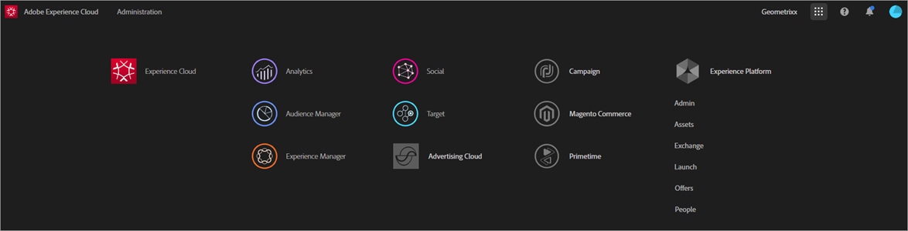

# Experience cloudおよびコアサービス製品ドキュメント

このページでは、Adobe Experience cloudのソリューションおよびサービスに関するセルフヘルプ、サポート、技術および製品ドキュメントを提供します。 Experience Cloud には、アドビが提供するデジタルマーケティングソリューションおよびサービスが統合されています。Experience Cloud は、クラウドソリューションやコアサービスにすばやくアクセスできる直感的なインターフェイスでもあります。

## リリースノートとコミュニティリソース

* [Experience cloudリリースノート](https://docs.adobe.com/content/help/en/release-notes/experience-cloud/current.html) — すべての製品
* [Priority Product Update](https://www.adobe.com/subscription/priority-product-update.html) — 購読して、毎月リリースノートを受け取る)
* [アドビのビデオ学習](https://docs.adobe.com/content/help/en/core-services-learn/tutorials/overview.html)
* [Adobe Experience League](https://landing.adobe.com/experience-league/) — ガイド付き学習
* [カスタマーケアにお問い合わせください](https://helpx.adobe.com/contact/enterprise-support.ec.html)
* [コミュニティフォーラム](https://forums.adobe.com/community/experience-cloud)
* [Experience Cloud のラーニングとサポート](https://helpx.adobe.com/support/experience-cloud.html)
* [アドビトレーニングおよびチュートリアル](https://helpx.adobe.com/learning.html?promoid=KAUDK)
* [Adobe Customer Experience Blog](https://theblog.adobe.com/customer-experience/) （ブログ）
* [コアサービスの概要](https://theblog.adobe.com/part-2-capturing-leveraging-consumer-behavior-adobe-marketing-cloud/)（ブログ）

## Experience Cloud とコアサービスのヘルプ

* [Adobe Mobile](https://docs.adobe.com/content/help/en/mobile-services/using/home.html)
* [オーディエンス](https://docs.adobe.com/content/help/en/core-services/interface/audiences/audience-library.html)
* [Assets](experience-cloud-assets/experience-cloud-assets.md)
* [顧客属性](https://docs.adobe.com/content/help/en/core-services/interface/customer-attributes/attributes.html)
* [Device Co-op](https://docs.adobe.com/content/help/en/device-co-op/using/home.html)
* [Dynamic Tag Management](https://docs.adobe.com/content/help/en/dtm/using/dtm-home.html)
* [Exchange](https://experiencecloud.adobeexchange.com/)
* [Experience Cloud ID サービス](https://docs.adobe.com/content/help/en/id-service/using/home.html)
* [Experience Platform Launch](https://docs.adobelaunch.com/)
* [Experience Cloud デバッガー](https://marketing.adobe.com/resources/help/en_US/experience-cloud-debugger/)
* [Feed](feed.md)
* [一般データ保護規則（GDPR）API](https://www.adobe.io/apis/experiencecloud/gdpr.html)

## 管理と有効化

* [ユーザーおよび製品の管理](admin-getting-started/admin-getting-started.md)（Admin Console）
* [コアサービス向けにソリューションを有効化](core-services/core-services.md)
* [よくある質問](admin-getting-started/admin-getting-started.md)
* [組織とアカウントのリンク](admin-getting-started/organizations.md)
* [統合](marketing-cloud-integrations.md)
* [Adobe Target と Experience Cloud の統合](https://docs.adobe.com/content/help/en/target/using/integrate/a4t/a4t.html)
* [Experience Cloud のプライバシーとセキュリティの概要](assets/Adobe-Marketing-Cloud-Privacy-and-Security-Overview.pdf)
* [Adobe Experience cloudのプロファイル管理](https://theblog.adobe.com/profile-management-adobe-marketing-cloud-comes-together/) （ブログ）
* [DNS プリフェッチ](admin-getting-started/admin-getting-started.md#concept_6BC8C6856E3644F8956D7AD0A96383B7)
