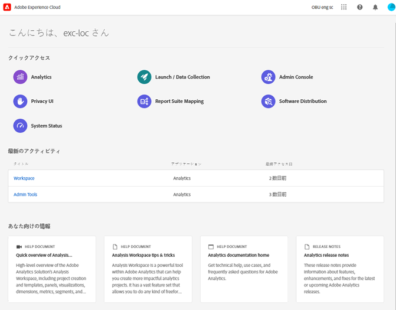

# Experience Cloud の主要なインターフェイスコンポーネントガイド

[Experience Cloud](https://experience.adobe.com) には、アドビが提供するデジタルマーケティングアプリケーション、製品およびサービスが統合されています。直感的なインターフェイスから、クラウドアプリケーション、製品機能、サービスにすばやくアクセスできます。

Experience Cloud のヘッダーから、次の操作を実行できます。

* アプリケーションとサービスへのアクセス
* ヘルプメニューから、製品ドキュメント、チュートリアル、コミュニティへの投稿を検索します。Experience League で結果を表示します。
* 「検索」フィールドのグローバル検索を使用したビジネスオブジェクトの検索（Experience Platform ユーザーのみ）。
* アカウント設定（アラート、通知、サブスクリプション）の管理

## Experience Cloud にサインインする {#signin}

ログインし、自分が適切な[組織](organizations.md)に属していることを確認します。

1. [Adobe Experience Cloud](https://experience.adobe.com) に移動します。
1. アドビのメールアドレスを入力し、「**[!UICONTROL 続行]**」を選択します。

   管理者向け：[Experience Cloud ユーザー認証](admin-getting-started.md#migration)の ID タイプ（Business ID）に関する重要な更新を参照してください。

1. アカウントを選択します。
1. パスワードを入力します。
1. 自分が適切な組織に属していることを確認します。

   

   **組織の検証**

   正しい [組織](organizations.md) にログインしていることを確認するには、プロファイルのアバターをクリックして組織名を表示します。複数の組織にアクセスできる場合は、ヘッダーバーで別の組織を表示して切り替えることもできます。

   組織が Federated ID を使用している場合、Experience Cloud を使用すると、自身のメールアドレスとパスワードを入力しなくても、組織のシングルサインオンでログインできます。`#/sso:@domain` を Experience Cloud URL（`https://experience.adobe.com`）に追加して、このタスクを完成します。

   例えば、Federated ID を持ち、ドメインが `adobecustomer.com` の組織の場合、URL リンクを `https://experience.adobe.com/#/sso:@adobecustomer.com` に設定します。 また、この URL にアプリケーションパスを付けてブックマークに追加することで、特定のアプリケーションに直接移動することもできます。 （例えば、Adobe Analytics の場合は `https://experience.adobe.com/#/sso:@adobecustomer.com/analytics`。）

## Experience Cloud アプリケーションへのアクセス {#navigation}

Experience Cloud にログインすると、統合ヘッダーからすべてのアプリケーション、サービスおよび組織にすばやくアクセスできます。

組織内でプロビジョニングされた Experience Cloud のアプリケーションおよびサービスにアクセスするには、アプリケーションセレクター  に移動します。

## Experience Cloud でのブラウザーのサポート {#browser}

最高のパフォーマンスを実現するために、Experience Cloud は、一番人気のブラウザー（最新バージョンに加えて 2 つ前までのバージョンを含む）に合わせて最適化されています。

* Chrome
* Edge
* Firefox
* Opera
* Safari

ブラウザーがリストに表示されない場合でも、サポートされている可能性はありますが、リストに表示されたブラウザーの いずれかを使用することをお勧めします。

>[!NOTE]
>
>Experience Cloud ドメインで実行されているすべてのアプリケーションがすべてのブラウザーをサポートしているわけではありません。不明な場合は、特定のアプリケーションのドキュメントを確認してください。

## Experience Cloud での言語サポート {#languages}

Experience Cloud は、アドビユーザーアカウントの環境設定で設定された各ユーザーの優先言語をサポートしています。現在サポートされている言語は次のとおりです。

* 中国語
* 英語
* フランス語
* ドイツ語
* イタリア語
* 日本語
* 韓国語
* ポルトガル語
* スペイン語
* 台湾語

すべてのアプリケーションチームはグローバルな言語サポートに取り組んでいますが、一部のアプリケーションは、上記のすべての言語では提供されていません。プライマリ言語が Experience Cloud アプリケーションでサポートされていない場合、利用可能であればセカンダリ言語をデフォルトに設定することもできます。 これは、[Experience Cloud のユーザーの環境設定](https://experience.adobe.com/preferences) で実行できます。

## お問い合わせとサポート {#support}

[Experience League](https://experienceleague.adobe.com/?lang=ja#home) のヘルプコンテンツ（ドキュメント、チュートリアル、コース）および個々のアプリケーションの追加リソースなど、ヘッダーのヘルプアイコン（）を使用して、学習やヘルプにアクセスします。自由形式のフィードバックを送信して、優先度の高いサポートチケットを作成することもできます。

[!UICONTROL ヘルプ]メニューからも、次の項目にアクセスできます。

* **[!UICONTROL サポート]：** サポートチケットを作成するか、Twitter を使用して[!UICONTROL サポート]にお問い合わせください。
* **[!UICONTROL フィードバック]：** Experience Cloud のエクスペリエンスに関するフィードバックをお寄せください。フィードバックは、アドビの製品およびサービスを改善するために使用されます。
* **[!UICONTROL ステータス]：** に移動して、製品の `https://status.adobe.com/experience_cloud` 運用状況と[!UICONTROL サブスクリプションの管理]を確認します。
* **[!UICONTROL Developer Connection]：** `adobe.io` に移動して、開発者向けドキュメントを見つけます。

## ユーザープロファイルとアカウントの環境設定 {#preferences}

Experience Cloud の環境設定には、通知、購読、アラートが含まれます。アカウントの環境設定メニューで、次の操作を実行できます。

* ダークテーマを指定する（このテーマに対応していないアプリケーションもあります）
* [組織](organizations.md)を検索する
* ログアウト
* アカウントの環境設定、通知、サブスクリプションを設定する

環境設定を管理するには、アカウントメニュー  から「**[!UICONTROL 環境設定]**」を選択します。

[!UICONTROL Experience Cloud の環境設定]では、次の機能を設定できます。

| 機能 | 説明 |
|--- |--- |
| デフォルトの[組織](organizations.md) | Experience Cloud の起動時に表示する組織を選択します。 |
| [!UICONTROL 製品データ収集] | アドビ製品の使用方法に関するデータを収集するためにアドビが使用できるテクノロジーを選択します。 |
| [!UICONTROL パーソナライズされたラーニングのレコメンデーションとプロモーション] | アドビ製品のパーソナライズされたヘルプを受ける場所を選択します。このヘルプは、メール、製品内および Experience League コミュニティから利用できます。[詳細情報](personalized-learning-preferences.md)。 |
| [!UICONTROL サブスクリプション] | 購入する製品とカテゴリを選択します。[!UICONTROL 通知]ポップオーバーとメール内の通知。 |
| [!UICONTROL 優先度] | 優先度が高いと見なすカテゴリを選択します。これらのカテゴリには「高」タグが付き、アラートんなどの配信用に設定できます。 |
| [!UICONTROL アラート] | ブラウザーにアラートを表示する通知を選択します。アラートは、ウィンドウの右上隅に数秒間表示されます。 |
| メール | 通知メールの受信頻度を指定します。（送信しない、即時、毎日または毎週） |

{style="table-layout:auto"}

## 通知とお知らせ {#notifications}

「**[!UICONTROL 通知]**」を選択すると、製品リリース、メンテナンス通知、共有項目、承認リクエストなど、関連性の高い実用的な更新に関する警告が表示されます。

## Experience Cloud ドメイン {#domains}

Experience Cloud は、次のホストを使用してアプリケーションを配信し、パフォーマンスと製品エクスペリエンスを向上させます。アドビは、最適なエクスペリエンスを実現するために、これらのドメインをファイアウォールの許可リストに追加することをお勧めします。Adobe Analytics などの特定の Experience Cloud アプリケーションで、追加のドメインが使用されている場合もあります。詳しくは、それらのアプリケーションのドキュメントを確認してください。

| 技術 | ドメイン |
|--- |--- |
| Adobe Experience Cloud ドメイン | `adobe.com`、`adobe.net`、`adobe.io` |
| Adobe Identity Management サービス（IMS） | `adobelogin.com` |
| Experience Cloud フォント | `typekit.net` |
| アドビデータ収集（製品ガイダンスおよびヘルプ用） | `adobedtm.com` |
| Gainsight（製品ガイダンスおよびヘルプ用） | `esp.aptrinsic.com` |

## 管理およびクロスアプリケーションサービスに関するお問い合わせ

このガイドでは、Admin Console の Experience Cloud ユーザーと製品管理に関するヘルプにアクセスし、プラットフォームサービスのソリューションを有効にする方法について説明します。オーディエンスライブラリ、顧客属性、Experience Cloud アセットなどのヘルプにアクセスすることもできます。

* [[!UICONTROL オーディエンスライブラリ]](audience-library.md)
* [[!UICONTROL 顧客属性]](attributes.md)
* [Experience Cloud [!UICONTROL Assets]](experience-cloud-assets.md)
* [Experience Cloud の cookie](cookies-privacy.md)
* [ユーザーおよび製品の管理](admin-getting-started.md)（Admin Console）
* [コアサービス向けアプリケーションの有効化](core-services.md)
* [よくある質問](admin-getting-started.md)
* [組織とアカウントのリンク](organizations.md)
* [統合](marketing-cloud-integrations.md)
* [Adobe Target と Experience Cloud の統合](https://experienceleague.adobe.com/docs/target/using/integrate/a4t/a4t.html?lang=ja)
* [Experience Cloud のプライバシーとセキュリティの概要](assets/Adobe-Marketing-Cloud-Privacy-and-Security-Overview.pdf)
* [DNS プリフェッチ](admin-getting-started.md#concept_6BC8C6856E3644F8956D7AD0A96383B7)

## ガイド

関連する Experience Cloud ガイドは次のとおりです。

* [Adobe Mobile](https://experienceleague.adobe.com/docs/mobile-services/using/home.html?lang=ja)
* [Experience Platform Co-op Graph](https://experienceleague.adobe.com/docs/device-co-op/using/home.html?lang=ja)
* [Exchange](https://exchange.adobe.com/experiencecloud)
* [Experience Cloud ID サービス](https://experienceleague.adobe.com/docs/id-service/using/home.html?lang=ja)
* [Experience Platform タグ](https://experienceleague.adobe.com/docs/tags.html?lang=ja)
* [Experience Cloud Debugger](https://experienceleague.adobe.com/docs/debugger/using/experience-cloud-debugger.html?lang=ja)

## チュートリアル

セルフサービスのチュートリアルと、Experience League のクイックハウツーを活用：

* [Experience League のすべてのチュートリアル](https://experienceleague.adobe.com/?lang=ja#quick-how-tos)
* [Experience Platform チュートリアル](https://experienceleague.adobe.com/docs/platform-learn/data-collection/overview.html?lang=ja)
* [Real-time Customer Data Platform](https://experienceleague.adobe.com/docs/platform-learn/tutorials/application-services/rtcdp/understanding-the-real-time-customer-data-platform.html?lang=ja)

## リリースノートおよび関連する Experience Cloud ヘルプ

* [すべての Experience Cloud アプリケーションの製品ドキュメント](https://experienceleague.adobe.com/docs/home.html?lang=ja) - Experience Cloud のラーニングとサポートでヘルプを参照する
* [リリースノートと製品アップデート](https://experienceleague.adobe.com/docs/release-notes/experience-cloud/current.html?lang=ja) - Experience Cloud の新機能を参照およびサブスクリプションでアップデートを入手する
* [コアサービスの実装に関するチュートリアル](https://experienceleague.adobe.com/docs/platform-learn/data-collection/overview.html?lang=ja) - コアサービスに関するビデオやチュートリアルを参照する
* [Experience League で提供されるエキスパートヘルプ](https://experienceleague.adobe.com/?lang=ja) - 専門家やコミュニティからガイド付きの指導を受ける
* [教育とトレーニング](https://helpx.adobe.com/jp/learning.html?promoid=KAUDK) - アドビと連携してアドビ製品を最大限に活用する
* [エクスペリエンスブログ](https://blog.adobe.com/jp/topics/digital-transformation) - Experience Cloud のブログを読む
* [カスタマーケア](https://experienceleague.adobe.com/?support-solution=General&amp;lang=ja#support) - アドビカスタマーケアに問い合わせる
