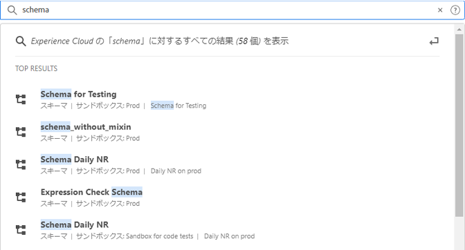
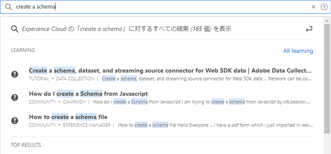

# オブジェクトとエンティティの[!UICONTROL 統合検索] {#globally-search}

[!UICONTROL 統合検索]を使用すると、一貫性のあるシームレスなワンクリックエクスペリエンスで、検索可能なビジネスオブジェクトやエンティティを見つけることができます。この検索では、最近アクセスしたオブジェクトも表示されます。

## 統合検索へのアクセス

統合検索は、ページ上部の Experience Cloud ヘッダーのすべてのページで利用できます。 キーボードショートカット（`command /` または `ctrl /`）を使用して検索にアクセスすることもできます。

現在この機能は、次のサポート対象製品でのみ使用できます。

* Experience Platform（AEP）
* Journey Optimizer（AJO）

さらに多くのコンテンツにインデックスを作成すると、この機能は関連するアプリケーションに追加されます。

## 検索可能なオブジェクトおよびフィールド

入力中、自身が表示アクセス権を持っているオブジェクトから、一致する上位の結果が表示されます。

当社のアルゴリズムは、最も関連性の高いレコードを最初に表示します。次のような複数の要因により、結果の順序は変わります。

機能とオブジェクト権限の
一致率
完全一致があるかどうか

検索可能なビジネスオブジェクトには、次のものが含まれます。

* セグメント（名前、説明、ID）
* スキーマ（名前、説明、ID）
* データセット（名前、説明、ID）
* ソース（名前、説明、ID）
* 宛先（名前、説明、ID）
* クエリ（名前、説明、ID）
* メッセージ（名前、説明、ID）
* オファー（名前、説明、ID）
* コンポーネント（名前、説明、ID）
* ジャーニー（名前、説明、ID）

キーワードがナビゲーションページと一致する場合は、ナビゲーションページのサンプルデータセットへのクイックアクセスリンクを取得できます。この「上位の結果」セクションには、上位 30 件の結果が表示されます。

ヘルプ記事は、Experience League と Communities からも確認できます。自然言語のクエリがサポートされています。

例： _スキーマの作成方法_&#x200B;の結果は、_[!UICONTROL ラーニング]_&#x200B;の下の Experience League から生成されます。

検索アルゴリズムは、最も関連性の高いレコードを最初に表示します。結果の順序は、次のような複数の要因によって異なります。

* オブジェクトにアクセスするためのユーザー権限
* 一致率
* 完全一致
* この「_[!UICONTROL 上位の結果]_」セクションには、上位 30 件の結果が表示されます。

検索を絞り込むには、次のいずれかをクリックします。

* **[!UICONTROL すべてのラーニング]**：検索を Experience League で開きます。
* **[!UICONTROL すべて表示…]**：結果をさらに絞り込んだりフィルターしたりできます。

## 統合検索機能

統合検索では、次の機能を利用できます。

| 機能 | 説明 |
| ------- | ------- |
| グローバル言語サポート | グローバル検索ではクエリを理解し、ドイツ語、スペイン語、フランス語、イタリア語、日本語、韓国語、ポルトガル語、中国語での結果を生成します。 |
| 誤字許容値 | 統合検索では、高度なアルゴリズムを使用した堅牢な誤字許容値を提供します。 これらのアルゴリズムは、編集内容を計算し、適切な結果を提供します。 |
| 強調表示 | 検索応答では、検索クエリから一致するキーワードが強調表示されるため、クエリに一致するセクションや単語を簡単に見つけることができます。 強調表示は、スペルミスのある単語にも機能します。 |
| スニペット | 検索応答で、結果のスニペットを確認できます。 スニペットは、一致する単語と、一致するキーワードの前後のコンテンツを返します。 |
| ストップワード | 英語でよく使用する単語の一部は、_ストップワード_&#x200B;として定義されています。 ストップワードが検索クエリに含まれる場合は、それらに与えられる重み付けは低くなります。 ストップワードの対象語： _a、an、and、are、as、at、be、but、by、for、if、in、into、is、it、no、not、of、on、or、such、that、the、their、then、there、these、they、this、to、was、will、 with_。 ストップワードは、他のグローバル言語ではサポートされていません。 |
| 自然言語クエリ | Experience League コミュニティでヘルプ記事やディスカッションを検索する際に、自然言語を使用して質問を入力し、回答を得ることができます。 検索例：「スキーマを作成するにはどうすればよいですか？」 |
| 引用符で囲まれた完全一致検索 | クエリで引用符を使用して、完全一致検索を実行できます。 完全一致クエリに対しては、誤字修正は行われません。 例：「Luma ジャーニー 2022」。 |
| フィルター | _オブジェクトタイプ_&#x200B;などのフィルターや、その他のオブジェクト固有のフィルターを完全な検索結果のポップアップに適用できます。検索クエリを入力した後に Enter キーを押すと、フルページのポップアップが開き、そのフィルターもポップアップに含まれます。 |

{style="table-layout:auto"}

## 見つからない場合は、

次のヒントを試してみてください。

* より具体的な検索語句を入力する
* スペルを確認する
* 検索語句全体を記述してみる
* 検索するオブジェクトへの権限があることを確認する
