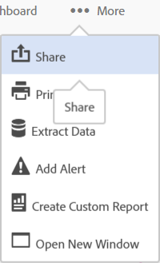

# Feed

**Experience cloudフィードは、2019年11月1日からサポートされなくなり、2019年12月までに廃止されます。**

Experience Cloud Feed を使用してアセットや Analytics レポートを共有または直接投稿する方法を説明します。

Experience Cloud への初回ログイン時には、Feed に何も表示されない場合があります。投稿を作成したり何かを共有したり、他のユーザーによってコンテンツが共有されたりすると、Feed が自動的に設定されてチームメンバーと共に最新の情報を入手できます。

Feed の設定には次のものが含まれます。

* **トピック：すべての \&lt;組織名\&gt;：**&#x200B;共有している投稿とアクセス可能な投稿をすべて表示します。
* **トピックを管理：**&#x200B;トピックをフォロー、フォロー解除または提案できます。管理者は、トピックを承認、拒否、非アクティブ化および作成することもできます。
* **新しい投稿：**&#x200B;グループメンバーが表示できる投稿を作成します。
* **すべての投稿：**&#x200B;フィード内のすべての投稿を表示します。
* **自分の投稿：**&#x200B;自分の投稿のみを表示します。
* **メンション：**&#x200B;自分や自分のグループについて言及している投稿を表示します。
* **お気に入り：**&#x200B;お気に入りとしてマークされている投稿を表示します。

## Analytics プロジェクトを Feed に共有 {#section_F2BDF9FEF4394686BAC5051CBE913EE5}

**Experience cloudフィードは、2019年11月1日からサポートされなくなり、2019年12月までに廃止されます。**

[!UICONTROL Reports &amp; Analytics] から Experience Cloud Feed にレポートを共有できます。

1. Adobe ID を使用して Experience Cloud に[ログイン](admin-getting-started/getting-started-experience-cloud.md#topic_AC564B6795334DE39359ADD87F52F2E0)します。

1. Reports &amp; Analytics に移動し、[プロジェクトを作成](https://docs.adobe.com/content/help/en/analytics/analyze/analysis-workspace/build-workspace-project/freeform-overview.html)します。

1. **[!UICONTROL その他]**／**[!UICONTROL 共有]**&#x200B;をクリックします。

   

1. 共有ウィンドウで受信者を追加し、「**[!UICONTROL 共有]**」をクリックします。
