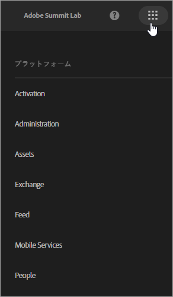
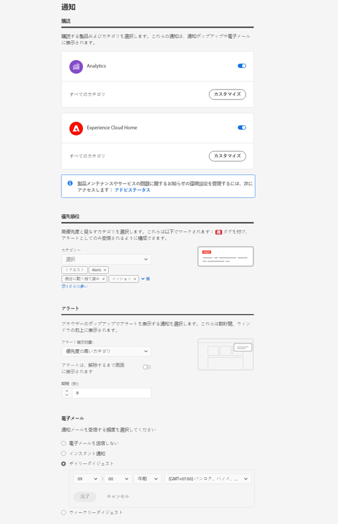

# ログインと Experience Cloud プロファイル設定の管理

個別のソリューションではなく Experience Cloud にログインすることにより、所有しているすべてのソリューションおよびサービスへのシングルサインオンが可能となります。ここでは、Experience Cloud へのログイン、パスワードおよび通知の管理、デフォルトのランディングページの指定について、それぞれの方法を説明します。

>[!IMPORTANT]
>
>ユーザーおよび製品管理の更新に関する管理者向けの情報については、[管理](admin-getting-started.md#topic_3FCB4099640647E3B2411ADBFCE81909)を参照してください。

## Experience Cloud へのログイン（管理者）  {#task_034FC955031347F3B02B686A09801A08}

ログインし、自分が適切な[組織](organizations.md#topic_C31CB834F109465A82ED57FF0563B3F1)に属していることを確認します。

1. Experience Cloudメニュー()を選択し、「**[!UICONTROL 管理]**」を選択します。

   「**[!UICONTROL 管理]**」リンクが表示されない場合は、表示されている[組織](organizations.md#topic_C31CB834F109465A82ED57FF0563B3F1)の Experience Cloud 管理者ではないということになります。管理者になる方法がわからない場合は、カスタマーケアまたは社内の Experience Cloud 管理者にお問い合わせください。
1. 「**[!UICONTROL 管理]**」を選択します。

1. 次のいずれかのリンクを選択して続行します。

| 要素 | 説明 |
|--- |--- |
| [Admin Console の基本](experience-cloud.md) | Experience Cloud ソリューションの使用を開始するために必要な最初の手順について説明します。 |
| [ID の設定](https://helpx.adobe.com/jp/enterprise/using/set-up-identity.html) | エンドユーザーを認証する ID システムを定義および設定します。 |
| [ユーザー管理](https://helpx.adobe.com/jp/enterprise/using/users.html) | Admin Console へのログインと Experience Cloud ユーザーの権限および製品プロファイルの管理について説明します。 |
| [Admin Console の起動](admin-getting-started.md) | Admin Console では、アドビのユーザーと製品の使用権限を組織全体にわたって一元的に管理できます。 [ダイレクトリンク](https://adminconsole.adobe.com)を使用して Admin Console にログインすることもできます。 |
| [Creative Cloud ユーザーの管理](t-admin-add-cc-user.md) | Experience Cloud Assets では、Creative Cloud を使用してデザイナーや他のクリエイティブ担当者とフォルダー上での共有、同期、共同作業をおこなえます。組織と共同作業することを承認された Creative Cloud ユーザーの管理はここでおこなえます。 |
| [レポートスイートをマッピング](core-services.md) | （Analytics のみ）Experience Cloud のコアサービスは個々のレポートスイートではなく組織に関連付けられています。これらのサービスを正しく機能させるには、各 Analytics レポートスイートを組織にマッピングする必要があります。（この作業は、[Analytics をコアサービスに対応させる](core-services.md#concept_07ED1D5C64234E77976E6D572E78FB9C)ワークフローの一部です）。 |
| [組織 ID](organizations.md)   | *組織 ID* は管理ページの下部に表示されています。この ID は、プロビジョニングした Experience Cloud 会社に関連付けられている ID です。この ID は 24 文字の英数字から成る文字列で、その後に @AdobeOrg（必須）が続きます。 |

{style=&quot;table-layout:auto&quot;}

## Experience Cloud へのログイン（ユーザー）  {#task_1BFE87E20DCB44078CAC82F3CD44B985}

Experience Cloud での非管理者ユーザーのログインに関するヘルプ情報です。

1. Experience Cloud で自分の[組織](organizations.md)のプロビジョニングが完了していることを管理者に確認します。

1. [Adobe Experience Cloud](https://experience.adobe.com)（[!DNL experience.adobe.com]）に移動します。
1. 「**[!UICONTROL Adobe IDでログイン]**」を選択します。

   Experience Cloud 管理者に問い合わせてアカウントのタイプ（Adobe ID または Enterprise ID）を確認してください。

1. ランディングページで、セレクターアイコンを選択してプルダウンメニューを開きます。

   

   このメニューに表示されるソリューションやサービスは、[管理者](admin-getting-started.md#topic_3FCB4099640647E3B2411ADBFCE81909)が定義したアプリケーション権限によって異なります。

## デフォルトの個人用アカウント設定の構成 {#task_73CBCAE6C91749D19C95421E5AC311BA}

個人の詳細情報を編集し、デフォルトの[組織](admin-getting-started.md#concept_705C626560A54CA2A4215F1C870C42B2)や Experience Cloud へのログイン後に表示されるランディングページを指定できます。

1. プロファイルにログインし、Experience Cloudのアイコンを選択します。

   
1. 「**[!UICONTROL プロファイルを編集]**」を選択します。

   
1. 続けて個人情報の設定と編集を行い、「**[!UICONTROL 変更の保存]**」を選択します。

## 通知の有効化 {#concept_0105453AD71847B8BFCAF4A40915F157}

システムのアップデート、メンテナンス、投稿、メンションおよび共有アセットについての通知を（電子メールまたは製品内で）受け取ります。また、顧客属性のアップロードステータスなどの通知を受け取りたい製品やソリューションを指定することもできます。

「通知」に移動するには、**[!UICONTROL 通知]**&#x200B;アイコンを選択し、**[!UICONTROL 設定]**&#x200B;アイコンを選択します。

メッセージタイプの重要度を基に通知の表示を並べ替えることができます。通知を検索することもできます。また、次のこともできます。

* メッセージタイプの重要度を基に並べ替える。
* 通知を検索する。

<!-- 
 <b>Analytics</b> 
 
<ul id="ul_91BF597858124FA5BF338C36F6C5533F"> 
 <li id="li_FAD3E93CDE6242F58F14D55C8A6E23D7">Contribution analysis completed </li> 
 <li id="li_03D33D3228884CECA371B58656B2F3E7">Guided analysis shared </li> 
 <li id="li_DCF710F89317487B8DAA86CC05C694CA">Scheduled report failure </li> 
</ul> 

 <b>Adobe Target</b> 
 

Test started or stopped 
 

 <b>Media Optimizer</b> 
 

Performance alerts 
 

 <b>Dynamic Tag Manager</b> 
 
<ul id="ul_9ACDA418933E40918744D9C32A57DD4B"> 
 <li id="li_4DD0FFD3D9F84A428703611EF767D4D0">New web property created </li> 
 <li id="li_C6B923012E9D40BA91F4CBF7D2D72986">New user added </li> 
 <li id="li_EB0B9D1CFDE24E6987935CCCBFC7892A">Approvals - publishing and approval status for new rules, data elements, and tools </li> 
 <li id="li_17B0B176FF85435FB7EDD4317BC18201">Property has been published </li> 
</ul> -->

## プロファイルとパスワードの管理 {#task_7B89F4F38E5A4C4EB0FF842953856382}

自分の Experience Cloud プロファイルを編集し、デフォルトの組織やランディングページなどを指定することができます。

1. Experience Cloud にログインします。

1. Experience Cloudで、プロフィール写真を選択します。

   
1. 「**[!UICONTROL プロファイルを編集]**」を選択します。

   プロファイルとパスワードページで、「個人の詳細情報」の各フィールドおよびオプションを設定します。

## パスワードの復元 {#task_46541A2806164CB1A4AE8239604E4EB1}

1. ソリューションのログインページに移動します。
1. 「**[!UICONTROL パスワードを忘れた場合]**」を選択します。

   ソリューションのパスワードをリセットすれば、Experience Cloud でのパスワードのリンクに関する問題は解決します。

   Adobe Analytics ユーザーの場合は、[https://sc2.omniture.com/password_recovery.html](https://sc2.omniture.com/password_recovery.html) に移動します。

## ダイレクトリンクを使用したソリューションログインの設定 {#concept_8BE493A08786469B88B210E13F78FF2F}

必要に応じ、Experience Cloud インターフェイスで提供される認証機能を使用して、ソリューション内の特定のページにログインすることもできます。

### URL テンプレート

`https://experience.adobe.com/#/@<tenantId>/<solutionname>?destURL=<fullURL>`

サンプル URL：

`https://experience.adobe.com/#/@aem62tenant/analytics?destURL=https%3A%2F%2Fsc.omniture.com%2Freports%2F11562.html`

>[!NOTE]
>
>`destURL` パラメーターで渡す URL は事前にエンコードする必要があります（[URL デコーダー／エンコーダー](https://meyerweb.com/eric/tools/dencoder/)などのエンコーダーサイトを使用できます）。

| パラメーター | 説明 | 例 | 必須／オプション |
|--- |--- |--- |--- |
| `tenantId` | ユーザーのログイン先となるテナントの名前。 | aem62tenant | オプション |
| `destURL` | ユーザーのリダイレクト先となる場所の完全な URL。 | http://sc.omniture.com/login/?r=%2Fx%2F1_7xxzf&amp;tenantId=obuengsc&amp;company=OBU+Eng+SC | オプション |
| `solutionname` | `destURL` パラメーターの所有主である MAC ソリューションの名前。このパラメーターは、URL の所有主であるソリューションにユーザーがアクセスできることを確認するために使用されます。`solutionname` と `destURL` パラメーターが同期しているかどうかの確認はソリューションサイドでおこなわれます。例：URLに Social として `solutionname` が含まれ、提供された `destURL` が Analytics の URL である場合、ユーザーは Analytics にアクセスできない場合でもその URL にリダイレクトされます。MAC では、`destURL` の所有主とソリューション名が同期しているかどうかの確認はおこなわれません。 | analytics |  `destURL` パラメーターが使用されている場合は必須です。 |

{style=&quot;table-layout:auto&quot;}
