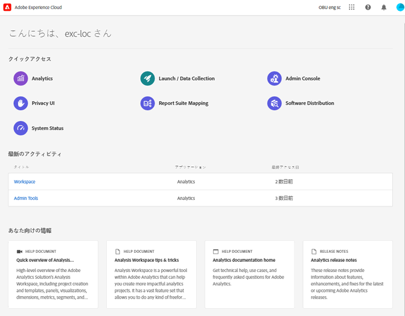

# CX エンタープライズインターフェイスと管理

[CX Enterprise](https://experience.adobe.com)は、Adobeの統合デジタルマーケティングアプリケーション、製品、サービスのファミリーです。 直感的なインターフェイスから、クラウドアプリケーション、製品機能、サービスにすばやくアクセスできます。

10月30日隠し

CX Enterpriseのヘッダーから、次のことができます。

* 顧客体験のあらゆるアプリケーションやサービスにアクセス
* ヘルプメニューから、製品ドキュメント、チュートリアル、コミュニティへの投稿を検索します。 Experience League で結果を表示します。
* 「検索」フィールドのグローバル検索を使用したビジネスオブジェクトの検索（Experience Platform ユーザーのみ）。
* アカウントの[環境設定](features/account-preferences.md)（アラート、通知、サブスクリプション）を管理します

## CX Enterpriseにログイン {#signin}

ログインし、自分が適切な[組織](administration/organizations.md)に属していることを確認します。

1. [Adobe CX Enterprise](https://experience.adobe.com)に移動します。
1. Adobeの電子メールアドレスを入力し、**[!UICONTROL Continue]**&#x200B;をクリックします。
1. アカウントをクリックします。
1. パスワードを入力します。
1. 自分が適切な組織に属していることを確認します。

   

   **組織の検証**

   [組織](administration/organizations.md)は、インターフェイスヘッダーに表示されます。

   組織でFederated IDを使用している場合は、電子メールアドレスとパスワードを入力しなくても、組織のシングルサインオンでログインできます。 CX エンタープライズ URL （`https://experience.adobe.com`）に`#/sso:@domain`を追加して、このタスクを実行します。

   例えば、Federated ID を持ち、ドメインが `example.com` の組織の場合、URL リンクを `https://experience.adobe.com/#/sso:@example.com` に設定します。 また、この URL にアプリケーションパスを付けてブックマークに追加することで、特定のアプリケーションに直接移動することもできます。 （例えば、Adobe Analytics の場合は `https://experience.adobe.com/#/sso:@example.com/analytics`。）

## CX Enterprise アプリケーションへのアクセス {#navigation}

CX Enterpriseにログインすると、統合ヘッダーからすべてのアプリケーション、サービス、組織にすばやくアクセスできます。

組織内でプロビジョニングされたCX エンタープライズ アプリケーションおよびサービスにアクセスするには、アプリケーション セレクターに移動します。

## お問い合わせとサポート {#support}

[Experience League](https://experienceleague.adobe.com/ja#home)に関するヘルプコンテンツ（ドキュメント、チュートリアル、コース）や個々のアプリケーションに関するその他のリソースなど、ヘッダーの&#x200B;**[!UICONTROL Help center]** （）を使用して、学習とヘルプにアクセスします。 自由形式のフィードバックを送信して、優先度の高いサポートチケットを作成することもできます。

[!UICONTROL Help] メニューでは、次のアクセス権も使用できます。

* **[!UICONTROL Support]:** サポートチケットを作成するか、Twitterを使用して[!UICONTROL Support]にお問い合わせください。
* **[!UICONTROL Feedback]:** CX Enterprise エクスペリエンスに関するフィードバックを共有します。 フィードバックは、アドビの製品およびサービスを改善するために使用されます。
* **[!UICONTROL Status]:** `https://status.adobe.com/ja-jp/experience_cloud`に移動し、製品操作の状態と[!UICONTROL Manage Subscriptions]を確認します。
* **[!UICONTROL Developer Connection]:** `adobe.io`に移動して、開発者ドキュメントを見つけます。

## ユーザープロファイルの管理

[!UICONTROL Profile] メニューでは、次の操作を行うことができます。

* ダークテーマを指定する（このテーマに対応していないアプリケーションもあります）
* CX エンタープライズ管理[環境設定](features/account-preferences.md)
* [組織](administration/organizations.md)を選択または検索する
* [!UICONTROL Legal Notices]を表示
* ログアウト
* アカウントの環境設定、通知、サブスクリプションを設定する

## 製品内通知とお知らせの表示 {#notifications}

ベルアイコンをクリックすると、通知とお知らせが表示されます。 お知らせには、製品リリース、メンテナンス通知、共有項目、承認リクエストなど、関連性の高い実用的な更新が含まれる場合があります。

通知とアラートを管理するには、[アカウントの環境設定と通知](features/account-preferences.md)を参照してください
