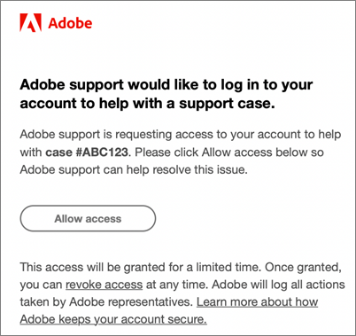

# Experience Cloud に関するよくある質問

Experience Cloud 管理者向けのブラウザーサポート、よくある質問および回答について説明します。

+++Experience Cloudでは、どのブラウザーがサポートされていますか？

Adobeでは、次のブラウザーの現在および以前の 2 つのバージョンをサポートしています。

* Microsoft® Edge
* Google Chrome
* Mozilla Firefox
* Safari
* Opera

別のブラウザーの使用は可能ですが、サポートは保証されません。

>[!NOTE]
>
>Experience Cloud ドメインで実行されているすべてのアプリケーションがすべてのブラウザーをサポートしているわけではありません。不明な場合は、特定のアプリケーションのドキュメントを確認してください。

+++

+++サポートされている言語は何ですか？

Experience Cloud は、アドビユーザーアカウントの環境設定で設定された各ユーザーの優先言語をサポートしています。現在サポートされている言語は次のとおりです。

* 中国語
* 英語
* フランス語
* ドイツ語
* イタリア語
* 日本語
* 韓国語
* ポルトガル語
* スペイン語
* 台湾語

アプリケーションチームはグローバルな言語サポートに取り組んでいますが、一部のアプリケーションは、上記のすべての言語では提供されていません。 プライマリ言語が Experience Cloud アプリケーションでサポートされていない場合、利用可能であればセカンダリ言語をデフォルトに設定することもできます。 これは、[Experience Cloud のユーザーの環境設定](https://experience.adobe.com/preferences) で実行できます。

+++

+++Adobeは、Adobe Experience Cloudへのアクセスに対して会社に料金を請求しますか？

いいえ。Adobe Experience Cloudは追加料金なしで含まれています。 ただし、コアサービスによっては追加コストがかかる場合があります。

+++

+++会社がExperience Cloudインターフェイスを使用してログインする必要があるのはなぜですか？

Experience Cloud インターフェイスが提供する機能は、ビジネスに新しい価値をもたらします。これは、今後アプリケーションにアクセスするための標準パスでもあり、最終的には他の個々のアプリケーションのログインフローに取って代わります。Experience Cloud を利用してログインすると、今後の移行をよりスムーズにおこなうことができます。

+++

+++Adobeは、Adobeクラウド環境にアクセスして問題のトラブルシューティングを行うにはどうすればよいですか？

Adobeカスタマーケアは、なりすましリクエストを送信し、明示的な認証を求めるAdobeブランドのメール（以下の例）が届く場合があります。 アクセス権は、限られた期間に対して付与されます。付与したアクセス権は、いつでも取り消すことができます。アドビは、アドビ担当者が実行したすべてのアクションを記録します。

+++

+++「プロビジョニング」とは？

Experience Cloud でのプロビジョニングは、次のことを意味します。

* ユーザーは、Experience Cloudへのログインとアプリケーションのリンクを開始できます。
* People など、Experience Cloud で利用できる機能の使用を開始できます。
* アプリケーション固有のログインプロセスを終了する準備ができます。
* アプリケーションへのアクセス制御を保持できます。

+++

+++ユーザーと製品プロファイルを管理するにはどうすればよいですか？

* 詳しくは、[Admin Console ユーザーガイド](https://helpx.adobe.com/jp/enterprise/admin-guide.html)を参照してください。

* ユーザーの使用権限と製品の管理は [Adobe Admin Console](https://adminconsole.adobe.com/enterprise)（製品リンク）でおこないます。

* **重要：** Analytics 管理ツールから Admin Console へのユーザー ID の移行に関する Analytics 管理者向けの情報について詳しくは、[Admin Console での Analytics ユーザーの管理](https://experienceleague.adobe.com/docs/analytics/admin/user-product-management/migrate-users/c-migration-tool.html)を参照してください。

+++

+++ユーザーがExperience Cloudにログインできない場合はどうすればよいですか？

Admin Console 管理者はユーザーにアクセス権を付与できます。ユーザーにはログイン手順が記載された電子メールが送信されます。

会社としてのプロビジョニングが完了していることを確認するために、[アドビサポートへの問い合わせ](https://experienceleague.adobe.com/?support-solution=General&amp;lang=ja#support)が必要になる場合もあります。

+++

+++アカウントのリンクはどこで管理できますか？

一部のユーザーは、アプリケーション（Analytics）アカウントを Adobe ID または Enterprise ID へリンクさせる必要が生じる場合があります。

[アプリケーションアカウントを Adobe ID にリンクする](../administration/organizations.md)を参照してください。

+++

+++ユーザーアカウントのプロファイルと組織を管理するにはどうすればよいですか？

[ユーザーアカウントの管理](../administration/organizations.md)を参照してください。

+++

+++組織とは？

[組織](../administration/organizations.md)は、管理者がグループおよびユーザーの設定や、Experience Cloud でのシングルサインオンの制御を行うことができるエンティティです。この組織は、Experience Cloud のすべての製品とアプリケーションにまたがるログイン会社のように機能します。ほとんどの場合、組織は勤務先の会社名です。ただし、1 つの会社が多くの組織を持つことができます。

+++

+++IMS 組織 ID はどこにありますか？

詳しくは、[組織 ID の表示](../administration/organizations.md)を参照してください。

+++

+++ユーザーの 1 人が会社を辞めた場合はどうすればよいですか？

そのユーザーのアクセスは、アプリケーション自体から削除する必要があります。アクセス権を削除されたユーザーは、その製品に対して Experience Cloud からのアクセスも、直接ログインによるアクセスもできなくなります。また、そのユーザーを Experience Cloud レベルで削除する必要もあります。

+++

+++Adobe IDとは

[ID タイプ](https://helpx.adobe.com/jp/enterprise/using/identity.html)を参照してください。

+++

+++ユーザーのアプリケーションアカウントをリンクできますか？

いいえ。ユーザーは、自分のアプリケーションを自分のユーザー名とパスワードでリンクさせる必要があります。

+++
