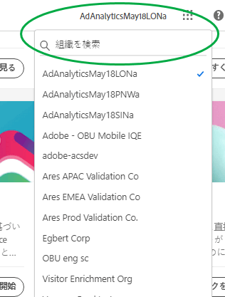
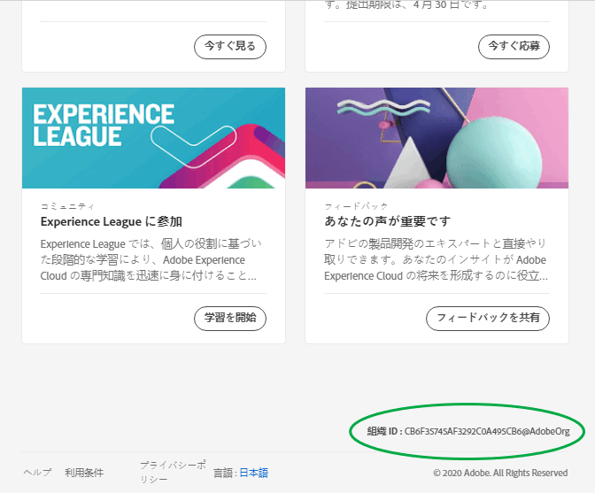

# 組織とアカウントのリンク

組織管理の概要と、ソリューションアカウントの Experience Cloud へのリンクについて説明します。

## 組織を特定する {#concept_384D169B0B724B799D573B8ECB5C39BF}

*組織は*、管理者がグループおよびユーザーの設定や、Experience Cloud でのシングルサインオンの制御をおこなえるエンティティです。組織は、すべての Experience Cloud 製品およびソリューションをまたいだログイン会社のように機能します。ほとんどの場合、組織は勤務先の会社名です。ただし、1 つの会社が多くの組織を持つことができます。

また、サポートを受けるために組織 ID を特定することが必要になる場合もあります。**[!UICONTROL 組織]**&#x200B;メニューを使用して、自分が正しい組織に属していることを確認したり、組織を切り替えたりできます。

## 組織 ID を見つける {#concept_EA8AEE5B02CF46ACBDAD6A8508646255}

**組織 ID：**&#x200B;プロビジョニングされた Experience Cloud の会社に関連付けられた ID。この ID は 24 文字の英数字から成る文字列で、その後に @AdobeOrg（必須）が続きます。

組織IDを表示するには、Experience Cloudランディングページに移動するか、()を選択してから、「**[!UICONTROL 管理]**」を選択します。 組織 ID は、[!UICONTROL Experience Cloud 使用の手引き]ページまたは[!UICONTROL 管理]ページの下部にあります。

## ソリューションアカウントを Adobe ID にリンクする {#task_FD389E78640848919E247AC5E95B8369}

通常は、Experience Cloud 管理者がソリューションやサービスへのアクセス権を付与します。まれに、ソリューションの資格情報を Adobe ID にリンクすることが必要になる場合があります。

1. Experience Cloud への招待メールに記載されている手順に従います。
1. Adobe ID または Enterprise ID を使用してログインします。
1. ソリューションセレクターを選択します。(  )。

   

   アクセスできるソリューションはカラー表示されます。
1. 目的のソリューションを選択します。

   

   このタイプのメッセージは、ユーザーが適切なグループに属している（かつソリューションに対する権限を持っている）ものの、そのアカウントの資格情報をまだ Adobe ID にリンクしていない場合に表示されます。
1. 「**[!UICONTROL アカウント]**&#x200B;をリンク」を選択し、資格情報を入力します。

## デフォルトの組織とランディングページを指定する {#concept_6A191B42A9874A9780882903BA18F071}

ログイン時に使用するデフォルトの組織およびランディングページを指定できます。

自分のプロファイルで、「**[!UICONTROL プロファイルを編集]**」を選択します。

デフォルトの組織およびランディングページでは、ログインエクスペリエンスをカスタマイズできます。

## アカウントのリンクに関する問題のトラブルシューティング {#concept_DFCB29A3B4834FC59AA29E0BBA301584}

アカウントのリンクに起因する問題に関するヘルプです。

一般的に、アカウントのリンクは、Adobe ID が以前のユーザーにリンクされていることが原因で失敗します。アカウントのリンクに失敗した場合は、

* [アドビサポートにお問い合わせ](https://experienceleague.adobe.com/?support-solution=General&amp;lang=ja#support)ください。
* 問題の解決前でも、標準ログインを使用してソリューションにアクセスできます。
