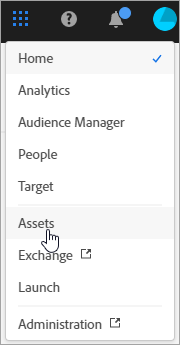
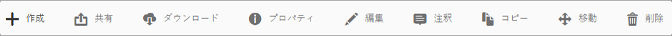
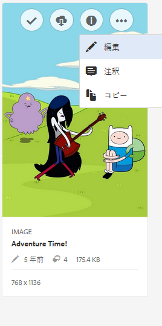
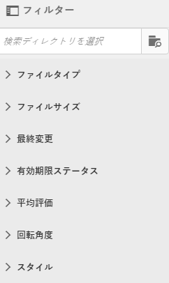
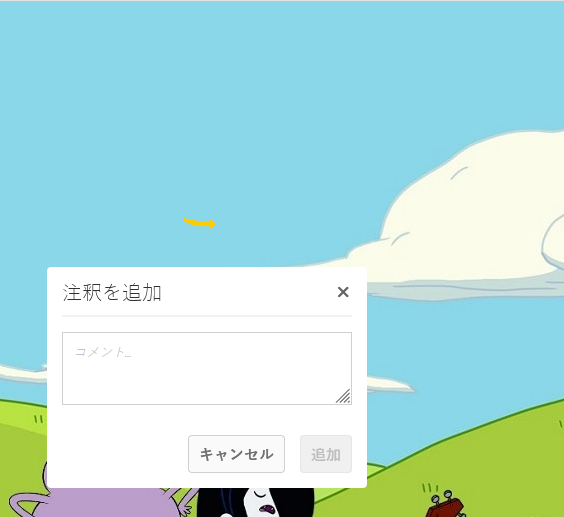
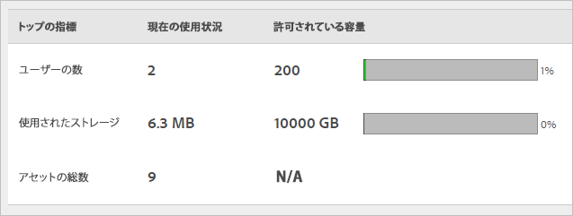

# CX Enterprise Assetsの概要

CX Enterprise Assetsは、アプリケーション間で共有できる、マーケティングに適したアセットの一元的なリポジトリを提供します。 アセットは、デジタルドキュメント、画像、ビデオ、オーディオのいずれか（またはその一部）で、複数のレンディションを持つことができ、サブアセット（例えば、[!DNL Photoshop] ファイルのレイヤー、[!DNL PowerPoint] ファイルのスライド、PDF のページ、ZIP 内のファイルなど）を持つことができます。

アセットサービスには次のものが含まれます。

* アセットストレージ、管理インターフェイス、（アプリケーション経由でアクセスする）組み込みの選択インターフェイス。
* Creative Cloud、CX Enterprise collaboration、CX Enterpriseアプリケーションとの統合。

アセットを使用すると、一貫性とブランドコンプライアンスが向上し、市場投入までの時間が短縮されます。 アプリケーションのワークフローを効率化できます。

* **[!DNL Adobe Target]**：A/B テストと多変量分析テストを設定できます。
* **[!DNL Ad Cloud]**：様々なチャネルとキャンペーン全体で広告ユニットを作成できます。
* **[!DNL Adobe Campaign]**：アセットを電子メールニュースレターとキャンペーンに配置します。

## CX Enterprise Assetsへの移動

## ツールバーへのアクセス

アセット （またはアセットディレクトリ）に移動し、**[!UICONTROL Select]**&#x200B;をクリックします。

ツールバーから、検索、タイムライン、レンディション、編集、注釈、ダウンロードなどの機能にすばやくアクセスできます。

>[!NOTE]
>
>アセットを [!DNL Target] から正常に削除するには、アセットを Adobe Target アクティビティから削除する必要があります。

## アセットの編集

アセットの編集機能には次のものが含まれます。

* 切り抜き
* 回転
* 反転

## アセットの検索

キーワード、ファイルタイプ、サイズ、最終変更日時、公開ステータス、向きおよびスタイルで検索できます。

## アセットへの注釈の付加

画像上に円または矢印を描画して&#x200B;**[!UICONTROL Annotate]**&#x200B;をクリックし、同僚がレビューするアセットに注釈を付けます。

## アセットのフルスクリーン表示とズーム

**[!UICONTROL Views]** > **[!UICONTROL Image]**&#x200B;をクリックして、完全なアセット画像を表示し、ズームを有効にします。

## アセットプロパティの表示

プロパティ付きのカードビュー、リスト表示および列ビューのいずれかを選択して、アセットをより容易に見つけることができます。

**[!UICONTROL Views]** > **[!UICONTROL Properties]**&#x200B;をクリックして、アセットのプロパティを表示します。

## 使用状況レポートの実行

ユーザー数、使用されているストレージおよびアセット合計数を表示します。

**[!UICONTROL Tools]** > **[!UICONTROL Reports]** > **[!UICONTROL Usage Report]**&#x200B;をクリックします

