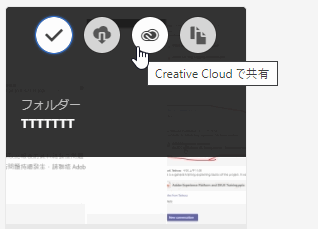
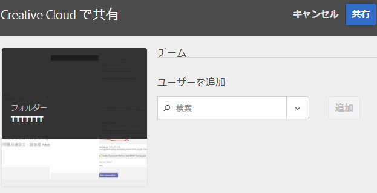
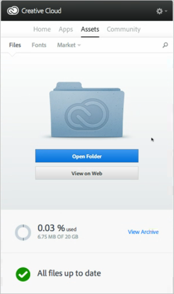
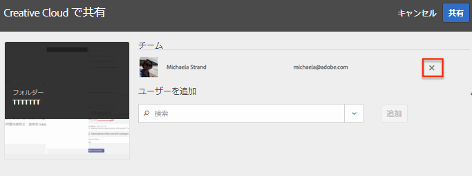
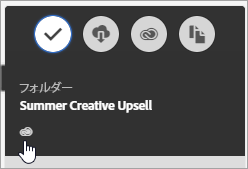

# Experience Cloud アセットフォルダーの共有

Experience Cloud と Creative Cloud の間でフォルダーとアセットを共有します。共有アセットで共同作業をしたり、注釈を付けたり、それらをAdobe TargetなどのExperience Cloud アプリケーションで使用したりできます。 共有フォルダーは Experience Cloud から作成する必要があります。

**分かち合いの利点**

* クリエイティブ制作物の確認、承認および公開ワークフローを効率化できます。
* 複数の場所に分散された作業中ファイルやバージョンの管理にかかる時間を短縮できます。
* クリエイティブなアセットをより効果的に追跡および管理できます。
* 企業セキュリティを強化できます。
* クリエイティブとマーケターの間でファイルを共有、保存および送信できます。

Creative Cloud ユーザーがアセットにアクセスするには、Experience Cloudで許可リストに登録されている必要があります。 [Creative Cloud ユーザーの管理](manage-cc-users.md)を参照してください。

**Experience Cloud アセットフォルダーを共有するには**

1. アセットフォルダーで、「**[!UICONTROL Share to Creative Cloud]**」をクリックします。

   
1. Creative Cloudで共有ページでユーザーを検索してから、「**[!UICONTROL Add]**」をクリックします。

   

1. 「**[!UICONTROL Share]**」をクリックします。
1. [!DNL Creative Cloud] Desktop を起動（またはブラウザーの [!UICONTROL Creative Cloud Files] ページに移動）して、要求通知を探します。

   
1. リクエストを開いてから、「**[!UICONTROL Accept]**」をクリックします。

   
1. フォルダーのコンテンツにアクセスするには、「**[!UICONTROL Open Folder]**」（または「**[!UICONTROL View on Web]**」）をクリックします。

   
1. 共有アセットにコメントを追加して続行します。

   Creative Cloudでは、画像を選択してから「**[!UICONTROL Activity]**」をクリックして、画像にコメントを追加することができます。 コメントは、[!DNL Creative Cloud] と [!DNL Experience Cloud] のアセットで同期されます。

   

   Experience Cloudで、画像を選択してからタイムラインアイコンを選択して、画像にコメントを追加します。 コメントは、Creative Cloud と Experience Cloud のアセットで同期されます。

   

1. フォルダーの共有を解除するには、「**[!UICONTROL Share Using Creative Cloud]**」をクリックし（[ 手順 3](share.md) と同様）、「X」を選択してユーザーを削除して、「**[!UICONTROL Share]**」をクリックします。

   

   Creative Cloud ユーザーをすべて削除すると、そのフォルダーの共有が解除され、Creative Cloud ユーザーはそれらにアクセスできなくなります。

共有アセットを使用するその他の方法としては、アクティビティ内の画像用にAdobe Targetの [ オファーライブラリ ](https://experienceleague.adobe.com/docs/target/using/experiences/offers/manage-content.html) でアセットを読み込んだり入れ替えたりすることが挙げられます。

Creative Cloud にフォルダーを共有すると、フォルダー上に Creative Cloud のロゴが表示されます。

関連するヘルプ：

* [Creative Cloud ヘルプ - ファイルの管理と同期](https://helpx.adobe.com/jp/creative-cloud/help/sync-creative-cloud-files.html)
* [Creative Cloud ヘルプ - 他のユーザーとの共同作業](https://helpx.adobe.com/jp/creative-cloud/help/collaboration.html)
* [Creative Cloud ヘルプ - 共同作業に関する FAQ](https://helpx.adobe.com/jp/creative-cloud/help/collaboration-faq.html)

## Adobe Target とのアセットの共有について

[!DNL Adobe Target] でアクティビティを作成する場合、[!UICONTROL Offers Library] で画像を入れ替える際に、共有画像アセットを使用できます。

[!DNL Target] ヘルプの[オファーライブラリ](https://experienceleague.adobe.com/docs/target/using/experiences/offers/manage-content.html)を参照してください。

