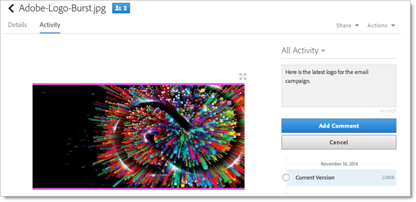

# Experience Cloud アセットフォルダーの共有

Creative Cloud ユーザーと Experience Cloud アセットフォルダーを共有します。

1. Asset フォルダーで、「**[!UICONTROL Creative Cloud で共有]**」をクリックします。

   
1. Creative Cloud で共有ページでユーザーを検索してから、「**[!UICONTROL 追加]**」をクリックします。

   

1. 「**[!UICONTROL 共有]**」をクリックします。
1. [!DNL Creative Cloud] デスクトップを起動（またはブラウザーの [!UICONTROL Creative Cloud Files] ページに移動）して、要求通知を探します。

   
1. 要求を開いてから、「**[!UICONTROL 同意]**」をクリックします。

   
1. フォルダーのコンテンツにアクセスするには、「**[!UICONTROL フォルダーを開く]**」（または「**[!UICONTROL Web で表示]**」）をクリックします。

   
1. 共有アセットにコメントを追加して続行します。

   Creative Cloudでは、画像を選択して「**[!UICONTROL アクティビティ]**」をクリックし、画像にコメントを追加することができます。 コメントは、[!DNL Creative Cloud] と [!DNL Experience Cloud] のアセットで同期されます。

   

   Experience Cloudで、画像を選択してからタイムラインアイコンを選択して、画像にコメントを追加します。 コメントは、Creative Cloud と Experience Cloud のアセットで同期されます。

   

1. フォルダーの共有を解除するには、**[!UICONTROL Creative Cloudーを使用して共有]** （[ 手順 3](share.md) と同様）をクリックしてから X を選択してユーザーを削除し、**[!UICONTROL 共有]** をクリックします。

Creative Cloud ユーザーをすべて削除すると、そのフォルダーの共有が解除され、Creative Cloud ユーザーはそれらにアクセスできなくなります。

共有アセットを使用するその他の方法としては、アクティビティ内の画像用にAdobe Targetの [ オファーライブラリ ](https://experienceleague.adobe.com/docs/target/using/experiences/offers/manage-content.html) でアセットを読み込んだり入れ替えたりすることが挙げられます。

Creative Cloud にフォルダーを共有すると、フォルダー上に Creative Cloud のロゴが表示されます。

関連するヘルプ：

* [Creative Cloud ヘルプ - ファイルの管理と同期](https://helpx.adobe.com/jp/creative-cloud/help/sync-creative-cloud-files.html)
* [Creative Cloud ヘルプ - 他のユーザーとの共同作業](https://helpx.adobe.com/jp/creative-cloud/help/collaboration.html)
* [Creative Cloud ヘルプ - 共同作業に関する FAQ](https://helpx.adobe.com/jp/creative-cloud/help/collaboration-faq.html)
