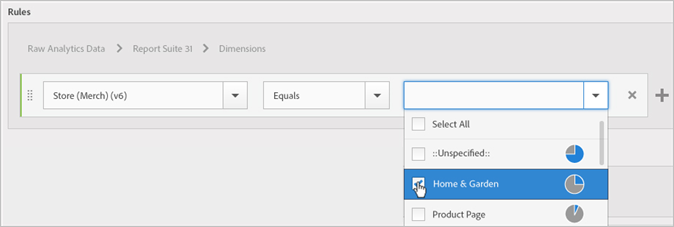

# オーディエンスの作成

[!UICONTROL Audience Library]では、属性ルールを使用してオーディエンスを作成し、CX Enterprise アプリケーションで共有するための複合オーディエンスを定義できます。

この記事では、以下の方法について説明します。

* オーディエンスの作成
* ルールの作成
* ルールを使用した複合オーディエンスの定義

次の図は、複合オーディエンスの 2 つのルールを表しています。

それぞれの円が、オーディエンスのメンバーシップを定義するルールを表します。 重なっている両方のオーディエンスルールのメンバーと認定される訪問者が、複合オーディエンスとして定義されます。

>[!NOTE]
>
>オーディエンスが完全に定義されるのは、指定されたデータ収集期間の終了後です。

次に、複合オーディエンスのルールを作成する方法の例を示します。 このオーディエンスは、次のもので構成されます。

* ページデータまたは Analytics の生データから得られる Home &amp; Garden セクション。
* [!DNL Adobe Analytics] セグメント [公開済み](overview.md) ～ [!DNL CX Enterprise]から派生したChromeおよびSafari ユーザー。

  

**オーディエンスを作成するには、以下を実行します。**

1. [!DNL CX Enterprise]個のアプリ （）をクリックし、**[!UICONTROL People]** > **[!UICONTROL Audience Library]をクリックします。**

1. [!UICONTROL Audiences] ページで、**[!UICONTROL New]**&#x200B;をクリックします。 

   

1. [!UICONTROL Create New Audience] ページで、**[!UICONTROL Title]**&#x200B;および&#x200B;**[!UICONTROL Description]** フィールドに入力します。
1. [!UICONTROL Rules]で、参照レポートスイートを選択し、属性ソースを選択します。

   * **[!UICONTROL Real-Time Analytics Data:]** （またはRaw データ）これは、Real-Time Analytics イメージリクエストから派生した属性データです。 eVarやイベントも含まれます。 この属性ソースを使用する場合は、レポートスイートを選択し、含めるディメンションまたはイベントを定義する必要があります。 このレポートスイートの選択により、レポートスイートで使用された変数構造が提供されます。

     >[!NOTE]
     >
     >Analyticsで削除されたレポートスイートは、キャッシュが原因で、CX Enterpriseに削除が表示されるまでに12時間かかる。

   * [!DNL CX Enterprise] ソースから派生した&#x200B;**[!UICONTROL CX Enterprise:]**&#x200B;属性データ。 例えば、[!DNL Analytics] で作成したオーディエンスセグメントからのデータや、[!DNL Audience Manager] からのデータです。

1. オーディエンスルールを定義し、**[!UICONTROL Save].**&#x200B;をクリックします

**例：複合オーディエンスのルールを定義**

>[!NOTE]
>
>オーディエンスルールを定義する場合は、実装変数について理解している必要があります。

[!UICONTROL Rules]で、*`Home & Garden`*&#x200B;属性の選択を定義します。

* **[!UICONTROL Attribute Source:]**&#x200B;個の生の分析データ
* **[!UICONTROL Report Suite:]** レポートスイート 31
* Dimension = **[!UICONTROL Store (Merch) (v6)]** > **[!UICONTROL Equals]** > **[!UICONTROL Home & Garden]**

*Chrome および Safari の訪問者*&#x200B;は、Analytics から共有されたオーディエンスセグメントです。

* **[!UICONTROL Attribute Source:]** CX エンタープライズ
* **[!UICONTROL Dimension:]**&#x200B;人のChromeとSafari訪問者

比較のために、*OR* ルールを追加して、「Patio &amp; Furniture」のようなサイトセクションへのすべての訪問者を確認することもできます。

このルールの結果として得られるのは、Home &amp; Garden を訪問した Chrome および Safari ユーザーで構成される、定義されたオーディエンスです。 「Patio &amp; Furniture」セグメントにより、このサイトセクションに訪問するすべての訪問者に対する追加のインサイトが得られます。

* **履歴による予測：**（点線の円）[!DNL Analytics] データに基づいて作成されたルールを表しています。
* **実際のオーディエンス：**（実線の円）Audience Manager からの 30 日間のデータで作成されたルールです。 Audience Manager データが 30 日に達すると、線が実線になり、実際の数を表します。

特定期間のデータ収集が終了すると、円は結合されて、定義されたオーディエンスを表示します。

オーディエンスが保存されると、他のCX Enterprise アプリケーションで使用できるようになります。 例えば、Adobe Target [ アクティビティ ](https://experienceleague.adobe.com/en/docs/target/using/activities/activities)に共有オーディエンスを含めることができます。
