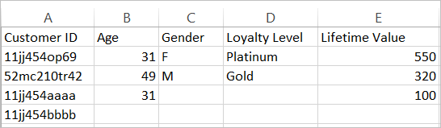
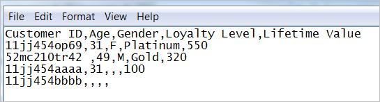

# 顧客属性データファイルとソース

顧客属性データをCX Enterpriseにアップロードするためのデータファイル要件と複数のデータソース。

企業内の CRM データや同様のデータにアクセスする必要があります。 CX Enterpriseにアップロードするデータは、`.csv` ファイルである必要があります。 FTP や sFTP を利用してアップロードする場合は、`.fin` ファイルもアップロードします。

[!DNL Customer Attributes]は、1日に数個のファイルを処理するように設計されています。 小さなファイルを多数処理することで発生する処理の遅延を軽減するために、同じ組織から以前のバッチ後 30 分以内に送信されたファイルは、優先順位の低いキューにルーティングされます。

## 許可されるファイルタイプと命名規則

| ファイルタイプ | 説明 |
| --- | --- |
| `.csv` | 値をコンマで区切って入力したファイル（Excel で作成するファイルなど）。 このファイルには、顧客属性データが含まれます。   命名要件：ファイル名の拡張子に空白が含まれていないことを確認します。 |
| `.fin` | （必須） `.fin` ファイルは、データのアップロードが完了したことをシステムに通知します。 `.fin` ファイルの名前は、`.csv` ファイルの名前と一致する必要があります。  Adobeでは、`.fin`拡張子を持つ空のテキストファイルを作成することをお勧めします。 空のファイルは、スペースとアップロード時間を節約します。 **注：** `.fin` ファイルの名前を変更することは、アップロード後に許可されません。 `.fin` ファイルは個別にアップロードする必要があり、以前にアップロードしたファイルの名前を変更することはできません。 顧客属性FTPに`.fin` ファイルをアップロードすると、システムはデータを迅速に（1分以内に）取得します。 これは、データの取得頻度が低い（1時間に1回程度）他のAdobe FTP ベースのシステムとは異なります。 ドラッグ&amp;ドロップ アップロード方式を使用する場合、`.fin` ファイルは必要ありません。 |
| `.gz` または `.zip` | `.gz` （gzip）または`.zip` – 圧縮ファイル用。 `.zip` ファイルに複数のファイルを含めることはできません。 命名要件：`.zip`または`.gz`の名前は、`.csv` ファイルの名前と一致する必要があります。 例えば、`.csv` ファイルが`crm_small.csv`の場合、`.zip` ファイルは`crm_small.csv.zip`になります。 `.fin` ファイルは`.csv`と一致する必要があります。 |

## 属性データファイルの要件

**CSV の例**

CSV ファイルは次の形式に準拠する必要があります。



テキストエディターで閲覧された同じファイル：



**ガイドライン**

<table id="table_A9849CC9AA784763921DE057F0F61515"> 
 <thead> 
  <tr> 
   <th colname="col1" class="entry"> 項目 </th> 
   <th colname="col2" class="entry"> 説明 </th> 
  </tr> 
 </thead>
 <tbody> 
  <tr> 
   <td colname="col1"> <p>ドラッグ＆ドロップ </p> </td> 
   <td colname="col2"> <p>ドラッグ＆ドロップファイルは 100 MB 未満にしてください。 </p> <p>Web の UI でドラッグ＆ドロップしてアップロードする場合、<span class="filepath">.fin</span> ファイルは不要です。 </p> </td> 
  </tr> 
  <tr> 
   <td colname="col1"> <p>顧客ID列 </p> </td> 
   <td colname="col2"> <p> 1 列目は一意の顧客 ID でなければなりません。 使用するIDは、CX Enterprise ID サービスに渡されるIDに対応する必要があります。 </p> <p>Analytics の場合は、prop または eVar に格納されている ID です。 </p> <p>Targetの場合は、setcustomerID値。 </p> <p> この顧客 ID は、データベース内の各ユーザーを表すために CRM で使用する一意の ID です。 残りの列は CRM から取得される属性です。 アップロードする属性の数を選択します。 </p> <p>列の見出しには読みやすく、わかりやすい名前を使用することが推奨されますが、必須ではありません。 アップロード後におこなうスキーマの検証の際に、アップロードされた行と列にわかりやすい名前をマッピングできます。 </p> <p> <b>顧客IDについて</b> </p> <p>通常、企業は、CRM システムからの顧客 ID を使用します。 このIDは、ユーザーがログインしたときに<span class="codeph"> setcustomerID </span>呼び出しを使用して設定されます。 このIDは、CX EnterpriseにアップロードされるCRM ファイルのキーとしても使用されます。 <a href="t-crs-usecase.md" format="dita" scope="local">エイリアス ID</a> は、エイリアスデータが格納される Audience Manager のデータストアの識別子です。 システムは、このデータストアに（setcustomerIDを介して）エイリアスを送信します。 CRM ファイルは、このデータストアのデータに適用されます。 </p> <p><span class="codeph">個のsetcustomerID </span>について詳しくは、<a href="https://experienceleague.adobe.com/docs/id-service/using/reference/authenticated-state.html?lang=ja" format="https" scope="external">個の顧客IDと認証状態</a>を参照してください。 </p> </td> 
  </tr> 
  <tr> 
   <td colname="col1"> <p>2 列目以降のヘッダーと列 </p> </td> 
   <td colname="col2"> <p>2 列目以降のヘッダーは、各属性の名前を表す必要があります。 </p> <p> これらの列は、CRM から取得される顧客属性を含んでいる必要があります。 </p> </td> 
  </tr> 
  <tr> 
   <td colname="col1"> <p>属性の制限 </p> </td> 
   <td colname="col2"> <p>数百の<span class="filepath"> .csv </span>列をCX Enterpriseの顧客属性サービスにアップロードできます。 ただし、サブスクリプションを設定して属性を選択する場合、所有するアプリケーションに応じて、次の制限が適用されます。 </p> <p> 
     <ul id="ul_2BB85067918D4BB3B59394F3E3E37A6D"> 
      <li id="li_93703988B9934384B4B94A839D028380"> <b>Analytics Standard：</b>合計 3 件 </li> 
      <li id="li_D1E5E7BD24C54591B14D15DE97447835"> <b>Analytics Premium：</b>レポートスイートあたり 200 件 </li> 
      <li id="li_8C891FE3D1EF49FA9F81E2E32CD0B9CA"> <b>Adobe Target Standard：</b>5 件 </li> 
      <li id="li_2B66D43023F34EA685CE2C38A9250CEA"> <b>Adobe Target Premium：</b>200 件 </li> 
     </ul> </p> </td> 
  </tr> 
  <tr> 
   <td colname="col1"> <p>行の制限 </p> </td> 
   <td colname="col2"> <p>行数に制限はありません。 </p> </td> 
  </tr> 
  <tr> 
   <td colname="col1"> <p>列の制限 </p> </td> 
   <td colname="col2"> <p>実用上、列数は最大 200 個前後に制限されています。 </p> </td> 
  </tr> 
  <tr> 
   <td colname="col1"> <p>文字制限 </p> </td> 
   <td colname="col2"> <p>Analytics サブスクリプションの作成時には、アップロードするファイルのフィールド長が 255 文字以下になるように切り詰められます。 </p> </td> 
  </tr> 
  <tr> 
   <td colname="col1"> <p>FTP に関するガイドラインとサイズ制限 </p> </td> 
   <td colname="col2"> <p> 
     <ul id="ul_E157EE6F98914EADA0C103D1D1E705D3"> 
      <li id="li_84FBD455DD164A28AC16F4A5AB19E4B3">FTP のファイルサイズの上限は、各アップロードで 4 GB です。 </li> 
      <li>ファイルサイズの下限は、各アップロードで 10 MB です。 </li>
      <li>30 分ごとに 1 つのファイルをアップロードできます。 </li>
      <li id="li_B69A20C51D824727AA99C1F6F78537A4"> <span class="filepath">.csv</span>（および <span class="filepath">.fin</span>）ファイルを FTP サイトのルートフォルダーにアップロードする必要があります。 </li> 
     </ul> </p> <p> <p>重要：FTP アカウントの合計許容量は 40 GB です。 処理されたデータを削除するのは、ユーザーの責任です。 </p> </p> </td> 
  </tr> 
  <tr> 
   <td colname="col1"> <p>ファイル要件 </p> </td> 
   <td colname="col2"> <p> 各属性ソースには、コンマで区切った同数のフィールドが含まれる必要があります。 </p> <p> 改行、二重引用符またはコンマを含むフィールドは引用符で囲む必要があります。 </p> <p> フィールド内の二重引用符文字は、バックスラッシュ（\）を使用してエスケープする必要があります。 </p> <p> 空白の列は<span class="term"> null </span>として保存されます。 </p> </td> 
  </tr> 
  <tr> 
   <td colname="col1"> <p>複数のファイル </p> </td> 
   <td colname="col2"> <p>顧客属性データをアップロードする際、連続してアップロードする複数のファイルがある場合（特にファイルが大きい場合）は、前のファイルが処理されていることを確認してから次のファイルをアップロードするようにしてください。 これは、前のファイルが[!DNL Customer Attributes] FTP アカウント内の処理済みまたは失敗したフォルダーに移動されたタイミングを確認することで監視できます。 </p> <p> 大きなファイルを小さなファイルに分割し、それらを短時間で連続して送信すると、次のファイルを送信する前に各ファイルが処理されない限り、処理速度が低下する可能性があります。 </p> </td> 
  </tr> 
  <tr> 
   <td colname="col1"> <p>文字エンコーディング </p> </td> 
   <td colname="col2"> <p>日本では UTF-8 にする必要があります。 </p> </td> 
  </tr> 
   <tr> 
   <td colname="col1"> <p>履歴データ </p> </td> 
   <td colname="col2"> <p> 顧客属性は、[!DNL Analytics]の基になる訪問者プロファイルに関連付けられます。 このように、[!DNL Customer Attributes]は[!DNL Analytics]の訪問者プロファイルの全期間にわたって訪問者に関連付けられます。 このプロファイルには、顧客が最初にログインする前の行動が含まれます。 </p> <p> Data Warehouse のバックフィル手法を使用している場合、データは Analytics ID（AID）に基づく post_visid_high/low に関連付けられます。 CX Enterprise ID サービスを使用している場合、データはCX Enterprise ID （MID）に基づくpost_visid_high/lowに関連付けられます。 </p> <p> Data Warehouseのバックフィル方式は、2022年10月からは使用できなくなります。 </td> 
  </tr> 
  <tr> 
   <td colname="col1"> <p>データフィード </p> </td> 
   <td colname="col2"> <p>顧客属性はデータフィードでは使用できません。 </p> </td> 
  </tr> 
 </tbody> 
</table>

## 複数のデータソースの使用

顧客属性ソースを作成、変更または削除する場合、ID が新しいデータソースと同期され始めるまで、約 1 時間の遅延があります。

各顧客属性ソースのエイリアス ID は、一意である必要があります。 同じ ID を活用する複数のデータソースがある場合、次のように設定します。

**VisitorAPI.jsまたはDynamic Tag ManagementのCX Enterprise ID ツールで：**

適切なデータソースに対応する 2 つの顧客 ID を設定します。

```
Visitor.setcustomerIDs({ 
     "ds_id1":"123456", 
     "ds_id2":"123456" 
});
```

（詳しくは、[顧客IDと認証状態](https://experienceleague.adobe.com/docs/id-service/using/reference/authenticated-state.html?lang=ja)を参照してください）。

**[!DNL CX Enterprise]** > **[!DNL Customer Attributes]**&#x200B;で：

上記の顧客 ID に対応する一意のエイリアス ID を使用して、2 つの顧客属性ソースを作成します。 この手法を使用すると、同じ参照 ID を複数の顧客属性ソースに送信できます。
