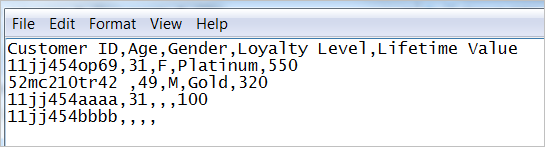

# [!DNL Customer Attributes] のデータファイルとデータソースについて

顧客属性データをExperience Cloudにアップロードするためのデータファイル要件および複数のデータソース。

企業内の CRM データや同様のデータにアクセスする必要があります。Experience Cloudにアップロードするデータは、`.csv` ファイルにする必要があります。 FTP や sFTP を利用してアップロードする場合は、`.fin` ファイルもアップロードします。

[!DNL Customer Attributes] は、1 日に数個のファイルを処理するように設計されています。 小さなファイルを多数処理することで発生する処理の遅延を軽減するために、同じ組織から以前のバッチ後 30 分以内に送信されたファイルは、優先順位の低いキューにルーティングされます。

## 許可されるファイルタイプと命名規則 {#section_6F64FA02ACCC4215B0862CB6A1821FBF}

| ファイルタイプ | 説明 |
|--- |--- |
| `.csv` | 値をコンマで区切って入力したファイル（Excel で作成するファイルなど）。このファイルには、顧客属性データが含まれます。   命名要件：ファイル名拡張子に空白が含まれていないことを確認します。 |
| `.fin` | （必須） `.fin` ファイルは、データのアップロードが完了したことをシステムに伝えます。 `.fin` ファイルの名前は、`.csv` ファイルの名前と一致する必要があります。  Adobeでは、`.fin` の拡張子を持つ空のテキストファイルを作成することをお勧めします。 空のファイルを使用すると、領域を節約でき、アップロード時間も短縮されます。 **メモ：** アップロード後に `.fin` ファイルの名前を変更することはできません。 `.fin` ファイルは個別にアップロードする必要があり、以前にアップロードしたファイルの名前を変更することはできません。 顧客属性 FTP に `.fin` ファイルをアップロードすると、システムはデータを素早く（1 分以内に）取得します。 これは、データの取得頻度が低い（1 時間に 1 回程度）他のAdobe FTP ベースシステムとは異なります。 ドラッグ&amp;ドロップによるアップロード方法を使用する場合、`.fin` ファイルは必要ありません。 |
| `.gz` または `.zip` | `.gz` （gzip）または `.zip` – 圧縮ファイルの場合。 `.zip` ファイルには、アーカイブ内に複数のファイルを含めることはできません。 命名要件：`.zip` または `.gz` の名前は、`.csv` ファイルの名前と一致する必要があります。 例えば、`.csv` ファイルが `crm_small.csv` の場合、`.zip` ファイルは `crm_small.csv.zip` である必要があります。 `.fin` ファイルは `.csv` と一致する必要があります。 |


## 属性データファイルの要件 {#section_169FBF5B7BBA47CE825B7A330CF3FE98}

**CSV の例**

CSV ファイルは次の形式に準拠する必要があります。


テキストエディターで閲覧された同じファイル：



**ガイドライン**

<table id="table_A9849CC9AA784763921DE057F0F61515"> 
 <thead> 
  <tr> 
   <th colname="col1" class="entry"> 項目 </th> 
   <th colname="col2" class="entry"> 説明 </th> 
  </tr> 
 </thead>
 <tbody> 
  <tr> 
   <td colname="col1"> <p>ドラッグ＆ドロップ </p> </td> 
   <td colname="col2"> <p>ドラッグ＆ドロップファイルは 100 MB 未満にしてください。 </p> <p>Web の UI でドラッグ＆ドロップしてアップロードする場合、<span class="filepath">.fin</span> ファイルは不要です。 </p> </td> 
  </tr> 
  <tr> 
   <td colname="col1"> <p>顧客 ID 列 </p> </td> 
   <td colname="col2"> <p> 1 列目は一意の顧客 ID でなければなりません。使用する ID は、Experience Cloud ID サービスに渡される ID に対応している必要があります。 </p> <p>Analytics の場合は、prop または eVar に格納されている ID です。 </p> <p>Target の場合、setcustomerID 値。 </p> <p> この顧客 ID は、データベース内の各ユーザーを表すために CRM で使用する一意の ID です。残りの列は CRM から取得される属性です。アップロードする属性の数を選択します。 </p> <p>列の見出しには読みやすく、わかりやすい名前を使用することが推奨されますが、必須ではありません。アップロード後におこなうスキーマの検証の際に、アップロードされた行と列にわかりやすい名前をマッピングできます。 </p> <p> <b> 顧客 ID について </b> </p> <p>通常、企業は、CRM システムからの顧客 ID を使用します。この ID は、ユーザーがログインしたときに <span class="codeph"> setcustomerIDs </span> 呼び出しを使用して設定されます。 この ID は、Experience Cloudにアップロードされる CRM ファイルでもキーとして使用されます。 <a href="t-crs-usecase.md" format="dita" scope="local">エイリアス ID</a> は、エイリアスデータが格納される Audience Manager のデータストアの識別子です。システムはこのデータストアに（setcustomerIDs を介して）エイリアスを送信します。 CRM ファイルは、このデータストアのデータに適用されます。 </p> <p>setcustomerID<span class="codeph"> 詳細 </span> ついては、顧客 ID<a href="https://experienceleague.adobe.com/docs/id-service/using/reference/authenticated-state.html?lang=ja" format="https" scope="external"> 認証状態の </a> を参照してください。 </p> </td> 
  </tr> 
  <tr> 
   <td colname="col1"> <p>2 列目以降の見出しと列 </p> </td> 
   <td colname="col2"> <p>2 列目以降の見出しは、各属性の名前を表す必要があります。 </p> <p> これらの列は、CRM から取得される顧客属性を含んでいる必要があります。 </p> </td> 
  </tr> 
  <tr> 
   <td colname="col1"> <p>属性の制限 </p> </td> 
   <td colname="col2"> <p>数百の.csv<span class="filepath"> 列 </span>Experience Cloudの顧客属性サービスにアップロードできます。 ただし、サブスクリプションを設定して属性を選択する場合、所有するアプリケーションに応じて、次の制限が適用されます。 </p> <p> 
     <ul id="ul_2BB85067918D4BB3B59394F3E3E37A6D"> 
      <li id="li_93703988B9934384B4B94A839D028380"> <b>Analytics Standard：</b>合計 3 件 </li> 
      <li id="li_D1E5E7BD24C54591B14D15DE97447835"> <b>Analytics Premium：</b>レポートスイートあたり 200 件 </li> 
      <li id="li_8C891FE3D1EF49FA9F81E2E32CD0B9CA"> <b>Adobe Target Standard：</b>5 件 </li> 
      <li id="li_2B66D43023F34EA685CE2C38A9250CEA"> <b>Adobe Target Premium：</b>200 件 </li> 
     </ul> </p> </td> 
  </tr> 
  <tr> 
   <td colname="col1"> <p>行の制限 </p> </td> 
   <td colname="col2"> <p>行数に制限はありません。 </p> </td> 
  </tr> 
  <tr> 
   <td colname="col1"> <p>列の制限 </p> </td> 
   <td colname="col2"> <p>実用上、列数は最大 200 個前後に制限されています。 </p> </td> 
  </tr> 
  <tr> 
   <td colname="col1"> <p>文字制限 </p> </td> 
   <td colname="col2"> <p>Analytics サブスクリプションの作成時には、アップロードするファイルのフィールド長が 255 文字以下になるように切り詰められます。 </p> </td> 
  </tr> 
  <tr> 
   <td colname="col1"> <p>FTP に関するガイドラインとサイズ制限 </p> </td> 
   <td colname="col2"> <p> 
     <ul id="ul_E157EE6F98914EADA0C103D1D1E705D3"> 
      <li id="li_84FBD455DD164A28AC16F4A5AB19E4B3">FTP のファイルサイズの上限は、各アップロードで 4 GB です。 </li> 
      <li>ファイルサイズの下限は、各アップロードで 10 MB です。 </li>
      <li>30 分ごとに 1 つのファイルをアップロードできます。 </li>
      <li id="li_B69A20C51D824727AA99C1F6F78537A4"> <span class="filepath">.csv</span>（および <span class="filepath">.fin</span>）ファイルを FTP サイトのルートフォルダーにアップロードする必要があります。 </li> 
     </ul> </p> <p> <p>重要：FTP アカウントの合計許容量は 40 GB です。処理されたデータを削除するのは、ユーザーの責任です。 </p> </p> </td> 
  </tr> 
  <tr> 
   <td colname="col1"> <p>ファイル要件 </p> </td> 
   <td colname="col2"> <p> 各属性ソースには、コンマで区切った同数のフィールドが含まれる必要があります。 </p> <p> 改行、二重引用符またはコンマを含むフィールドは引用符で囲む必要があります。 </p> <p> フィールド内の二重引用符文字は、バックスラッシュ（\）を使用してエスケープする必要があります。 </p> <p> 空白の列は null<span class="term"> として保存 </span> れます。 </p> </td> 
  </tr> 
  <tr> 
   <td colname="col1"> <p>複数のファイル </p> </td> 
   <td colname="col2"> <p>顧客属性データをアップロードする際、連続してアップロードする複数のファイルがある場合（特にファイルが大きい場合）は、前のファイルが処理されていることを確認してから次のファイルをアップロードするようにしてください。これを監視するには、前のファイルが [!DNL Customer Attributes] の FTP アカウント内の処理済みフォルダーまたは失敗フォルダーに移動したタイミングを確認します。 </p> <p> 大きなファイルを小さなファイルに分割し、それらを短時間で連続して送信すると、次のファイルを送信する前に各ファイルが処理されない限り、処理速度が低下する可能性があります。 </p> </td> 
  </tr> 
  <tr> 
   <td colname="col1"> <p>文字エンコーディング </p> </td> 
   <td colname="col2"> <p>日本では UTF-8 にする必要があります。 </p> </td> 
  </tr> 
   <tr> 
   <td colname="col1"> <p>履歴データ </p> </td> 
   <td colname="col2"> <p> 顧客属性は、基になる [!DNL Analytics] の訪問者プロファイルに関連付けられています。 そのため、[!DNL Customer Attributes] は [!DNL Analytics] での訪問者のプロファイルの全期間にわたって訪問者と関連付けられます。 このプロファイルには、顧客が最初にログインする前の行動が含まれます。 </p> <p> Data Warehouse のバックフィル手法を使用している場合、データは Analytics ID（AID）に基づく post_visid_high/low に関連付けられます。Experience Cloud ID サービスを使用している場合、データは Experience Cloud ID（MID）に基づく post_visid_high/low に結び付けられます。 </p> <p> なお、Data Warehouseのバックフィルは、2022 年 10 月以降、使用できなくなります。 </td> 
  </tr> 
  <tr> 
   <td colname="col1"> <p>データフィード </p> </td> 
   <td colname="col2"> <p>顧客属性はデータフィードでは使用できません。 </p> </td> 
  </tr> 
 </tbody> 
</table>

## 複数のデータソースの使用 {#multiple}

顧客属性ソースを作成、変更または削除する場合、ID が新しいデータソースと同期され始めるまで、約 1 時間の遅延があります。

各顧客属性ソースのエイリアス ID は、一意である必要があります。同じ ID を活用する複数のデータソースがある場合、次のように設定します。

**VisitorAPI.js または Dynamic Tag Management の Experience Cloud ID ツール：**

適切なデータソースに対応する 2 つの顧客 ID を設定します。

```
Visitor.setcustomerIDs({ 
     "ds_id1":"123456", 
     "ds_id2":"123456" 
});
```

（詳しくは、[ 顧客 ID と認証状態 ](https://experienceleague.adobe.com/docs/id-service/using/reference/authenticated-state.html?lang=ja) を参照してください。）

**[!DNL Experience Cloud]** > **[!DNL Customer Attributes]** で以下を実行します。

上記の顧客 ID に対応する一意のエイリアス ID を使用して、2 つの顧客属性ソースを作成します。この手法を使用すると、同じ参照 ID を複数の顧客属性ソースに送信できます。
