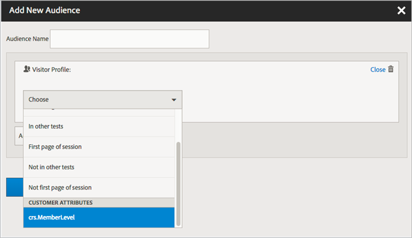

# データソースの作成とファイルのアップロード

顧客属性ソース（`.csv` ファイルと `.fin` ファイル）を作成してデータをアップロードします。 準備できたら、データソースをアクティブ化できます。データ ソースがアクティブになったら、属性データを [!DNL Analytics] と [!DNL Target] に共有します。

ワ **[!DNL Customer Attributes]クフロー**


## [!DNL Customer Attributes] を見つけます

[!DNL Experience Cloud] で、**[!UICONTROL Apps]** メニュー **[!DNL Customer Attributes]** クリックします。

## [!DNL Customer Attributes] を使用するための前提条件

* **グループメンバーシップ：** データをアップロードするには、ユーザーは [!DNL Customer Attributes] グループのメンバーである必要があります。 また、Adobe Analytics グループまたは Adobe Target グループのいずれかに属している必要もあります。

  会社が顧客属性へのアクセス権を持っているかどうかを確認するには、[!DNL Experience Cloud] 管理者は [Experience Cloud](https://experience.adobe.com) にログインする必要があります。 **[!UICONTROL Admin Console]**/**[!UICONTROL Products]** に移動します。 *[!DNL Customer Attributes]* の 1 つとして [!UICONTROL product profiles] が表示された場合は、開始する準備が整っています。

  に追加され [!DNL Customer Attributes] ユーザーには、Experience Cloud インターフェイスの左側に「[!DNL Customer Attributes]」メニュー項目が表示されます。

* 顧客属性には、**Adobe Target** `at.js`（任意のバージョン）または `mbox.js` バージョン 58 以降が必要です。

  [at.js のデプロイ方法](https://experienceleague.adobe.com/docs/target-dev/developer/client-side/overview.html?lang=ja)を参照してください。

## データファイルの作成

このデータは、CRM の企業顧客データです。データには、メンバー ID、権限付与されている製品、最も頻繁に起動する製品など、製品に関する購読者データが含まれます。

1. `.csv` ファイルを作成します。

   >[!NOTE]
   >
   >このプロセスの後半で、`.csv` ファイルをドラッグ&amp;ドロップしてファイルをアップロードします。 [FTP を使用してアップロード](t-upload-attributes-ftp.md#task_591C3B6733424718A62453D2F8ADF73B)する場合は、`.csv` と同じ名前の `.fin` ファイルも必要です。

   企業顧客データファイルの例：

   

1. 続行する場合は、ファイルをアップロードする前に[データファイル要件](crs-data-file.md)の重要な情報を確認してください。
1. 以下に説明するように、[顧客属性ソースを作成してデータファイルをアップロードします](t-crs-usecase.md#create-source)。

## 属性ソースの作成とデータファイルのアップロード

Experience Cloudの [!UICONTROL Create Customer Attribute Source] ページでこれらの手順を実行します。

>[!IMPORTANT]
>
>顧客属性ソースを作成、変更または削除する場合、ID が新しいデータソースと同期され始めるまで、最大 1 時間の遅延があります。顧客属性ソースを作成または変更するには、Audience Manager の管理者権限が必要です。Audience Manager カスタマーケアまたはコンサルティングに問い合わせて、管理者権限を取得してください。

1. [!DNL Experience Cloud] で、**[!UICONTROL Apps]** メニュー **[!DNL Customer Attributes]** クリックします。

   

1. 「**[!UICONTROL New]**」をクリックします。

   

1. [!UICONTROL Create Customer Attribute Source] ページで、次のフィールドを設定します。

   * **[!UICONTROL Name:]** データ属性ソースのわかりやすい名前。 [!DNL Adobe Target] の場合、属性名にスペースを含めることはできません。スペースを含む属性が渡された場合、[!DNL Target] はその属性を無視します。次の文字もサポートされていません。`< , >, ', "`

   * **[!UICONTROL Description:]** （オプション）データ属性ソースの説明。

   * **[!UICONTROL Alias ID:]** 特定の CRM システムなど、顧客属性データのソースを表します。 [!UICONTROL Alias ID] は、[!UICONTROL customer attribute Source] コードで使用される一意の ID です。 ID は一意で、スペースを含まないアルファベットおよびアンダースコアの組み合わせにしてください。Experience Cloudで顧客属性ソースの [!UICONTROL Alias ID] フィールドに入力する値は、実装から（Platform データ収集または Mobile SDKのJavaScriptを使用して）渡されている値と一致させる必要があります。

     >[!IMPORTANT]
     >
     >エイリアス ID は複数のサービスに保存され、サービス間でプロファイルをマッピングするために使用されるので、エイリアス ID に関連付けられたデータソースを削除しても、エイリアス ID は使用できません。

     エイリアス ID は、追加の顧客 ID 値を設定する特定の領域に対応します。 例：

      * **タグ：** エイリアス ID は、*Experience Cloud ID サービス* ツールの [!UICONTROL customer Settings] の下にある [Integration Code](https://experienceleague.adobe.com/docs/experience-platform/tags/home.html?lang=ja) 値に対応しています。

      * **訪問者 API:** エイリアス ID は、各訪問者に関連付けることができる追加の [&#x200B; 顧客 ID](https://experienceleague.adobe.com/docs/id-service/using/reference/authenticated-state.html?lang=ja) に対応します。

        例：*crm_id* の場合：

        ```
        "crm_id":"67312378756723456"
        ```

      * **iOS:** エイリアス ID は *visitorSyncIdentifiers*[&#x200B; の :identifiers&quot;idType&quot;](https://experienceleague.adobe.com/docs/mobile-services/ios/overview.html?lang=ja) に対応しています。

        例：

        `[ADBMobile visitorSyncIdentifiers:@{@<`**`"idType"`**`:@"idValue"}];`

      * **Android™：**&#x200B;エイリアス ID は [syncIdentifiers](https://experienceleague.adobe.com/docs/mobile-services/android/overview.html?lang=ja) の *&quot;idType&quot;*&#x200B;に対応しています。

        例：

        `identifiers.put(`**`"idType"`**`, "idValue");`

        エイリアス ID フィールドと顧客 ID に関するデータ処理について詳しくは、[&#x200B; 複数のデータソースの活用 &#x200B;](crs-data-file.md#section_76DEB6001C614F4DB8BCC3E5D05088CB) を参照してください。

   * **[!UICONTROL Namespace Code:]** この値は、AEP WebSDK 実装の一環として [IdentityMap](https://experienceleague.adobe.com/ja/docs/experience-platform/web-sdk/identity/overview) を使用する際に顧客属性ソースを識別するために使用します。

1. 「**[!UICONTROL Save]**」をクリックします。

## ファイルをアップロード

顧客属性レコードが作成され、顧客属性を編集してファイルをアップロードできます。

1. [!DNL Customer Attributes] ページで、属性ソースをクリックします。

1. [!UICONTROL Edit Customer Data Source] ページで「**[!UICONTROL File Upload]**」をクリックします。

   

1. `.csv`、`.zip` または `.gzip` のデータファイルをドラッグ&amp;ドロップウィンドウにドラッグ&amp;ドロップします。

>[!IMPORTANT]
>
>特定のデータファイル要件が存在します。詳しくは、[データファイル要件](crs-data-file.md)を参照してください。

ファイルをアップロードすると、テーブルデータがこのページの [!UICONTROL File Upload] 見出しの下に表示されます。 スキーマを検証したり、購読を設定したり、FTP を設定したりできます。


* **[!UICONTROL Unique customer ID:]** この属性ソースにアップロードした一意の ID の数を表示します。

* **[!UICONTROL customer-Provided IDs Aliased to Experience Cloud Visitor IDs:]** Experience Cloudの訪問者 ID にエイリアスされている ID の数を表示します。

* **[!UICONTROL customer-Provided IDs with High Alias Counts:]** エイリアスされた 500 以上のExperience Cloud訪問者 ID を持つ、お客様から提供された ID の数を表示します。 このような顧客提供 ID は、個人ではなくある種の共有ログインを表している可能性が最も高くなります。これらの ID に関連付けられた属性は、エイリアス数が 10,000 に達するまで、直近にエイリアスされた 500 個の Experience Cloud 訪問者 ID に振り分けられます。次に、システムは顧客から提供された ID を無効にし、関連付けられた属性を配布しなくなります。—>

## スキーマの検証

検証プロセスでは、アップロードした属性（文字列、整数、数値など）に表示名と説明をマッピングできます。また、スキーマを更新して属性を削除することもできます。

[スキーマの検証](validate-schema.md)を参照してください。

属性を削除するには、[（オプション）スキーマの更新（属性の削除）](t-crs-usecase.md)を参照してください。

## （オプション）スキーマの更新（属性の削除） 

スキーマの属性を削除したり属性を置換したりする方法。

1. [!UICONTROL Edit Customer Attribute Source] ページで、**[!UICONTROL Target]** または **[!UICONTROL Analytics]** のサブスクリプション（**[!UICONTROL Configure Subscriptions]** の下）を削除します。

1. [更新されたフィールドを含む新しいデータファイルをアップロードします](t-crs-usecase.md)。

## 購読の設定と属性ソースの有効化

購読を設定すると、Experience Cloudとアプリケーション間のデータフローが設定されます。 属性ソースを有効化すると、購読しているアプリケーションでデータが利用できるようになります。アップロードした顧客レコードは、Web サイトまたはアプリケーションから入ってくる ID 信号と照合されます。

[&#x200B; 購読の設定とデータソースのアクティベート &#x200B;](subscription.md) を参照してください。

## Adobe Analyticsでの [!DNL Customer Attributes] データの使用

Adobe Analytics などのアプリケーションで利用できるデータを使用して、データをレポートおよび分析し、マーケティングキャンペーンで適切なアクションを起こすことができます。

以下の例は、アップロードした属性に基づいた [!DNL Analytics] セグメントを示しています。このセグメントは、最も頻繁に起動する製品が Photoshop である [!DNL Photoshop Lightroom] の購読者を示しています。


セグメントをExperience Cloudに公開すると、Experience Cloud Audiences とAudience Managerで使用できるようになります。

## Adobe Targetでの [!DNL Customer Attributes] データの使用

[!DNL Target] では、オーディエンスの作成時に「[!UICONTROL Visitor Profile]」セクションから顧客属性を選択できます。 すべての顧客属性には、リストのプレフィックス `crs.` が付きます。 これらの属性を、必要に応じて他のデータ属性と組み合わせることで、オーディエンスを構築します。



ヘルプの [&#x200B; オーディエンスの作成 &#x200B;](https://experienceleague.adobe.com/docs/target/using/audiences/create-audiences/audiences.html?lang=ja) を参照 [!DNL Target] てください。

