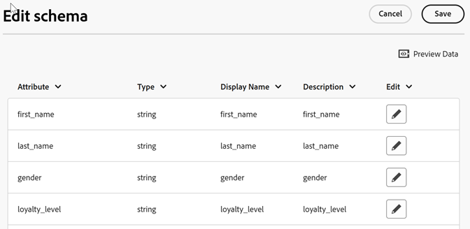

# スキーマの検証

検証プロセスでは、アップロードされた属性（文字列、整数、数値など）に表示名と説明をマップできます。

これらの設定に基づいてスキーマが作成されます。このスキーマは、このデータソースに今後アップロードされるすべてのデータの検証に使用されます。マッピングプロセスによって元のデータが変更されることはありません。

>[!NOTE]
>
>検証後にスキーマを更新すると、顧客属性が削除されます。[スキーマの更新（属性の削除）](t-crs-usecase.md)を参照してください。

**スキーマを検証するには**

1. [!DNL Customer Attributes] で、編集する属性ソースをクリックします。

1. **[!UICONTROL 顧客属性Sourceを編集]** で、「**[!UICONTROL ファイルのアップロード]**」をクリックします。

1. [!UICONTROL  ファイルのアップロードとスキーマの検証 ] ページで、**[!UICONTROL アクション]**/**[!UICONTROL スキーマの表示/編集]** をクリックします

   

   [!UICONTROL  スキーマを編集 ] ページでは、スキーマの各行は、アップロードされた CSV ファイルの列を表しています。

   

**アクション**

* **[!UICONTROL データの追加：]**&#x200B;新しい属性データをこのデータソースにアップロードできます。

* **[!UICONTROL スキーマを表示 / 編集：]**&#x200B;次の手順で説明するように、表示名を属性データにマッピングします。

* **[!UICONTROL FTP のセットアップ：]** FTP アカウントを作成して [FTP を使用してデータをアップロード ](t-upload-attributes-ftp.md) します（オプション）。

* **[!UICONTROL ID 参照：]** `.csv` ーザーの顧客 ID （CID）を入力して、ID のExperience Cloud情報を検索します。 この機能は、訪問者に対して属性データが表示されない理由をトラブルシューティングするのに役立ちます。

   * **[!UICONTROL ECID（Experience Cloud ID）：]**&#x200B;最新の Experience Cloud ID サービスを使用している場合に表示されます。MCID サービスを使用しているが、ここに ID がリストされていない場合、Experience Cloudはその CID のエイリアスを受信していません。 つまり、その訪問者がログインしていないか、実装がその ID を渡していません。

   * **[!UICONTROL CID （顧客 ID）:]** この CID に関連付けられた属性。 prop または eVar を使用して CID（AVID）をアップロードし、属性は表示されるが AVID は表示されない場合は、訪問者がサイトにログインしていないことを意味します。

   * **[!UICONTROL AVID（Analytics 訪問者 ID）：]** prop または eVar を使用して CID をアップロードする場合に表示されます。これらの ID がExperience Cloudに渡される場合、入力した CID に関連付けられているすべての訪問者 ID がここに表示されます。
