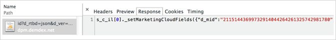

# CX エンタープライズサービスを始める

最近Experience Platform タグを使用してCX Enterpriseを実装した場合、顧客属性とCX Enterprise オーディエンス用にすでに設定されています。 また、Admin Console でユーザーや製品を管理することもできます。

既存顧客は、アプリケーション実装を近代化し、CX Enterpriseを導入できます。 これにより、Adobe Analytics、Audience Manager、Adobe Target をまたいで顧客属性とオーディエンス機能を使用できます。

## CX Enterpriseに参加して管理者になる {#section_2423F0BD3DF642658103310EE5EA6154}

CX エンタープライズに参加するために必要なこと：

1. 適切な Adobe Analytics または Adobe Target SKU を持っていることを確認する。

   * **Adobe Analytics：** Standard または Premium（レガシー [!DNL SiteCatalyst] SKU ではない）。
   * **Adobe Target：** Standard または Premium。

   >[!NOTE]
   >
   >[!DNL Target] の場合は、`mbox.js` から at.js に移行します。 at.js 1からの[ アップグレードを参照してください。 xからat.js 2へ x](https://experienceleague.adobe.com/docs/target-dev/developer/client-side/at-js-implementation/upgrading-from-atjs-1x-to-atjs-20.html?lang=ja)。

1. [!UICONTROL Admin Console]のユーザーと製品を管理します。

### 管理者ログイン

管理者になると、[experience.adobe.com](https://experience.adobe.com) でログインできます。

**[!UICONTROL Admin Console]** リンクは、CX エンタープライズ メニューのナビゲーションで使用できます。

### ユーザーログイン

CX Enterpriseにログインするには、ユーザーが次の操作を行う必要があります。

* Adobe ID（または会社の Enterprise ID）を持っている。
* [experience.adobe.com](https://experience.adobe.com) でログインする。
* エンタープライズグループにマッピングされているアプリケーショングループに属します。
* 必要に応じて、アプリケーションアカウントを Adobe ID にリンクします（以下で説明）。

### オプション：既存のユーザーアカウントをリンクします。

多くの場合、以前に[!UICONTROL Analytics] > [!UICONTROL Admin Tools]で管理したAnalytics グループなど、既にアプリケーショングループのメンバーであるユーザーがいます。

これらのグループをCX Enterprise グループにマッピングする場合、それらのユーザーはアプリケーションアカウントの資格情報を手動でAdobe IDにリンクする必要があります。

CX Enterpriseの[Link アカウント ](../administration/organizations.md)を参照してください

>[!NOTE]
>
>エンタープライズグループとソリューショングループのマッピング後、新しいユーザーは自動的にリンクされます。 （ソリューションの資格情報が自動的に作成されて Adobe ID にリンクされます）。

以下の節では、実装を最新化する方法を説明します。 CX Enterpriseのコアサービスを有効にすることで、実装を最新化できます。

## [!UICONTROL CX Enterprise ID Service] の実装 {#section_3C9F6DF37C654D939625BB4D485E4354}

[!UICONTROL CX Enterprise ID Service]は、アプリケーション間の統合に共通のIDを提供します。 [!DNL Customer Attributes]経由でアップロードされたCRM データに基づいて、クロスドメインの訪問者の識別と、クロスデバイス/ブラウザーのターゲティングおよびパーソナライゼーションのパスを提供します。

CX Enterprise コアサービスを有効にする最も簡単な方法は、[!UICONTROL Experience Platform Launch]の[CX Enterprise ID Service拡張機能](https://experienceleague.adobe.com/docs/experience-platform/tags/extensions/adobe/id-service/overview.html)を介して、AnalyticsとAdobe Targetに対して自動的に有効にすることです。

CX Enterprise ID サービスの完全なヘルプ（以前の訪問者ID）については、[こちら](https://experienceleague.adobe.com/docs/id-service/using/intro/overview.html#intro)を参照してください。

**[!UICONTROL Experience Platform tags]を使用していませんか？**

[!UICONTROL Experience Platform tags]を使用していない場合は、次のように、JavaScript デプロイメント （`VisitorAPI.js`）を介してID サービスを手動で実装します。

| タスク | 説明 |
| -----------| ---------- |
| [Analytics用CX Enterprise ID サービスの実装](https://experienceleague.adobe.com/docs/id-service/using/implementation/setup-analytics.html) | また、追加の[顧客 ID](https://experienceleague.adobe.com/docs/id-service/using/reference/authenticated-state.html?lang=ja) を設定することを推奨します。 これらのIDは各訪問者に関連付けられ、CX Enterpriseの現在および将来の機能を有効にします。 |
| 既存の `s_code` をバージョン H.27.3 以降に更新、または既存の `AppMeasurement.js` をバージョン 1.4 以降に更新 | これらのファイルは、Analytics 管理ツールの[コードマネージャー](https://experienceleague.adobe.com/docs/analytics/admin/admin-tools/code-manager-admin.html)でダウンロードして入手できます （`AppMeasurement.js` について詳しくは、[JavaScript の実装](https://experienceleague.adobe.com/docs/analytics/implementation/js/overview.html#js)を参照してください）。 |

{style="table-layout:auto"}

### Analytics と Adobe Target - 顧客 ID の同期 {#section_AD473A6A21C1446498E700363F9A8437}

CX Enterprise ID サービスの設定の一環として、Adobeでは、Analyticsおよび[!DNL Target]に対して、[顧客ID](https://experienceleague.adobe.com/docs/id-service/using/reference/authenticated-state.html?lang=ja)をCX Enterpriseと同期することをお勧めします。

Adobe Target では、 `mbox3rdpartyid` は顧客 ID を取得して、それを [!DNL Target] に送信する必要があります。 （[!DNL Target] のヘルプで[顧客属性の操作方法](https://experienceleague.adobe.com/docs/target/using/audiences/visitor-profiles/working-with-customer-attributes.html?lang=ja)を参照してください）。

訪問者が web サイトで認証をおこなうとき、または別の方法で本人確認をおこなうとき、実装では、その人物の CRM 顧客 ID をページまたはアプリに公開する必要があります。 次に、適切な関数呼び出しを使用して、顧客IDをCX Enterpriseに同期できます。 この同期により、訪問者のCRM顧客IDがCX Enterpriseに保存され、その顧客の属性がCX Enterpriseで使用できるようになります。

例えば、Bob が CRM システムに顧客 ID `52mc210tr42` を持っているとします。 Bob がサイトで認証をおこなうときは、その顧客 ID をページに公開し、その顧客 ID を使用して次のいずれかの方法で同期する必要があります。

* 訪問者 ID サービスを使用して `visitor.setCustomerIDs({"crm_id":"52mc210tr42"})` を呼び出します。 または、
* prop または eVar に *`Customer ID (52mc210tr42)`* を設定します。

この顧客 ID を、顧客 ID が認識される個々の [!DNL Analytics] サーバー呼び出しに対して設定する必要があります。

#### Analytics：顧客 ID とデータウェアハウスのバックフィルメソッドとの同期

顧客属性が利用可能になったとき、一部のお客様は、CX Enterprise ID サービスをまだ実装しておらず、顧客属性を簡単に利用できませんでした。 この問題を軽減するために、アドビでは、Adobe Analytics データウェアハウスを使用して ID 同期のバックフィルを行う手段を作成しました。 この機能は、データウェアハウスのバックフィルと呼ばれます。 データウェアハウスのバックフィルは通常は必要ないため、2022年10月以降は使用できなくなります。

### モバイル SDK

[Enterprise ID](https://experienceleague.adobe.com/docs/mobile-services/android/overview.html?lang=ja)および[Android](https://experienceleague.adobe.com/docs/mobile-services/ios/overview.html?lang=ja) モバイルアプリケーションで追加の顧客IDを設定する方法について™構文の例については、*CX iOS Service*&#x200B;の節を参照してください。

### 履歴データの属性の有効化

顧客属性データは、訪問者のログイン後に使用可能になります。 ID サービスをまだ実装しておらず、過去にpropまたはeVarで顧客IDをトラッキングしていた場合は、過去のログイン情報をCX Enterpriseに送信するプロセスをリクエストできます。 このプロセスを使用すると、顧客属性の使用をすぐに開始できます。

カスタマーケアに連絡して履歴データを有効にしてください。

## レポートスイートをCX エンタープライズ組織にマッピング {#section_7B08516B01BA421681DF03D0E86CE3BA}

>[!NOTE]
>
>レポートスイートのマッピング機能は、2020 年 11 月に廃止されます。 ご質問があれば、カスタマーサポートにお問い合わせください。

CX Enterprise サービス（CX Enterprise ID サービスなど）は、個々のAnalytics レポートスイートではなく、CX Enterprise組織に関連付けられます。 これらのサービスが正しく動作するようにするには、各Analytics レポートスイートをCX Enterprise組織にマッピングする必要があります。

## Analytics の AppMeasurement コードを更新する {#section_1798D9D0F05C47E29816AC4EEB9A0913}

ファーストパーティ Cookieを使用している場合は、データ収集CNAMEとクロスドメイン トラッキングについて、[CNAMEおよびCX Enterprise ID サービス ](https://experienceleague.adobe.com/docs/id-service/using/reference/analytics-reference/cname.html?lang=ja)を参照してください。

訪問者 API など JavaScript ライブラリを更新して Analytics の実装を最新化することが推奨されます。 これを行う最も簡単な方法は、Experience Platform データ収集に [Adobe Analytics 拡張機能](https://experienceleague.adobe.com/docs/experience-platform/tags/extensions/adobe/analytics/overview.html)を追加することです。

## Adobe Target 実装のアップデート {#section_C2F4493C7A36406DAE2266B429A4BD24}

* ライブラリの取得が自動的に行われるように、[Adobe Target拡張機能](https://experienceleague.adobe.com/docs/experience-platform/tags/extensions/adobe/target-v2/overview.html)を[!UICONTROL Experience Platform] タグに追加することをお勧めします。 [!UICONTROL Experience Platform] タグを使用して、Adobe Target（およびその他のアプリケーション）用に[CX Enterprise ID Service拡張機能](https://experienceleague.adobe.com/docs/experience-platform/tags/extensions/adobe/id-service/overview.html)を設定することもできます。 Adobe TargetでPeople サービスを使用するには、[!UICONTROL CX Enterprise ID Service]の更新&#x200B;**が必要です**。
* [!UICONTROL Experience Platform]個のタグを使用していない場合は、[mbox ライブラリを手動で更新します](https://experienceleague.adobe.com/docs/target/using/implement-target/client-side/implement-target-for-client-side-web.html)。
* [!DNL Adobe Target] のレポートソースとして Adobe Analytics を使用するためのアクセスをリクエストします。 [!DNL Target] と [!DNL Analytics] のデータは、処理中に同じサーバー呼び出しで結合されるため、訪問者は 2 つのアプリケーション間で接続されます。 [Analytics for Target の実装](https://experienceleague.adobe.com/docs/target/using/integrate/a4t/a4t.html)を参照してください。

  >[!IMPORTANT]
  >
  >すべての Analytics ユーザーは、顧客属性などコアサービスのために既にプロビジョニングされています。 Analytics ユーザーになっていないユーザーがいる場合は、そのユーザーのプロビジョニングをカスタマーケアに依頼します。

## 実装の検証 {#section_E641782A0F4F44AF8C9C91216BE330D5}

次のプロセスを使用して、CX Enterprise ID サービスがサイトに正しく実装されていることを確認します。

1. サイトのCookieをクリアして、CX Enterprise ID サービスへのリクエストを確認できるようにします（リクエストは初回訪問時に発生し、その後、訪問者ごとに1週間に1回の訪問で発生します）。
1. パケットアナライザーまたは Web ブラウザーデバッガーのネットワークパネルを使用して、[!DNL dpm.demdex.net] へのリクエストを検索します。
1. 応答に `d_mid` と値が含まれていることを確認します（例：`_setMarketingCloudFields({"d_mid":"4235...`）。
1. Analytics リクエストに`mid` パラメーター（CX Enterprise ID）が含まれていることを確認します。 猶予期間中（有効になっている場合）には、`aid` パラメーター（Analytics 訪問者 ID）も表示されます。

CX Enterprise IDを含む応答が期待されます。

CX Enterprise IDを含むAnalytics イメージリクエスト（`mid`または&#x200B;_訪問者ID_&#x200B;とも呼ばれます）:

CX Enterprise ID](../assets/mid.png)を含む

### 猶予期間とは

CX Enterprise ID サービスをデプロイすると、新規訪問者はデータ収集サーバーからAnalytics CX Enterprise IDを受け取らなくなります。 サイトのセクションがまだID サービスを実装していない場合、訪問者がこれらのセクションを参照すると、CX Enterprise IDは認識されず、訪問者には従来のAnalytics訪問者IDが割り当てられます。 その結果、訪問者数が重複してカウントされたり、誤った属性が割り当てられたりするなどの問題が生じる可能性があります。

例えば、サイトのサポートセクションを別の CMS で管理している場合は、そのセクション用に別の Analytics JavaScript ファイルを使用していることがあります。 ID サービスをサポートサイトにデプロイする前に、CX Enterprise IDをメインサイトにデプロイすると、新規訪問者がサポートセクションにアクセスすると、従来のAnalytics IDが表示されます。 両方のサイトセクションにまたがる訪問は、異なる訪問として報告されます。

複数のJavaScript ファイルまたはその他のテクノロジ（Flashなど）を使用しているサイトにCX Enterprise ID サービスをデプロイすると、調整の問題が発生する可能性があります。 これらの問題は、サイトのすべての部分でCX Enterprise ID サービスを同時に有効にする必要があるため発生します。 猶予期間を設定することで、新規訪問者はID サービスから引き続きAnalytics訪問者IDを受け取ることができます。 訪問者は、訪問者ID サービスを使用するようにアップグレードされていないサイトのセクションで一貫して識別できます。

## ユーザーと製品を管理する {#section_B6E95F4E0E12483CB9DA99CBC0C5A4AF}

起動して実行したら、[Admin Console](https://adminconsole.adobe.com/) に移動して、ユーザーと製品プロファイルを管理できます。

### 顧客属性

[!DNL Customer Attributes] グループに追加されたユーザーは、CX Enterpriseの左側に[!DNL Customer Attributes] メニュー項目を表示できます。

## 属性とオーディエンスデータの共有を開始する {#section_960C06093623462E8EA247B3E97274A1}

次の機能を利用します。

### [!UICONTROL Customer Attributes]

顧客関係管理（CRM）データベースで企業顧客データを取得する場合は、CX Enterpriseの顧客属性データソースにデータをアップロードできます。 アップロード後は、データを [!DNL Adobe Analytics] と [!DNL Adobe Target] で利用できます。

詳しくは、[顧客属性](customer-attributes/attributes.md)を参照してください。

### [!UICONTROL People]／[!UICONTROL Audience Library]

CX Enterprise [!UICONTROL Audiences]は、オーディエンスを作成し、既存のオーディエンスを組み合わせて複合オーディエンスを作成し、すべての共有オーディエンスを表示できるインターフェイスです。

詳しくは、[ オーディエンス ](audiences/overview.md)を参照してください。

## データストレージおよびプライバシー開示

Adobe [!DNL CX Enterprise] 内のリアルタイムのオーディエンスプロファイルおよびその他のコアサービスを利用する場合、これらのサービスの使用は、データが保管されるデータセンター（および国）の選択に影響を与えることがあります。 特に、[!DNL CX Enterprise]はAudience Managerを使用しているため、[!UICONTROL People] サービス内で使用されるデータは、米国内のAudience Manager サーバー内に存在する必要があります。

[!UICONTROL People] サービスを介して利用可能なサービスを使用する場合、他のAdobe製品からaudience managementに送信されるデータの種類は次のとおりです。

* [!DNL Analytics] キーと値のペア（prop、eVar、リスト変数、その他）。 デフォルトでは、ログの行には、IP の最終オクテット（IP アドレスが Adobe [!DNL Analytics] の IP の不明化設定で変更されていないと仮定）を含む IP アドレスが含まれます。
* Audience Manager に設定されたルールに基づいて訪問者が資格を得る特性とセグメント。
* （オプション）お使いの ID のうちの 1 つまたは複数。 ID サービスの導入に応じて、CRM ID またはハッシュの電子メールアドレスなど、お使いの ID のうち 1 つまたは複数が送信されることもあります。 このデータが Adobe [!DNL Analytics] に送信されると、Adobe Audience Management に転送されます。 個人データを Adobe [!DNL Analytics] に提供しないことを推奨します。 代わりに、アドビに送付する前に、一方向のハッシュを使用してデータをマスクします。
* バックエンドのセグメント共有機能を使用して、[!DNL Analytics] から取得されるセグメント。
* サードパーティ Cookie がブロックされない場合、demdex.net Cookie が設定されます。 `AMCV_###@AdobeOrg`の1st パーティ Cookieは、常にCX Enterprise ID サービスで設定されます。

これらすべてのデータ要素は、ログファイルの形式で Adobe Audience Manager に配信されます。 Audience Manager は、このデータを米国内で処理および格納します。 Audience Manager は、このデータを米国外に格納または処理するオプションは提供しません。
