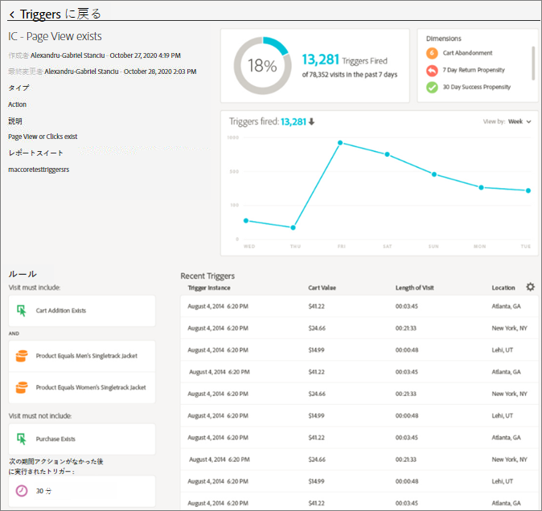
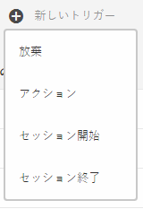
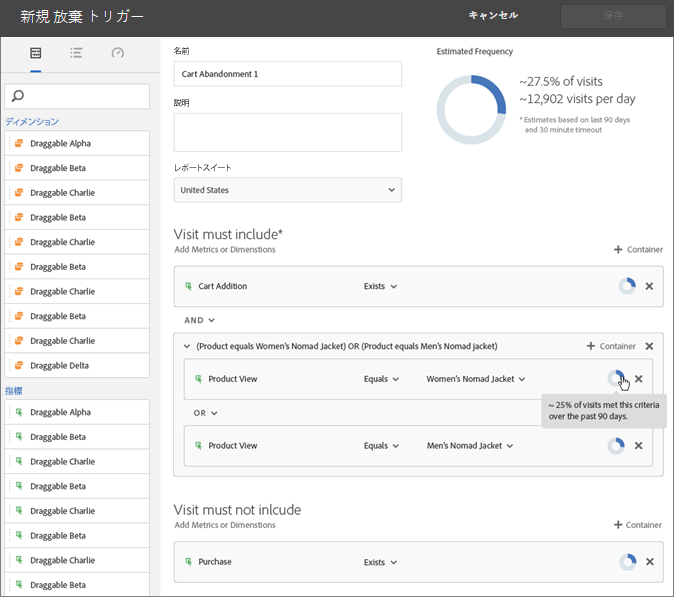
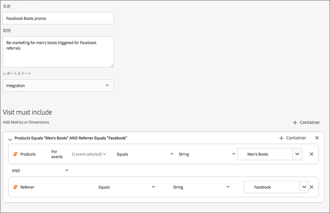

# 顧客体験に関する大規模なトリガー

CX Enterpriseの[!UICONTROL トリガー]を使用すると、主要な消費者行動を特定、定義、モニターしてから、アプリケーション間のコミュニケーションを生成して訪問者を再エンゲージできます。 リアルタイムでの意思決定とパーソナライゼーションに Triggers を使用できます。 Adobe Campaignで[!UICONTROL トリガー]を使用する方法について詳しくは、[Campaign Standard](https://experienceleague.adobe.com/docs/campaign-standard/using/integrating-with-adobe-cloud/working-with-campaign-and-triggers/using-triggers-in-campaign.html)を参照してください。

次に例を示します。

* 買い物かごに製品を追加後に放棄、または製品を削除して買い物かごを放棄した利用者への迅速なリマーケティングの設定
* 入力に不備のあるフォームや申請
* オンサイトでの任意のアクションまたは一連のアクション

>[!NOTE]
>
>トリガーは本質的には決定論的ではない。 複数のユーザーが1つのブラウザーやデバイス（共有デバイスや公開デバイスなど）を共有している場合、トリガーを正しい訪問者IDにマッピングできない可能性があります。

## トリガーの種類

一般に、トリガーがマーケティングキャンペーンを起動するには 15～90 分かかることがあります。 このディレイは、データ収集の実装、パイプラインへの読み込み、定義済みトリガーのカスタム設定、Adobe Campaign のワークフローによって異なります。

* **放棄：**&#x200B;訪問者が製品を表示したが買い物かごに何も追加しない場合に実行するトリガーを作成できます。
* **アクション：**&#x200B;例えば、ニュースレターのサインアップ、電子メールの購読またはクレジットカードの申請（確認）の後に実行するトリガーを作成できます。 小売業者の場合、ロイヤルティプログラムにサインアップする訪問者用のトリガーを作成できます。 メディアおよびエンターテインメントでは、特定のショーを観て、調査に回答したいと思われる訪問者用のトリガーを作成できます。
* **セッション開始およびセッション終了：**&#x200B;セッション開始およびセッション終了イベントのトリガーを作成します。

## CX企業トリガーの構築

トリガーを作成し、トリガーの条件を設定します。 例えば、買い物かごの放棄のような指標や製品名のようなディメンションなど、訪問中のトリガーのルールに対する条件を指定できます。 ルールを満たすと、トリガーが実行されます。

>[!NOTE]
>
>現在、100 トリガーまでという技術的な制限があります。

1. CX エンタープライズで、をクリックし、**[!UICONTROL データ収集/起動]**&#x200B;をクリックします。
1. [!UICONTROL トリガー] カードで、**[!UICONTROL トリガーの管理]**&#x200B;をクリックします。
1. 「**[!UICONTROL 新規トリガー]**」をクリックし、トリガーの種類を指定します。

   

1. 次のフィールドに入力し、指標およびディメンション項目をルールのコンテナにドラッグすることで、トリガーを設定します。

   | 要素 | 説明 |
   | --- | --- |
   | [!UICONTROL 名前] | このトリガーのわかりやすい名前。 |
   | [!UICONTROL 説明] | このトリガーの説明、使い方など。 |
   | [!UICONTROL レポートスイート] | このトリガーに使用する Analytics [レポートスイート](https://experienceleague.adobe.com/docs/analytics/admin/manage-report-suites/report-suites-admin.html?lang=ja)。 この設定は、使用するレポートデータを特定します。 |
   | 訪問には 訪問を含める必要があります 操作を行わない後のトリガー  メタデータを含める | 条件または発生してほしい訪問者の行動、および発生してほしくない行動を定義できます。 例えば、シンプルな買い物かご放棄トリガーのルールは、次のようになります。<ul><li>訪問には、[!UICONTROL 買い物かごの追加] （指標）と[!UICONTROL 存在]が含まれている必要があります。 （特定の製品の表示またはブラウザータイプなどのディメンションでルールをさらに洗練させることができます）。</li><li>訪問に次を含めることはできません：[!UICONTROL &#x200B; チェックアウト &#x200B;]。</li><li>次のアクションがなかった後のトリガー：10 分。</li><li>[!UICONTROL Meta データを含める]：訪問者の行動に関連する特定の[!DNL Campaign] ディメンションまたは変数を追加できます。 このフィールドは、Adobe Campaign で適切なリマーケティング電子メールを構築するのに便利です。</li></ul>  ルールにとって重要であると判断した条件に応じて、コンテナ内またはコンテナ間の[!UICONTROL Any]、[!UICONTROL And]または[!UICONTROL Or] ロジックを指定できます。 |
   | [!UICONTROL &#x200B; コンテナ &#x200B;] | [!UICONTROL Containers]は、トリガーを定義するルール、条件、フィルターを設定して保存する場所です。 同時にイベントを発生させたい場合、イベントを同じコンテナに配置します。 つまり、各コンテナは、ヒットレベルで別々に処理されます。 例えば、2 つのコンテナが AND 演算子で結合されている場合、2 つのヒットが要件を満たすタイミングを満たすルールを期待できます。 |
   | この次に新しいセッションを開始 | セッション開始およびセッション終了イベントのトリガーを作成します。 |

   {style="table-layout:auto"}

1. 「**[!UICONTROL 保存]**」をクリックします。
1. [!DNL Adobe Campaign] でトリガーを[リアルタイムリマーケティング](https://experienceleague.adobe.com/docs/campaign-standard/using/integrating-with-adobe-cloud/working-with-campaign-and-triggers/about-adobe-experience-cloud-triggers.html?lang=ja)に使用します。

## トリガーの例

CX企業トリガーの例：

### カート放棄トリガー

例えば、次のページは、訪問中に閲覧した商品に基づいて、[!UICONTROL 買い物かご放棄]トリガーに使用できるルールを示しています。

### リファラートリガー

次のトリガーは、ヒットがメンズブーツの製品および Facebook のリファラーで発生すると実行されます。 2 つの条件（*製品*&#x200B;と&#x200B;*リファラー*）が同じヒットで評価されるためには、両方を同じコンテナに追加する必要があります。

## トリガーのアクティビティを検証しています

トリガーが実行されたことを確認するには、[!UICONTROL トリガー] インターフェイスを使用して、トリガーの最近のアクティビティを確認します。 このインターフェイスには、最近のトリガーイベントの数が限られているため、データ量が多い実装では、すべてのトリガーアクティビティが表示されない場合があります。 APIによるプログラマティック検証は現在サポートされていません。
