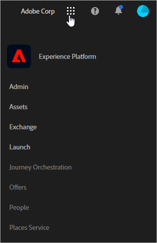

# Experience Cloud の新しいクラウド名について {#topic_BD726D3A649E4FC49063029E86B70C62}

各クラウドのブランド名変更に関する最新情報や、インターフェイスへのアクセス方法、各種ソリューションおよびコアサービスのヘルプ情報の参照先について説明します。

## 新しいクラウド名 {#concept_3D567681C3C94989AD1A30A1C5C41609}

最新のクラウド名と各クラウドのソリューションを以下に示します。

[Experience Cloud](https://www.adobe.com/experience-cloud.html?promoid=FZPQZ2HS&mv=other)

*Marketing Cloud* に代わり、アドビが提供するすべてのデジタルエクスペリエンスソリューションおよびサービスの親クラウドの名称になります。

>[!NOTE]
>
>すべてのソリューションインターフェイスが *Enterprise Cloud* にブランド化されるまで、以前の幅広いコンテキストで *Marketing Cloud* への参照を引き続き確認できます。

[Marketing Cloud](https://www.adobe.com/marketing-cloud.html)

次のソリューションが含まれます。

* Adobe Experience Manager
* Adobe Campaign
* Adobe Target
* Adobe Primetime
* Adobe Social

[Analytics Cloud](https://www.adobe.com/data-analytics-cloud.html)

次のソリューションが含まれます。

* Adobe Analytics
* Adobe Audience Manager

[Advertising Cloud](https://www.adobe.com/advertising-cloud.html)

Media ManagerとTubeMogulが含まれます。

## 解決策は？ {#concept_4F52341A45DC49B2B216824B14D54FDA}

以下の情報は、各ソリューションの簡単な説明と、ヘルプ情報へのリンクを提供します。[使用事例レシピは](https://helpx.adobe.com/marketing-cloud/how-to/use-cases.html) 、デジタルマーケティングワークフローの支援にも使用できます。

[Adobe Analytics](https://docs.adobe.com/content/help/en/analytics/landing/home.html)

Analytics での作業を開始するには、以下の手順に従います。

1. 「Adobe Analyticsの概要」で説明されている手順を使用して、最初のAnalyticsレポートスイート(デ [ータリポジトリ)を作成します](https://docs.adobe.com/content/help/en/analytics/analyze/analysis-workspace/home.html)。
1. Then, deploy Analytics code using [Experience Platform Launch](https://docs.adobe.com/content/help/en/launch/using/intro/get-started/quick-start.html).

エクスペリエンスプラットフォームの起動は、次世代のタグ管理で、すべてのAnalytics、マーケティングおよび広告タグを簡単に導入および管理できます。

関連トピック:

* [使用する Analytics 製品の検討](https://docs.adobe.com/content/help/en/analytics/admin/admin-overview/which-analytics-tool.html)
* [Analytics 製品の比較と必要システム構成](https://docs.adobe.com/content/help/en/analytics/admin/admin-overview/analytics-product-comparison.html)

[Adobe Target](https://docs.adobe.com/content/help/en/target/using/target-home.html)

アドビのターゲットは、Analyticsおよび他のExperience Cloudコアサービスと統合されます。 使い始めに役立つトピック：

* [ターゲット](https://docs.adobe.com/content/help/en/target/using/administer/administrating-target.html)
* [Adobe Target の仕組み](https://docs.adobe.com/content/help/en/target/using/introduction/how-target-works.html)
* [管理者の最初の手順](https://docs.adobe.com/content/help/en/target/using/administer/start-target.html)
* [Analyticsをアドビのレポートソースとして使用するターゲット](https://docs.adobe.com/content/help/en/target/using/integrate/a4t/a4t.html)

[Adobe Experience Manager](https://helpx.adobe.com/support/experience-manager/6-5.html)

コンテンツ管理ソリューションである Adobe Experience Manager では、Web サイト、モバイルアプリ、コミュニティおよびフォーラムのアセットやコンテンツを容易に管理できます。

ヘルプ [については、Adobe Experience Manager 6.5](https://helpx.adobe.com/support/experience-manager/6-5.html) を参照してください。

[Adobe Audience Manager](https://docs.adobe.com/content/help/en/audience-manager/user-guide/aam-home.html)

データ管理プラットフォームである Adobe Audience Manager では、固有のオーディエンスプロファイルを作成し、最も価値のある顧客セグメントをすべてのチャネルで特定しターゲティングできます。

[Adobe Advertising Cloud](https://docs.adobe.com/content/help/en/release-notes/experience-cloud/current.html#adcloud)

Adobe Advertising Cloud は、プログラマティックな広告バイイングソリューションです。広告チャネルの最適な組み合わせを予算に基づいて見つけて予測し、オーディエンスにふさわしいコンテンツを自動的に配信できます。

[Adobe Campaign](https://docs.adobe.com/content/help/en/campaign-standard/using/getting-started/about-adobe-campaign/campaign-orchestration.html)

Adobe Campaignを使用すると、すべてのオンラインチャネルとオフラインイベントでキャンペーンを計画、配信、測定できます。 Adobe Campaign を利用すれば、生産性を高めると共に、顧客に最適なエクスペリエンスを提供できます。

[Adobe Primetime](https://help.adobe.com/en_US/primetime/)

Adobe Primetimeは複数画面のTVプラットフォームで、放送者は、あらゆるオーディエンス向けにパーソナライズされた魅力的なテレビや映画のエクスペリエンスを作成できます。

## コアサービスとは {#concept_38AC4888C3F84694AE4F60311C21B9C2}

[コアサービス](https://docs.adobe.com/content/help/en/core-services/interface/about-core-services/core-services-landing.html)には、オーディエンスのセグメント化、顧客属性のアップロード、共同作業ツールなど、製品実装を簡易化し、クロスソリューションワークフローを実現する各種機能が含まれています。

