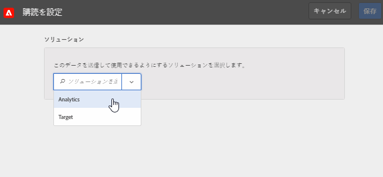

# Experience Cloud でのサブスクリプションの設定方法

ソリューションのデータソースと、サブスクリプションの設定について説明します。サブスクリプションを設定すると、Experience Cloudとソリューション（[!DNL Analytics]と[!DNL Target]）の間で顧客属性のデータをやり取りできるようになります。

例えば、Adobe Analytics を購読すると、レポート内で属性データが有効になります。Adobe Target を使用している場合は、ターゲティングとセグメント化用に顧客属性をアップロードできます。

**[!UICONTROL 顧客属性ソース]**／**[!UICONTROL 新しい顧客属性ソースを作成]**／**[!UICONTROL 新規]**

| 要素 | 説明 |
|--- |--- |
| ソリューション | **Adobe Analytics**  「Analytics」を選択し、属性データを受け取るレポートスイートおよび含める属性を指定します。 **Adobe Target**  ターゲティングとセグメント化用に顧客属性をアップロードできます。この機能は、属性データに基づいてテストのターゲットを設定する場合、または Analytics でのセグメント化でデータを使用できるようにする場合に便利です。 訪問者のアップロード済み顧客属性データは、 /オーディエンス **[!DNL Target]** を選択してログイ **ン時に使**&#x200B;用できます。 複数のデータソースがサポートされています。Web サイト上で[顧客 ID を設定](core-services.md)する場合は、少なくとも 1 つのエイリアスが [!DNL Target] にサブスクライブされていることを確認します。 |
| レポートスイート（Analytics） | Analytics のレポートスイート。 1 つの属性ソース内で Analytics の購読に追加できるレポートスイートの合計は最大 10 です。含めるレポートスイートを選択する際は、以下のアドバイスを考慮してください。<ul><li>認証済みの共通の顧客セットを持つレポートスイートを選択する。あるレポートスイートの認証済み顧客が別のレポートスイートの認証済み顧客と重ならない場合は、これらのレポートスイートを異なる属性ソースに分けてください。</li><li>可能であれば、1 つの属性ソースに含まれるレポートスイートのトラフィック量は同じにする。</li></ul> 認証済みの共通の顧客セットを持つレポートスイートが10以上ある場合は、追加の顧客属性ソースを設定して、それぞれを最大10レポートスイートにすることができます。 |
| 含める属性（Analyticsと[!DNL Target]） | ソリューションに送信する属性。 サブスクリプションを設定し属性を選択する場合、所有するソリューションに応じて、_レポートスイートごとに_&#x200B;次の制限が適用されます。<ul><li>Foundation：0 件</li><li>Select：3 件</li><li>Prime：15 件</li><li>Ultimate：200 件</li><li>Standard：合計 3 件</li><li>Premium：レポートスイートあたり 200 件</li><li>[!DNL Target] Standard：5 件</li><li>[!DNL Target] Premium：200 件</li></ul> **注意：** Analytics Premium にアップグレードすると、追加の属性を使用できるようになるまでに 24 時間の遅延が生じます。この遅延の間に、属性サブスクリプションの上限に関連するエラーが発生することがあります。 |

{style=&quot;table-layout:auto&quot;}
