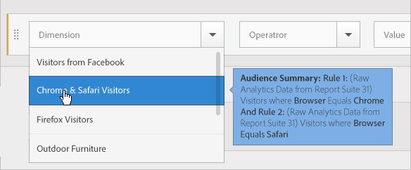

# オーディエンスの作成

 Experience Cloud で属性ルールを使用して、オーディエンスの作成や複合オーディエンスの定義をおこなう方法について説明します。

この記事では、以下の方法について説明します。

* オーディエンスの作成
* ルールの作成
* ルールを使用した複合オーディエンスの定義

次の図は、複合オーディエンスの 2 つのルールを表しています。

それぞれの円が、オーディエンスのメンバーシップを定義するルールを表します。重なっている両方のオーディエンスルールのメンバーと認定される訪問者が、複合オーディエンスとして定義されます。

>[!NOTE]
>
>オーディエンスが完全に定義されるのは、指定されたデータ収集期間の終了後です。

次に、複合オーディエンスのルールを作成する方法の例を示します。このオーディエンスは、次のもので構成されます。

* ページデータまたは Analytics の生データから得られる Home &amp; Garden セクション。
* [!DNL Experience Cloud] に[公開](audience-library.md#task_32FEEFE0B32E4E388CD4D892D727282A)された [!DNL Adobe Analytics] セグメントから得られる Chrome ユーザーと Safari ユーザー。

   

**オーディエンスを作成するには、以下を実行します。**

1. [!DNL Experience Cloud] の [!DNL Experience Platform] で、**[!UICONTROL People]**／**[!UICONTROL オーディエンスライブラリ]をクリックします。**
1. [!UICONTROL オーディエンス]ページで、「**[!UICONTROL 新規]**」（）をクリックします。

   

1. [!UICONTROL 新しいオーディエンスを作成]ページで、タイトルと説明を指定します。
1. 「[!UICONTROL ルール]」で、属性のソースを選択します。

   * **[!UICONTROL Real-Time Analyticsデータ：]** （または生データ）Real-Time Analyticsのイメージリクエストから得られる属性データで、eVarやイベントなどのデータが含まれます。この属性ソースを使用する場合は、レポートスイートを選択し、含めるディメンションまたはイベントを定義する必要があります。このレポートスイートの選択により、レポートスイートで使用された変数構造が提供されます。
   >[!NOTE]
   >
   >キャッシュの影響により、Analytics で削除したレポートスイートが Experience Cloud に反映されるまで 12 時間かかります。

   * **[!UICONTROL Experience Cloud：]** [!DNL Experience Cloud] Experience Cloud ソースから抽出された属性データ。例えば、[!DNL Analytics] で作成したオーディエンスセグメントからのデータや、[!DNL Audience Manager] からのデータです。

1. オーディエンスルールを定義したあと、「**[!UICONTROL 保存]**」をクリックします。

>[!NOTE]
>
>オーディエンスルールを定義する場合は、実装変数について理解している必要があります。

「[!UICONTROL ルール]」で、*`Home & Garden`* 属性の選択肢を定義します。

* **[!UICONTROL 属性のソース：]** Analytics 生データ
* **[!UICONTROL レポートスイート：]**&#x200B;レポートスイート 31
* ディメンション = **[!UICONTROL Store (Merch) (v6)]**／**[!UICONTROL 次の値と等しい]**／**[!UICONTROL ホーム＆ガーデン]**

*Chrome および Safari の訪問者*&#x200B;は、Analytics から共有されたオーディエンスセグメントです。

* **[!UICONTROL 属性のソース：]** Experience Cloud
* **[!UICONTROL ディメンション：]** Chrome および Safari の訪問者

比較のために、*OR* ルールを追加して、「Patio &amp; Furniture」などのサイトセクションへのすべての訪問者を確認することもできます。

このルールの結果として得られるのは、Home &amp; Garden を訪問した Chrome および Safari ユーザーで構成される、定義されたオーディエンスです。「Patio &amp; Furniture」セグメントにより、このサイトセクションに訪問するすべての訪問者に対する追加のインサイトが得られます。

* **履歴による予測：**（点線の円）[!DNL Analytics] データに基づいて作成されたルールを表しています。
* **実際のオーディエンス：**（実線の円）Audience Manager からの 30 日間のデータで作成されたルールです。Audience Manager データが 30 日に達すると、線が実線になり、実際の数を表します。

特定期間のデータ収集が終了すると、円は結合されて、定義されたオーディエンスを表示します。

オーディエンスを保存すると、他のソリューションで使用できるようになります。例えば、Adobe Target のアクティビティに共有オーディエンスを含めることができます。
