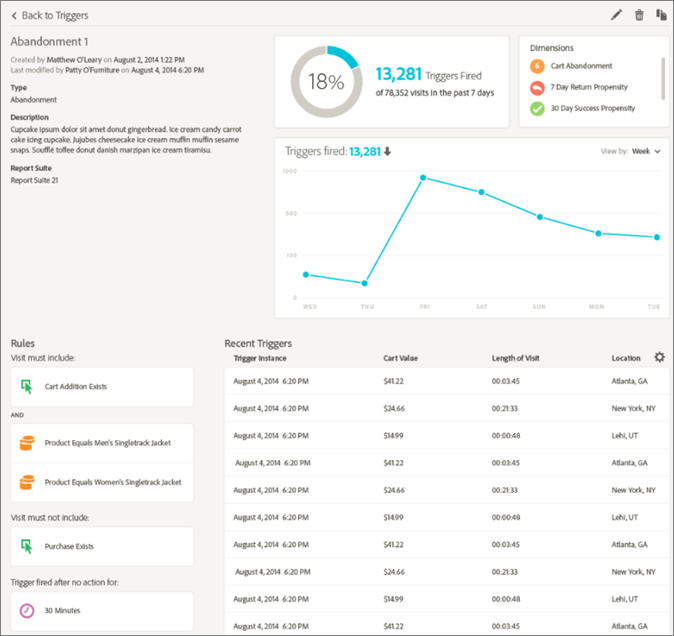

# Experience Cloud Triggers

 トリガーExperience Cloudを使用すると、主な消費者行動を識別、定義および監視し、ソリューションを横断するコミュニケーションを生み出して、訪問者を再び関与させることができます。

## Triggers の概要 {#topic_4F21FCE9A64E46E8B6D51F494FA652A7}

リアルタイムでの意思決定とパーソナライゼーションに Triggers を使用できます。次に例を示します。

* 買い物かごに製品を追加後に放棄、または製品を削除して買い物かごを放棄した利用者への迅速なリマーケティングの設定
* 入力に不備のあるフォームや申請
* オンサイトでの任意のアクションまたは一連のアクション

>[!NOTE]
>
>[!UICONTROL トリガー]の使用に関する詳細は、[Campaign Standard](https://experienceleague.adobe.com/docs/campaign-standard/using/integrating-with-adobe-cloud/working-with-campaign-and-triggers/using-triggers-in-campaign.html?lang=en)を参照してください。

### Triggers のタイプ

一般に、トリガーがマーケティングキャンペーンを起動するには 15～90 分かかることがあります。この遅延は、データ収集の実装、パイプラインでの読み込み、定義済みトリガーのカスタム設定、Adobe Campaignのワークフローによって異なります。

* **放棄：**&#x200B;訪問者が製品を表示したが買い物かごに何も追加しない場合に実行するトリガーを作成できます。
* **アクション：**&#x200B;例えば、ニュースレターのサインアップ、電子メールの購読またはクレジットカードの申請（確認）の後に実行するトリガーを作成できます。小売業者の場合、ロイヤルティプログラムにサインアップする訪問者用のトリガーを作成できます。メディアおよびエンターテインメントでは、特定のショーを観て、調査に回答したいと思われる訪問者用のトリガーを作成できます。
* **セッション開始およびセッション終了：**&#x200B;セッション開始およびセッション終了イベントのトリガーを作成します。

## Experience Cloud のトリガーの作成 {#task_821F37183AC045E5AC8EED20317598FE}

トリガーを作成し、トリガーの条件を設定します。例えば、買い物かごの放棄のような指標や製品名のようなディメンションなど、訪問中のトリガーのルールに対する条件を指定できます。ルールを満たすと、トリガーが実行されます。

>[!NOTE]
>
>現在、100 トリガーまでという技術的な制限があります。

1. Experience Cloudで「」を選択し、「**[!UICONTROL データ収集/Launch]**」を選択します。
2. [!UICONTROL トリガー]カードで、「**[!UICONTROL トリガーを管理]**」を選択します。
3. 「**[!UICONTROL 新しいトリガー]**」を選択し、トリガーのタイプを指定します。

   

4. 次のフィールドに入力し、指標およびディメンション項目をルールのコンテナにドラッグすることで、トリガーを設定します。

   | 要素 | 説明 |
   |--- |--- |
   | [!UICONTROL 名前] | このトリガーのわかりやすい名前。 |
   | [!UICONTROL 説明] | このトリガーの説明、使用方法など。 |
   | [!UICONTROL レポートスイート] | このトリガーに使用する Analytics [レポートスイート](https://experienceleague.adobe.com/docs/analytics/admin/manage-report-suites/report-suites-admin.html)。この設定は、使用するレポートデータを特定します。 |
   | 訪問には次を含める必要があります 訪問に次を含めることはできません 次のアクションがなかった後のトリガー 含めるメタデータ | 条件または発生してほしい訪問者の行動、および発生してほしくない行動を定義できます。例えば、シンプルな買い物かご放棄トリガーのルールは、次のようになります。<ul><li>訪問には次を含める必要があります。[!UICONTROL 買い物かごへの追加]（指標）と[!UICONTROL 存在]。 （特定の製品の表示またはブラウザータイプなどのディメンションでルールをさらに洗練させることができます）。</li><li>訪問に含めることはできません： [!UICONTROL チェックアウト]。</li><li>次のアクションがなかった後のトリガー：10 分。</li><li>[!UICONTROL メタデータを含める]:訪問者の行動に関連 [!DNL Campaign] する特定のディメンションまたは変数を追加できます。このフィールドは、Adobe Campaign で適切なリマーケティング電子メールを構築するのに便利です。</li></ul> ルールにとって重要  [!UICONTROL な条件に応じて、コンテナ内またはコンテナ間で「]任意   」、「   ANDOR」を指定できます。 |
   | [!UICONTROL コンテナ] | [!UICONTROL コンテナは、トリガーを定義するルール、条件またはフィルターを設定および保存する場所です。]同時にイベントを発生させたい場合、イベントを同じコンテナに配置します。つまり、各コンテナは、ヒットレベルで別々に処理されます。例えば、2 つのコンテナが AND 演算子で結合されている場合、2 つのヒットが要件を満たすタイミングを満たすルールを期待できます。 |
   | この次に新しいセッションを開始 | セッション開始およびセッション終了イベントのトリガーを作成します。 |

   {style=&quot;table-layout:auto&quot;}

5. 「**[!UICONTROL 保存]**」を選択します。
6. [!DNL Adobe Campaign] でトリガーを[リアルタイムリマーケティング](https://experienceleague.adobe.com/docs/campaign-standard/using/integrating-with-adobe-cloud/working-with-campaign-and-triggers/about-adobe-experience-cloud-triggers.html?lang=en)に使用します。

### トリガーの例

Experience Cloud Triggers の例を以下に示します。

#### 買い物かごの放棄トリガー

例えば、次のページは、訪問中に表示された製品に基づいて、[!UICONTROL 買い物かごの放棄]トリガーに使用する可能性のあるルールを示しています。

#### リファラートリガー

次のトリガーは、ヒットがメンズブーツの製品および Facebook のリファラーで発生すると実行されます。2 つの条件（*製品*&#x200B;と&#x200B;*リファラー*）が同じヒットで評価されるためには、両方を同じコンテナに追加する必要があります。

